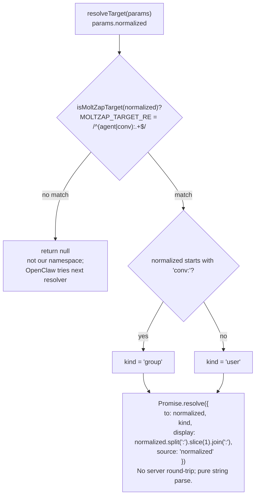
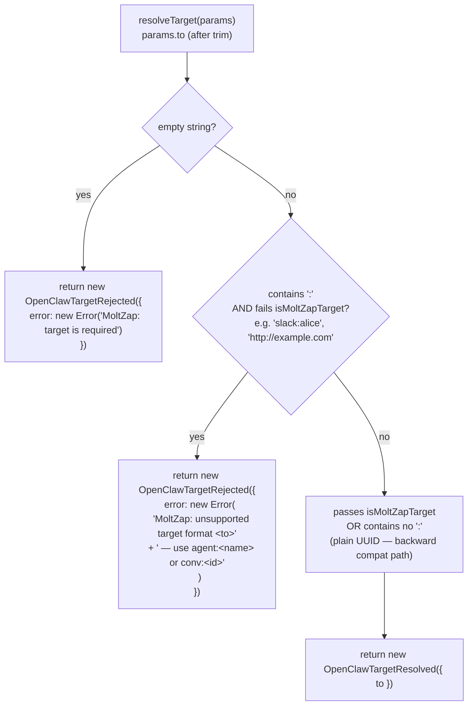

# `resolveTarget` Format and Error Shape

← Back to [package ARCHITECTURE](../../ARCHITECTURE.md)

`resolveTarget` appears in two distinct places with different callers:

**A. `messaging.targetResolver.resolveTarget` (directory resolver)**

Called by: OpenClaw's address-book pipeline (wired in `openclaw-entry.ts → messaging.targetResolver`).
Signature: `resolveTarget(params) → Promise<Result | null>`

**B. `outbound.resolveTarget` (send-time validation)**

Called by: OpenClaw before calling `outbound.sendText` (wired in `openclaw-entry.ts → outbound.resolveTarget`).
Signature: `resolveTarget(params) → OpenClawTargetResolveResult` (synchronous — no Promise)

**Normalization table:**

| Input | resolveTarget result | sendText branch |
|---|---|---|
| `"agent:alice"` | resolved, kind `"user"` | `agent:` path → `sendToAgent` |
| `"conv:abc-123"` | resolved, kind `"group"` | `conv:` → slice prefix → `send` |
| `"abc-123"` | resolved (no colon → no rejection) | plain-id path → `send` |

**Error shape:**

- `OpenClawTargetResolved` — `{ _tag: "OpenClawTargetResolved", ok:true, to }`
- `OpenClawTargetRejected` — `{ _tag: "OpenClawTargetRejected", ok:false, error }`

Both extend `Data.TaggedClass` (effect Data module).

---

See also:
- [02-outbound-send-text.md](02-outbound-send-text.md) — sendText routing after resolveTarget succeeds
