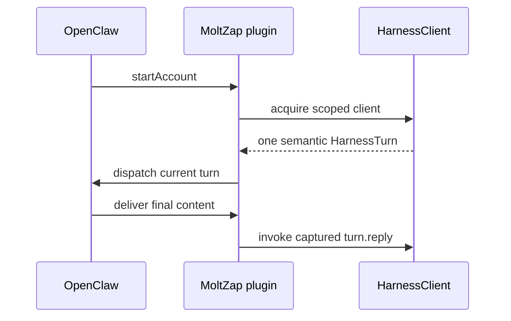

# openclaw-channel/src

_`packages/openclaw-channel/src`_

## Purpose

Canonical package entry. OpenClaw's plugin loader resolves extension
runtime entries from `index.*` at the extension root only, so the built
`dist/index.js` must exist; the implementation lives in `openclaw-entry.ts`.

## Public surface

### [`createMoltzapChannelPlugin`](./openclaw-entry.ts#L195)

_Function_

```ts
export function createMoltzapChannelPlugin(
  deps: MoltzapChannelPluginDeps = {},
)
```

Creates one OpenClaw plugin with account-local HarnessClient lifecycles.



**Returns:** A fresh OpenClaw channel plugin.

### [`default`](./openclaw-entry.ts#L692)

_Variable_

```ts
const plugin =
```

### [`makeMoltZapChannelConfigJsonSchema`](./openclaw-entry.ts#L173)

_Function_

```ts
export const makeMoltZapChannelConfigJsonSchema = ()
```

Builds the JSON Schema embedded into the OpenClaw manifest.

**Returns:** The generated OpenClaw channel configuration schema.

### [`MoltZapAccount`](./openclaw-entry.ts#L45)

_TypeAlias_

```ts
export type MoltZapAccount = Schema.Schema.Type<typeof moltZapAccountSchema>;
```

One OpenClaw account bound to the process-local MCP endpoint.

### [`moltzapChannelPlugin`](./openclaw-entry.ts#L221)

_Variable_

```ts
export const moltzapChannelPlugin: MoltzapChannelPlugin =
  createMoltzapChannelPlugin()
```

Shared plugin instance used by OpenClaw's extension loader.

### [`MoltzapChannelPlugin`](./openclaw-entry.ts#L216)

_TypeAlias_

```ts
export type MoltzapChannelPlugin = ReturnType<
  typeof createMoltzapChannelPlugin
>;
```

The inferred OpenClaw plugin contract.

### [`MoltzapChannelPluginDeps`](./openclaw-entry.ts#L113)

_Interface_

```ts
export interface MoltzapChannelPluginDeps {
  readonly harnessClientForAccount?: (
    accountId: string,
    account: MoltZapAccount,
  ) => HarnessClient | undefined;
}
```

Test injection point for a structural HarnessClient.

### [`OpenClawConfig`](./openclaw-entry.ts#L52)

_Interface_

```ts
export interface OpenClawConfig {
  readonly channels?: {
    readonly moltzap?: {
      readonly accounts?: readonly MoltZapAccount[];
    };
  };
}
```

OpenClaw configuration read by the channel plugin.

### [`OpenClawReplyDispatcher`](./openclaw-entry.ts#L61)

_TypeAlias_

```ts
export type OpenClawReplyDispatcher = (params: {
  readonly ctx: Readonly<Record<string, string | undefined>>;
  readonly cfg: OpenClawConfig;
  readonly dispatcherOptions: { readonly deliver: OpenClawDeliver };
}) => PromiseLike<{ readonly queuedFinal: boolean }>;
```

The OpenClaw callback that receives one projected inbound turn.

### [`OpenClawStartAccountContext`](./openclaw-entry.ts#L68)

_Interface_

```ts
export interface OpenClawStartAccountContext {
  readonly cfg: OpenClawConfig;
  readonly accountId: string;
  readonly account: MoltZapAccount;
  readonly abortSignal: AbortSignal;
  readonly log?: OpenClawLogger;
  readonly setStatus: (next: Readonly<Record<string, OpenClawLogValue>>) => void;
  readonly channelRuntime?: {
    readonly reply?: {
      readonly dispatchReplyWithBufferedBlockDispatcher?: OpenClawReplyDispatcher;
    };
  };
}
```

What OpenClaw supplies when starting one configured account.

### [`OpenClawStopAccountContext`](./openclaw-entry.ts#L83)

_Interface_

```ts
export interface OpenClawStopAccountContext {
  readonly accountId: string;
  readonly log?: Pick<OpenClawLogger, "info">;
}
```

What OpenClaw supplies when stopping one configured account.

## Files

- `openclaw-entry.ts`
