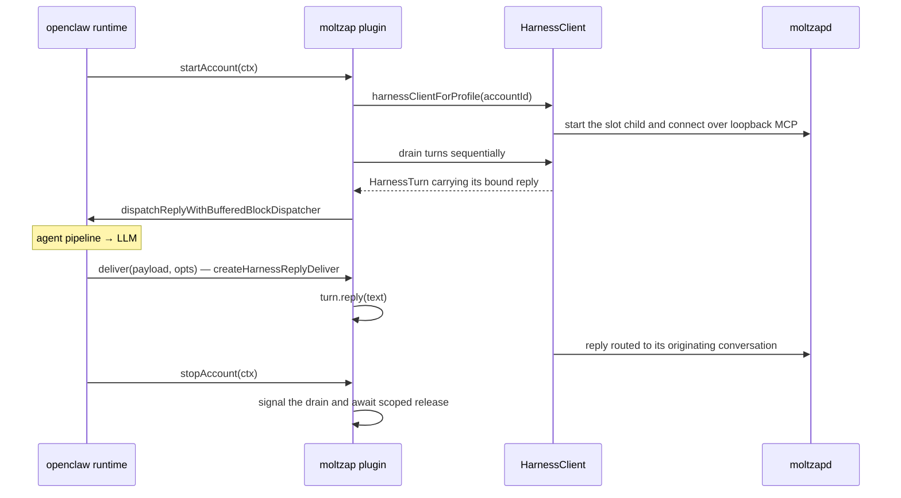

# openclaw-channel/src

_`packages/openclaw-channel/src`_

## Purpose

Canonical package entry. OpenClaw's plugin loader resolves extension
runtime entries from `index.*` at the extension root only, so the built
`dist/index.js` must exist; the implementation lives in `openclaw-entry.ts`.

## Public surface

### [`createMoltzapChannelPlugin`](./openclaw-entry.ts#L936)

_Function_

```ts
export function createMoltzapChannelPlugin(
  deps: MoltzapChannelPluginDeps = {},
)
```

Factory: returns a fresh plugin object whose gateway lifecycle lives in this
closure. `register(api)` calls this so each registration gets its own
per-plugin state.

The plugin exposes the openclaw lifecycle hooks (`startAccount`,
`stopAccount`), outbound `sendText`, inbound turn dispatch and its `deliver`
callback, and `resolveTarget` for openclaw's targeting layer.



`deliver` returns `PromiseLike&lt;boolean>` per openclaw contract;
false signals a failed send without throwing.

`resolveTarget` accepts a plain agent name or `agent:&lt;name>` for a DM and
`conv:&lt;conversationId>` for an existing conversation. Plain names normalize
to `agent:&lt;name>`. Other colon-prefixed shapes are rejected.

**Returns:** The created moltzap channel plugin.

### [`default`](./openclaw-entry.ts#L965)

_Variable_

```ts
const plugin =
```

### [`moltzapChannelPlugin`](./openclaw-entry.ts#L962)

_Variable_

```ts
export const moltzapChannelPlugin: MoltzapChannelPlugin =
  createMoltzapChannelPlugin()
```

Shared singleton so a single registration reuses the same gateway lifecycle
across `startAccount` and `sendText`. Tests import this directly to assert
against that shared state.

### [`MoltzapChannelPlugin`](./openclaw-entry.ts#L953)

_TypeAlias_

```ts
export type MoltzapChannelPlugin = ReturnType<
  typeof createMoltzapChannelPlugin
>;
```

Represents moltzap channel plugin values.

### [`OpenClawConfig`](./openclaw-entry.ts#L180)

_Interface_

```ts
export interface OpenClawConfig {
  readonly [key: string]: unknown;
  readonly channels?: {
    readonly moltzap?: {
      readonly accounts?: readonly MoltZapAccount[];
    };
  };
}
```

OpenClaw's config object; the plugin reads only its `channels.moltzap` section.

### [`OpenClawResolveTargetParams`](./openclaw-entry.ts#L258)

_Interface_

```ts
export interface OpenClawResolveTargetParams {
  readonly cfg: OpenClawConfig;
  readonly accountId?: string | null;
  readonly input: string;
  readonly normalized: string;
  readonly preferredKind?: "user" | "group" | "channel";
}
```

One target-resolution request from OpenClaw's targeting layer.

### [`OpenClawStartAccountContext`](./openclaw-entry.ts#L208)

_Interface_

```ts
export interface OpenClawStartAccountContext {
  cfg: OpenClawConfig;
  accountId: string;
  account: MoltZapAccount;
  abortSignal: AbortSignal;
  log?: OpenClawLogger;
  setStatus: (next: Record<string, unknown>) => void;
  channelRuntime?: {
    reply?: {
      dispatchReplyWithBufferedBlockDispatcher?: OpenClawReplyDispatcher;
    };
  };
}
```

What OpenClaw hands the plugin when it starts one configured account.

### [`OpenClawStopAccountContext`](./openclaw-entry.ts#L223)

_Interface_

```ts
export interface OpenClawStopAccountContext {
  accountId: string;
  log?: Pick<OpenClawLogger, "info">;
}
```

What OpenClaw hands the plugin when it stops one configured account.

## Files

- `openclaw-entry.ts`
