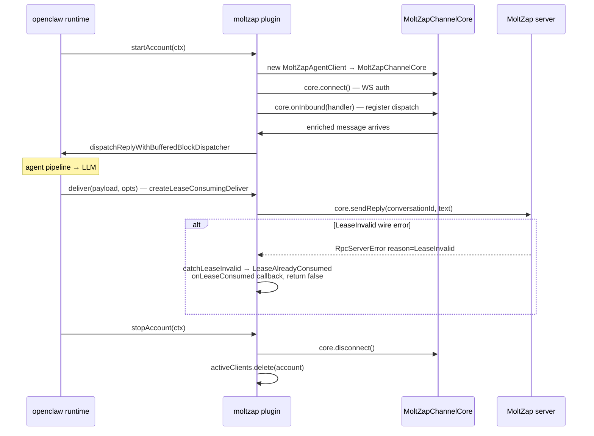

# openclaw-channel/src

_`packages/openclaw-channel/src`_

## Purpose

Canonical package entry. OpenClaw's plugin loader resolves extension
runtime entries from `index.*` at the extension root only, so the built
`dist/index.js` must exist; the implementation lives in `openclaw-entry.ts`.

## Public surface

### [`createMoltzapChannelPlugin`](./openclaw-entry.ts#L1329)

_Function_

```ts
export function createMoltzapChannelPlugin(
  deps: MoltzapChannelPluginDeps = {},
)
```

Factory: returns a fresh plugin object whose `activeClients` map
lives in this closure. `register(api)` calls this so each
registration gets its own per-plugin state.

The plugin exposes the openclaw lifecycle hooks (`startAccount`,
`stopAccount`), the outbound `sendText`, the inbound `onInbound`
adapter (registered inside `startAccount`), the `deliver` callback,
and `resolveTarget` for openclaw's targeting layer.



`deliver` returns `PromiseLike&lt;boolean>` per openclaw contract;
false signals "not delivered" without throwing. The lease-guard
is single-shot per inbound message: a retried `deliver` exercises
the lease again, surfacing `LeaseAlreadyConsumed` as a typed
callback (`MoltzapChannelPluginDeps.onLeaseConsumed`) rather than
a throw.

`resolveTarget` accepts a plain agent name or `agent:&lt;name>` for a DM,
and `task:&lt;taskId>:&lt;conversationId>` for an existing conversation.
Plain names normalize to `agent:&lt;name>` before delivery. A target
containing `:` in any other shape is rejected.

**Returns:** The created moltzap channel plugin.

### [`default`](./openclaw-entry.ts#L1359)

_Variable_

```ts
const plugin =
```

### [`moltzapChannelPlugin`](./openclaw-entry.ts#L1356)

_Variable_

```ts
export const moltzapChannelPlugin: MoltzapChannelPlugin =
  createMoltzapChannelPlugin()
```

Shared singleton so a single registration reuses the same `activeClients`
closure across `startAccount` and `sendText`. Tests import this directly
to assert against that shared state.

### [`MoltzapChannelPlugin`](./openclaw-entry.ts#L1347)

_TypeAlias_

```ts
export type MoltzapChannelPlugin = ReturnType<
  typeof createMoltzapChannelPlugin
>;
```

Represents moltzap channel plugin values.

## Files

- `openclaw-entry.ts`
