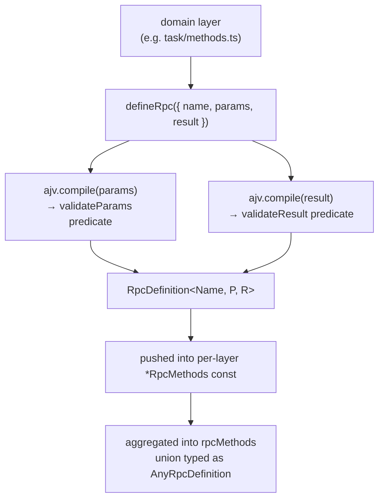

# 01 — Method-definition pipeline

← Back to [package ARCHITECTURE](../../ARCHITECTURE.md)

Every wire method is born at module-load time by a single `defineRpc` call.
The factory compiles AJV validators eagerly so every wire boundary uses
identical schema semantics:

**Annotations:**

- `defineRpc` — `transport/method.ts → defineRpc`
- `RpcDefinition` type — `method.ts → RpcDefinition type`; fields: `name` (branded), `paramsSchema` / `resultSchema` (TypeBox), `validateParams` / `validateResult` (Ajv), `encodeRequest(id, params) → RequestFrame` (`wire.ts → encodeRequest`), `encodeResponse(id, result) → ResponseFrame` (`wire.ts → encodeResponse`)
- `rpcMethods` / `AnyRpcDefinition` — `rpc-registry.ts → rpcMethods`, `rpc-registry.ts → AnyRpcDefinition`

`defineNotification` is the same pipeline minus the result schema and minus
the response encoder. Method names are branded `JsonRpcMethod<"the.name">`
so a runtime string can never accidentally type-fit a method position
(wire.ts → JsonRpcMethod branded type).
