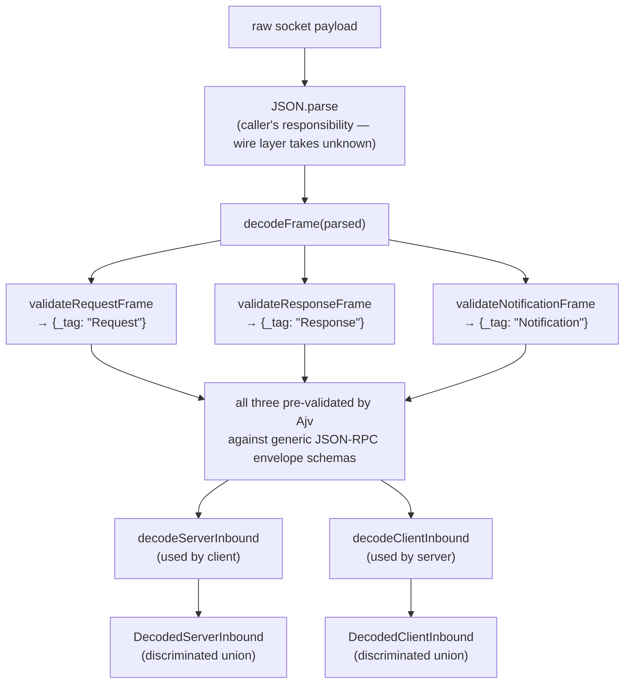

# 02 — Frame decode pipeline

← Back to [package ARCHITECTURE](../../ARCHITECTURE.md)

The single decode entry point is `decodeFrame` (wire.ts); the two
direction-typed wrappers in `rpc-registry.ts` narrow what *kind* of frame
is admissible on which side:

**Annotations:**

- `decodeFrame` — `wire.ts → decodeFrame`
- `decodeServerInbound` / `decodeClientInbound` — `rpc-registry.ts → decodeServerInbound / decodeClientInbound`

For `decodeServerInbound` (used by client):
- Request frames: `decodeRpcRequest(taskCallbackMethods)` → `ServerRequest`
- Response frames: `decodeResponseFrame` → `ResponseSuccess | ResponseError`
- Notification frames: `decodeNotification(notificationDefs)` → `Notification`

For `decodeClientInbound` (used by server):
- Request frames: `decodeRpcRequest(rpcMethods)` → `ClientRequest`
- Response frames: `decodeResponseFrame` → `ResponseSuccess | ResponseError`
- Notification frames: `decodeNotification(notificationDefs)` → `Notification`

Both wrappers **fail closed with `MalformedFrameError`** on any mismatch —
including a response frame whose `id` is `null` (rpc-registry.ts →
`decodeClientInbound`, null-id guard), since a null id has no pending call
to resolve.

Client-inbound `Request` frames are restricted to `taskCallbackMethods`
(the subset the server is allowed to call back into the client — e.g.
`dispatch/authorize`). Server-inbound `Request` frames cover the full
`rpcMethods` set.
