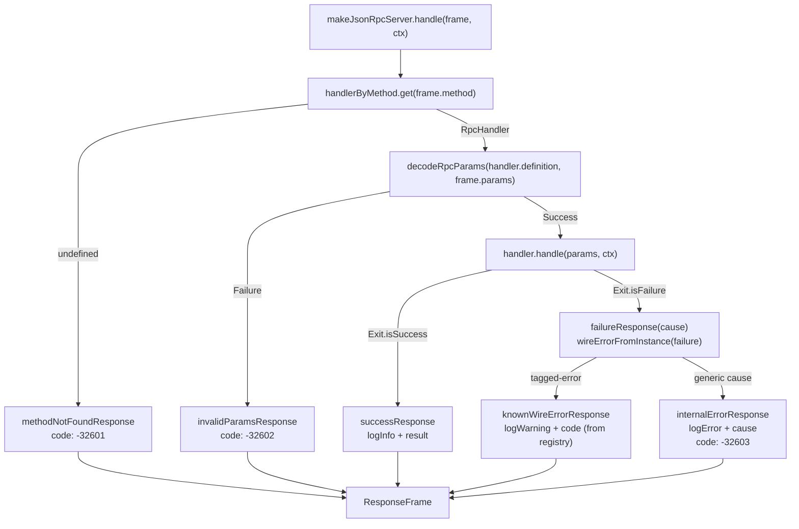

# 03 — Server request handling

← Back to [package ARCHITECTURE](../../ARCHITECTURE.md)

`makeJsonRpcServer` builds a method→handler map at construction time and
serves through a single `handle(frame, ctx)` entry point:

Tagged error mapping (in `json-rpc-server.ts → wireErrorFromInstance`): the
server uses `isRegisteredErrorInstance` to check whether the failure carries
a `static readonly code`/`message` set by `registerErrorClass`. If so, the
class's code + the instance's message + the instance's `data` ride the wire.
Anything else collapses to `InternalError` (-32603) with `Cause.pretty(cause)`
logged but **not** sent to the client.

Handlers are bound via the `handler(definition, fn)` factory (in
`json-rpc-server.ts → handler`). The cast erases descriptor-typed params to
`unknown` for storage; runtime `decodeRpcParams` produces the `ParamsOf<D>`
shape, so the erasure is safe.
