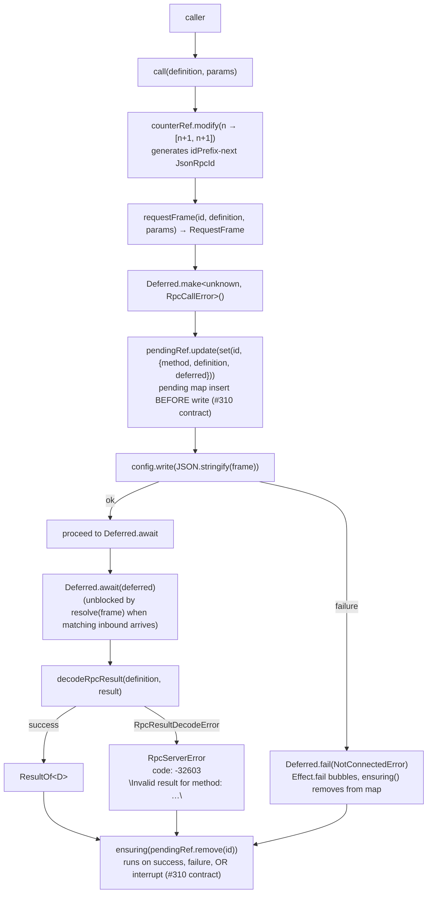
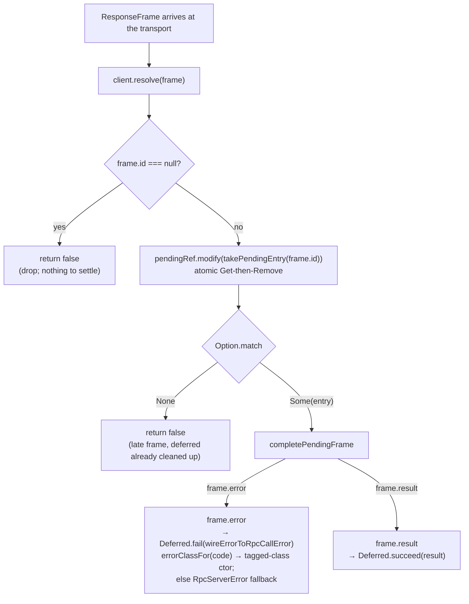

# 04 — Client call lifecycle

← Back to [package ARCHITECTURE](../../ARCHITECTURE.md)

`makeJsonRpcClient` is **scope-bound**: closing the scope runs
`failAllPending(NotConnectedError)` so no caller is ever orphaned on a
hung Deferred (in `json-rpc-client.ts → failAllPending`).

Inbound response routing (in `json-rpc-client.ts → resolve`):

The pending-map uses atomic `Ref.modify` for both insert and take, so two
inbound responses with the same id (server bug) at worst resolve once and
then race-lose harmlessly (second take sees `None`).
