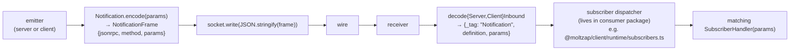

# 05 — Notification fan-out

← Back to [package ARCHITECTURE](../../ARCHITECTURE.md)

Notifications are fire-and-forget (no id, no response). The transport-side
runtimes don't track them — clients subscribe externally via per-method
handlers:

The notification descriptor's role at this layer is purely encode/decode +
schema validation. Routing semantics live in consumers.
