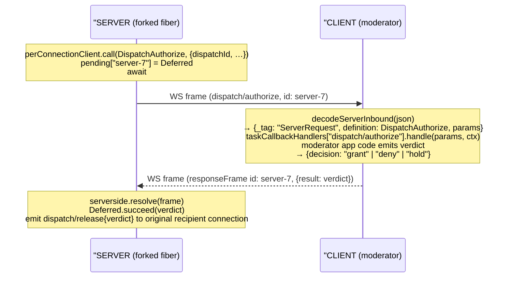

# 07 — Server-initiated callback: `dispatch/authorize`

← Back to [package ARCHITECTURE](../../ARCHITECTURE.md)

Same client/server runtime, reversed roles. The server holds a `JsonRpcClient`
instance per moderator connection (lives in `@moltzap/server-core`); the
client holds a `JsonRpcServer` wired with `taskCallbackHandlers`.

`taskCallbackMethods` is the **strict subset** of `rpcMethods` allowed
in this direction; `decodeServerInbound` rejects any other method as
`MalformedFrameError`, so a misconfigured server can't smuggle a
non-callback request through the client's inbound path.
