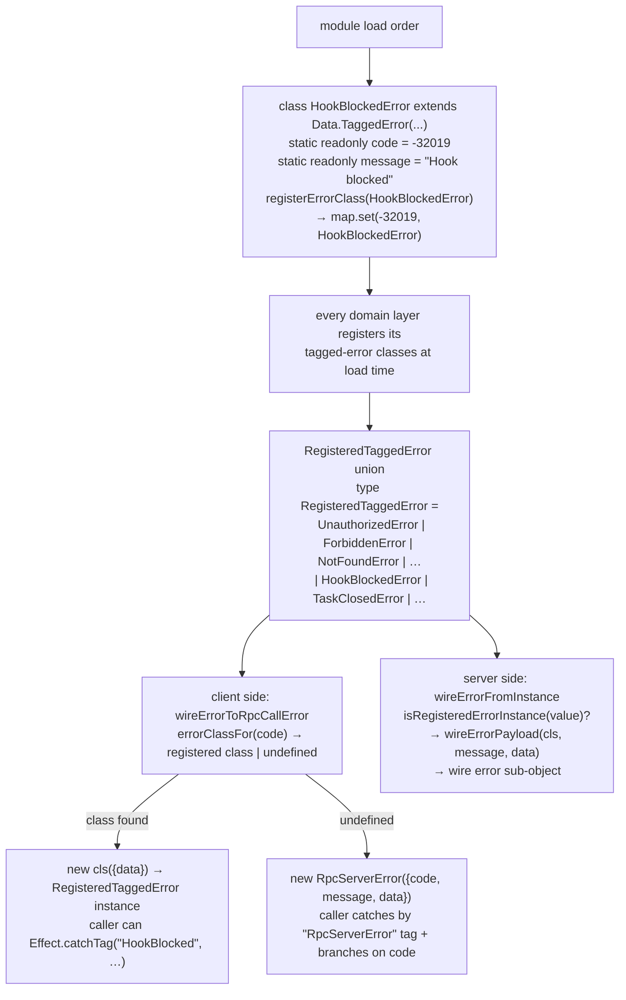

# 08 — Tagged error registry

← Back to [package ARCHITECTURE](../../ARCHITECTURE.md)

**Annotations:**

- `registerErrorClass` — `wire-errors.ts → registerErrorClass`
- `RegisteredTaggedError` union — `rpc-registry.ts → RegisteredTaggedError`; must be hand-kept in sync with registry; type system cannot enumerate the static-side registry into a union
- `wireErrorToRpcCallError` — `json-rpc-client.ts → wireErrorToRpcCallError`
- `wireErrorFromInstance` — `json-rpc-server.ts → wireErrorFromInstance`

`JSON_RPC_RESERVED_CODES` (in `json-rpc-server.ts`) covers only
the JSON-RPC 2.0 spec codes (-32700 ParseError, -32600 InvalidRequest,
-32601 MethodNotFound, -32602 InvalidParams, -32603 InternalError). Domain
codes are in the registry, not in a central table.
