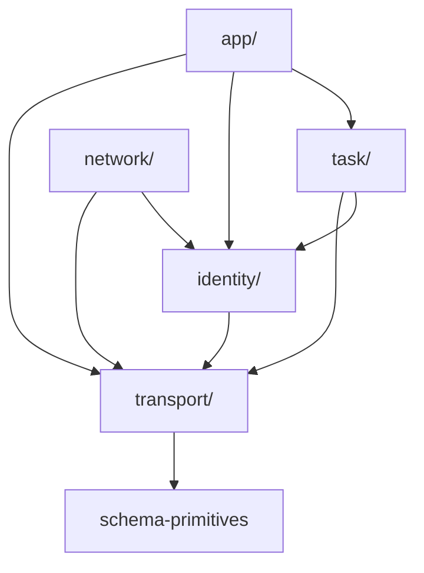

# 09 — Layer DAG

← Back to [package ARCHITECTURE](../../ARCHITECTURE.md)

Source layout enforces a directed DAG. Each layer's `methods.ts` may import
from layers below; never above:

A method defined in `task` may reference `identity` types (e.g. `AgentId`)
but never the other way. The Tag-allowlist hierarchy in
`server/src/rpc/layer-tags.ts` mirrors this, so handler bodies can only
pull services from layers at-or-below the method's home layer.
