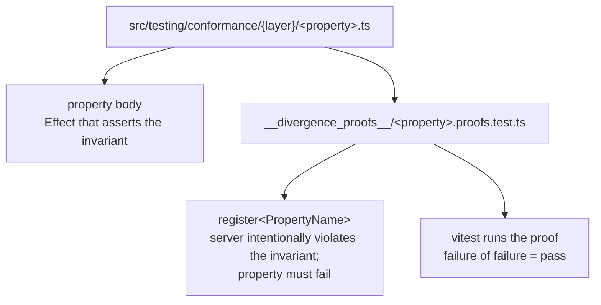

# 10 — Conformance suite

← Back to [package ARCHITECTURE](../../ARCHITECTURE.md)

`testing/conformance/` defines properties any compliant client/server pair
must satisfy. Each property ships an **executable** (a divergence proof)
that *intentionally fails* the property to prove the assertion has teeth.

External consumers (e.g. `moltzap-arena`) drop a ~20-line vitest wrapper
matching the AC22 template (see `packages/protocol/CLAUDE.md`) and the
suite runs against their real WS client.
