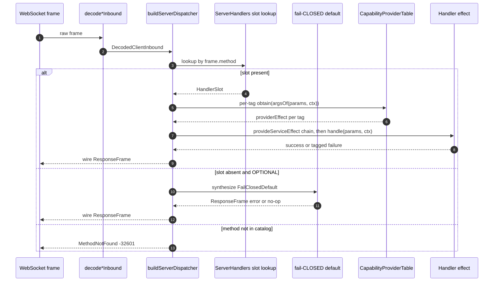

# Typed dispatcher — Spec F (#617)

Per-kind static handler tables, three specialized factories, auto-provision
dispatcher. Replaces the dynamic register/unregister design (Spec A #595)
and the legacy `makeJsonRpcServer` / `makeJsonRpcClient` pair.

This document is the per-flow detail for `packages/protocol`. Source-of-truth
is `packages/protocol/src/transport/{handlers,capabilities,connection,
dispatch,defaults,typed-dispatcher.types-check}.ts`. Spec body at
[#617](https://github.com/chughtapan/moltzap/issues/617). Architect
plan + reviewer prompts at [#619](https://github.com/chughtapan/moltzap/issues/619).

## 1. The three connection kinds

| Kind | Inbound RPC catalog | Outbound RPC surface | Outbound notifications |
|---|---|---|---|
| `ServerConnection` | `rpcMethods` (42 methods at `227c398`) | `taskCallbackMethods` (`DispatchAuthorize`, `MessagesAuthorize`) | full `notificationDefinitions` set |
| `AgentClientConnection` | empty | `rpcMethods` (full) | none |
| `TaskMasterConnection` | `taskCallbackMethods` | `rpcMethods` (full — TM is a superset of AgentClient outbound) | none |

The inbound catalog is reified as a closed object type
(`ServerHandlers<Ctx, Caps>`, `AgentClientHandlers<Ctx, Caps>`,
`TaskMasterHandlers<Ctx, Caps>`) — one slot per definition. REQUIRED slots
must be present at the factory's `handlers` literal (TS2741 if missing);
OPTIONAL slots may be omitted, in which case the dispatcher synthesizes the
protocol's baked-in fail-CLOSED default at runtime.

## 2. Data flow — per-frame dispatch



## 3. Catalog enumeration — normative

The handler-table aliases derive directly from `rpc-registry.ts`. LSP
`findReferences` is the verification mechanism.

- `ServerHandlers` catalog = `(typeof rpcMethods)[number]` = union of
  `identityRpcMethods` (11), `networkRpcMethods` (4), `taskRpcMethods`
  (24), `appRpcMethods` (3). 42 members at `227c398`.
- `TaskMasterHandlers` catalog = `(typeof taskCallbackMethods)[number]`
  = `DispatchAuthorize | MessagesAuthorize`. 2 members.
- `AgentClientHandlers` catalog = `never`. 0 members.

D1's `TaskConversation*` family adds members to `taskRpcMethods` →
`ServerHandlers` propagates automatically; D3's deletions remove the
keys from the catalog union, surfacing dangling references as tsc
errors.

## 4. Per-slot disposition table

The disposition is fixed at protocol-definition time by the
`slotDisposition` field on each `defineRpc(...)` call.

| Slot | Disposition | Default | Justification |
|---|---|---|---|
| `MessagesAuthorize` (TM) | OPTIONAL | `Forbidden` (-32001) | Authorization hook; default-deny is the safe outcome (`project_layered_refactor_hook_collapse`). |
| `DispatchAuthorize` (TM) | OPTIONAL | `Forbidden` (-32001) | Same. |
| Mutating server methods (`MessagesSend`, `TasksCreate`, …) | REQUIRED | — | Server has no fallback. |
| Read-only server methods (`AgentsLookup`, `AgentsList`, …) | REQUIRED | — | Same. |
| Notification-receiver slots (future kinds) | OPTIONAL | `NoOpNotification` | Notifications have no response. |

A caller cannot "register an empty handler" to bypass authorization —
the slot's default IS authorization-failing.

## 5. Facade Replacement Invariant (FRI)

Spec F removes the legacy JSON-RPC client/server factories from the
protocol's public surface. Every connection consumer goes through
`makeServerConnection` / `makeAgentClientConnection` /
`makeTaskMasterConnection`.

**Post-cutover state:**

- Protocol barrel (`transport/index.ts`) exports only the typed factories.
- Legacy server-side dispatch module deleted entirely.
- Originator helper internalized to `transport/originator.ts`; consumed
  privately by `transport/dispatch.ts → buildXDispatcher`. No public
  re-export.
- Production consumers (`server/src/app/server.ts → createCoreApp`,
  `server/src/transport/connection.ts`, `client/src/ws-client.ts →
  MoltZapWsClient.connectEffect`) all consume `make*Connection`.
- `MoltZapWsClient`'s per-frame inbound-reply construction (formerly a
  runtime-rebuild path) is replaced by the static-table dispatcher.

## 6. Internal originator lifecycle

The originator is the outbound half of every Connection — it owns the
pending-request map and the request-id counter for outbound `call(...)`
invocations. Post-Spec F it is an internal helper
(`originator.ts → makeOriginator`) consumed by
`dispatch.ts → buildServerDispatcher` / `buildAgentClientDispatcher` /
`buildTaskMasterDispatcher`. The public surface is `Connection.call`;
the lifecycle below is the internal contract that surface upholds.

`makeOriginator` is **scope-bound**: closing the scope runs
`failAllPending(NotConnectedError)` (in `originator.ts → failAllPending`)
so no caller is ever orphaned on a hung Deferred.

```text
caller
   │
   ▼  call(definition, params)                                  originator.ts → call
   │
   ▼  counterRef.modify(n → [n+1, n+1])
   │       generates `${idPrefix}-${next}` JsonRpcId
   │
   ▼  requestFrame(id, definition, params) → RequestFrame
   │
   ▼  Deferred.make<unknown, RpcCallError>()
   │
   ▼  pendingRef.update(set(id, {method, definition, deferred}))
   │       ─── pending map insert BEFORE write (#310 contract)
   │
   ▼  config.write(JSON.stringify(frame))
   │       │
   │       ├─ ok        →  proceed to Deferred.await
   │       │
   │       └─ failure   →  Deferred.fail(NotConnectedError);
   │                       Effect.fail bubbles, ensuring() removes from map
   │
   ▼  Deferred.await(deferred)
   │       ↑
   │       │  ── unblocked by `resolve(frame)` when matching inbound arrives
   │       │
   │       ▼  decodeRpcResult(definition, result)
   │             │
   │             ├─ success → ResultOf<D>
   │             │
   │             └─ RpcResultDecodeError → RpcServerError
   │                                       code: -32603,
   │                                       "Invalid result for method: …"
   │
   └─ ensuring(pendingRef.remove(id))  ── runs on success, failure, OR interrupt
                                          (Issue #310 contract)
```

Inbound response routing (in `originator.ts → resolve`):

```text
ResponseFrame arrives at the transport
   │
   ▼  client.resolve(frame)
   │
   ▼  frame.id === null  →  return false (drop; nothing to settle)
   │
   ▼  pendingRef.modify(takePendingEntry(frame.id))
   │       atomic Get-then-Remove
   │
   ▼  Option.match
        │
        ├─ None  →  return false   ── late frame, deferred already cleaned up
        │
        └─ Some(entry)  →  completePendingFrame
                              │
                              ├─ frame.error  →  Deferred.fail(wireErrorToRpcCallError)
                              │                      │
                              │                      └─ errorClassFor(code) → tagged-class
                              │                          ctor; else RpcServerError fallback
                              │
                              └─ frame.result →  Deferred.succeed(result)
```

The pending-map uses atomic `Ref.modify` for both insert and take, so two
inbound responses with the same id (server bug) at worst resolve once and
then race-lose harmlessly (second take sees `None`). The lifecycle
guarantees — pending insert-before-write, scope-finalizer, atomic
insert/take, late-frame drop — are unchanged from Spec A.

## 7. Capability auto-provision (Shape B — per-definition metadata)

TypeScript erases R channels at compile time. The architect picks Shape B:
each `RpcDefinition` carries an OPTIONAL `capabilities` array of
`CapabilityDescriptor` records (a `Context.Tag` instance + an
`argsOf(params, ctx)` resolver).

The dispatcher reads `definition.capabilities` per-frame, invokes the
provider table's entry for each tag with `argsOf(params, ctx)`, and
threads `Effect.provideServiceEffect(tag, providerEffect)`.

The type-level gate (`typed-dispatcher.types-check.ts`) enforces lockstep:
the handler's R channel must be a subset of `CapabilitiesOf<D>`.
Mismatch is a tsc error at the handler-table literal site.

Why Shape B over Shape A: capabilities are a property of the wire method,
not the implementation. `defineRpc(...)` is the single source of truth.

## 8. Sequencing with Spec E (#601) — capability auto-provision status

Spec F lands the auto-provision *plumbing*: `defineRpc` accepts a
`capabilities: ReadonlyArray<CapabilityDescriptor>` parameter, the
dispatcher reads `definition.capabilities` per frame and threads
`Effect.provideServiceEffect` for each tag, and
`typed-dispatcher.types-check.ts` enforces that the handler's `R` channel
is a subset of `CapabilitiesOf<D>`.

What Spec F does NOT do yet: every `defineRpc` call ships with the
`capabilities` field absent (effective `readonly []`). No capability tag
or provider table is actually wired up. The handler-side
`requireTmAuthority` check in `packages/server/src/task/services/task.service.ts`
is the current authority pattern; the per-method-descriptor `capabilities`
metadata that would replace it is empty across the workspace.

Spec E (#601) is the planned follow-up that introduces named capability
tags (`TmAuthority` etc.) and populates `capabilities` on the
relevant `defineRpc` calls; until then the auto-provision codepath
threads zero capabilities and is a no-op.

## 9. D-chain compounding (D1 / D2 / D3)

- **D1 (#598):** new `TaskConversation*` keys added to `taskRpcMethods`;
  `ServerHandlers` enumerates them; no per-handler boilerplate.
- **D2 (#599):** CLI uses `makeAgentClientConnection` (or `…TaskMaster…`);
  dispatcher contract unchanged.
- **D3 (#600):** see Invariant D3 below.

> **Invariant D3 (cutover scope, contract from F to D3):** Spec D3
> deletes both the RPC method DEFINITIONS in `@moltzap/protocol`
> (`ConversationsCreate`, `ConversationsList`, `ConversationsGet`,
> `ConversationsUpdate`, `ConversationsMute`, `ConversationsUnmute`,
> `ConversationsAddParticipant`, `ConversationsRemoveParticipant`,
> `ConversationsLeave`, `ConversationsArchive`,
> `ConversationsUnarchive`) AND the corresponding keys in
> `taskRpcMethods`. The type system enforces that every dangling
> reference compiles as an error.

## 10. Cross-references

- Architect plan: [#619](https://github.com/chughtapan/moltzap/issues/619)
- Spec body: [#617](https://github.com/chughtapan/moltzap/issues/617)
- Parent epic: [#602](https://github.com/chughtapan/moltzap/issues/602)
- Spec A (superseded): [#595](https://github.com/chughtapan/moltzap/issues/595) / architect [#603](https://github.com/chughtapan/moltzap/issues/603)
- Spec E (consumed unchanged): [#601](https://github.com/chughtapan/moltzap/issues/601) / architect [#606](https://github.com/chughtapan/moltzap/issues/606)
