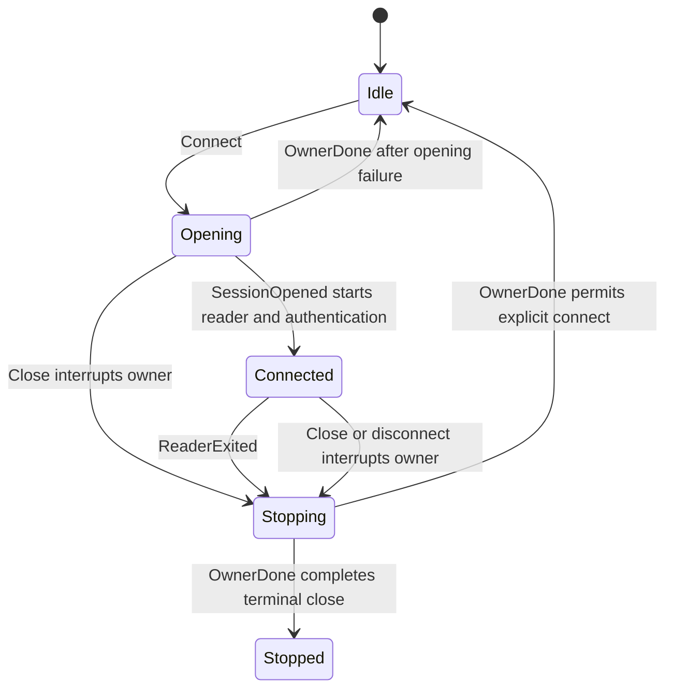

# protocol/src

_`packages/protocol/src`_

## Purpose

Protocol package root.

The root surface is intentionally tiny: concrete protocol-owned socket
lifecycle classes only. Domain descriptors, schemas, requirement tags, and
testing helpers live behind focused package subpaths.

## Public surface

### [`AgentClientOptions`](./socket/agent-client.ts#L40)

_Interface_

```ts
export interface AgentClientOptions {
  readonly serverUrl: string;
  readonly agentKey: AgentKey;
  readonly onDisconnect?: (close: CloseInfo) => void;
}
```

### [`AppClientOptions`](./socket/app-client.ts#L71)

_Interface_

```ts
export interface AppClientOptions {
  readonly serverUrl: string;
  readonly appKey: AppKey;
  readonly onDisconnect?: (close: CloseInfo) => void;
  readonly handlers: AppCallbackHandlers<AppCallbackContext>;
}
```

### [`ConnectResult`](./socket/lifecycle.ts#L114)

_TypeAlias_

```ts
export type ConnectResult = ResultOf<typeof AgentConnect>;
```

### [`MoltZapAgentClient`](./socket/agent-client.ts#L46)

_Class_

```ts
export class MoltZapAgentClient extends ProtocolClientLifecycle<
  AgentCallableRpcs,
  AgentClientDispatch
> {
  constructor(options: AgentClientOptions) {
    super({
      serverUrl: options.serverUrl,
      connectTag: AgentConnect.name,
      connectPayload: {
        agentKey: options.agentKey,
        minProtocol: PROTOCOL_VERSION,
        maxProtocol: PROTOCOL_VERSION,
      },
      openSession: openProtocolAgentClientSocket,
      callbackHandlers: makeAgentCallbackHandlers,
      onDisconnect: options.onDisconnect,
    });
  }

  call<Tag extends AgentCallableTag>(
    tag: Tag,
    payload: PayloadForTag<AgentCallableRpcs, Tag>,
    opts?: RpcCallOptions,
  ): Effect.Effect<
    SuccessForTag<AgentCallableRpcs, Tag>,
    ErrorForTag<AgentCallableRpcs, Tag> | NotConnectedError | RpcTimeoutError
  > {
    const timeoutMs = opts?.timeoutMs ?? RPC_TIMEOUT_MS;
    return this.callEffect(tag, payload, timeoutMs);
  }
}
```

Serializes connection generations through one controller. Each generation
has one scoped owner that acquires the socket, runs its reader, and reports
`OwnerDone` only after every session finalizer has completed. The start gate
prevents an acquired reader from running unless its generation is still
current.



### [`MoltZapAppClient`](./socket/app-client.ts#L78)

_Class_

```ts
export class MoltZapAppClient extends ProtocolClientLifecycle<
  AppCallableRpcs,
  AppClientDispatch
> {
  constructor(options: AppClientOptions) {
    super({
      serverUrl: options.serverUrl,
      connectTag: AppConnect.name,
      connectPayload: {
        appKey: options.appKey,
        minProtocol: PROTOCOL_VERSION,
        maxProtocol: PROTOCOL_VERSION,
      },
      openSession: openProtocolAppClientSocket,
      callbackHandlers: () => makeAppCallbackHandlers(options.handlers),
      onDisconnect: options.onDisconnect,
    });
  }

  call<Tag extends AppCallableTag>(
    tag: Tag,
    payload: PayloadForTag<AppCallableRpcs, Tag>,
    opts?: RpcCallOptions,
  ): Effect.Effect<
    SuccessForTag<AppCallableRpcs, Tag>,
    ErrorForTag<AppCallableRpcs, Tag> | NotConnectedError | RpcTimeoutError
  > {
    const timeoutMs = opts?.timeoutMs ?? RPC_TIMEOUT_MS;
    return this.callEffect(tag, payload, timeoutMs);
  }
}
```

Serializes connection generations through one controller. Each generation
has one scoped owner that acquires the socket, runs its reader, and reports
`OwnerDone` only after every session finalizer has completed. The start gate
prevents an acquired reader from running unless its generation is still
current.


### [`MoltZapServer`](./socket/server.ts#L300)

_Class_

```ts
export class MoltZapServer<
  AuthRequires,
  ConnectionProvides,
  ConnectionRequires,
  HookRequires = never,
> {
  constructor(
    private readonly options: MoltZapServerOptions<
      AuthRequires,
      ConnectionProvides,
      ConnectionRequires,
      HookRequires
    >,
  ) {}

  handleSocket(
    socket: Socket.Socket,
  ): Effect.Effect<
    void,
    Socket.SocketError,
    ServerSocketRequirements<AuthRequires, ConnectionRequires, HookRequires>
  > {
    return Effect.scoped(this.openSocketSession(socket));
  }

  private openSocketSession(
    socket: Socket.Socket,
  ): Effect.Effect<
    void,
    Socket.SocketError,
    ScopedServerSocketRequirements<
      AuthRequires,
      ConnectionRequires,
      HookRequires
    >
  > {
    return Effect.gen(this, function* () {
      const accepted = yield* makeAcceptedSocketSession(socket);
      const scope = yield* Effect.scope;
      const originator = yield* buildReverseClient({
        write: accepted.write,
        scope,
      });
      const session = makeMoltZapServerSession(accepted, originator);

      yield* this.options.onOpen(session);
      yield* Effect.logInfo("WebSocket connected").pipe(
        Effect.annotateLogs({ connId: session.connId }),
      );

      const disconnects = yield* Mailbox.make<number>();
      const sinkReady = yield* Deferred.make<ChannelSink>();
      yield* Layer.build(
        makeSocketRpcLayer({
          write: session.write,
          disconnects,
          sinkReady,
          handlers: this.options.handlers,
          authLayer: this.options.authLayer(session.connId),
          connectionLayer: this.options.connectionLayer(session.connId),
        }),
      );
      const serverSink = yield* Deferred.await(sinkReady);
      const reader = runMuxReader(
        socket,
        { server: serverSink, client: session.originator.sink },
        disconnects,
      );
      yield* this.runSocketReader(reader, session);
    }).pipe(Effect.withSpan("MoltZapServer.openSocketSession"));
  }

  private runSocketReader(
    reader: Effect.Effect<
      void,
      Socket.SocketError,
      ServerSocketRequirements<AuthRequires, ConnectionRequires, HookRequires>
    >,
    session: MoltZapServerSession,
  ): Effect.Effect<
    void,
    Socket.SocketError,
    ServerSocketRequirements<AuthRequires, ConnectionRequires, HookRequires>
  > {
    return Effect.raceFirst(
      reader,
      Deferred.await(session.closeRequested),
    ).pipe(
      Effect.onExit((exit) =>
        Effect.gen(this, function* () {
          yield* this.options.onClose(exit, session);
          if (Exit.isFailure(exit)) {
            yield* Effect.logWarning("WebSocket error").pipe(
              Effect.annotateLogs({
                connId: session.connId,
                cause: Cause.pretty(exit.cause),
              }),
            );
          }
          yield* Effect.logInfo("WebSocket disconnected").pipe(
            Effect.annotateLogs({ connId: session.connId }),
          );
        }),
      ),
    );
  }
}
```

### [`MoltZapServerOptions`](./socket/server.ts#L68)

_Interface_

```ts
export interface MoltZapServerOptions<
  AuthRequires,
  ConnectionProvides,
  ConnectionRequires,
  HookRequires = never,
> {
  readonly handlers: ServerHandlers;
  readonly authLayer: (
    connId: ConnectionId,
  ) => Layer.Layer<ServerRequirementMiddleware, never, AuthRequires>;
  readonly connectionLayer: (
    connId: ConnectionId,
  ) => Layer.Layer<ConnectionProvides, never, ConnectionRequires>;
  readonly onOpen: (
    session: MoltZapServerSession,
  ) => Effect.Effect<void, never, HookRequires>;
  readonly onClose: (
    exit: Exit.Exit<void, Socket.SocketError>,
    session: MoltZapServerSession,
  ) => Effect.Effect<void, never, HookRequires>;
}
```

### [`MoltZapServerSession`](./socket/server.ts#L54)

_Interface_

```ts
export interface MoltZapServerSession {
  readonly connId: ConnectionId;
  readonly write: ServerSocketWrite;
  readonly closeRequested: Deferred.Deferred<void>;
  readonly shutdown: Effect.Effect<void>;
  readonly originator: ReverseClient;
}
```

### [`RpcCallOptions`](./socket/lifecycle.ts#L98)

_Interface_

```ts
export interface RpcCallOptions {
  readonly timeoutMs?: number;
}
```

## Files

- `agent-client.ts`
- `app-client.ts`
- `lifecycle.ts`
- `server.ts`
