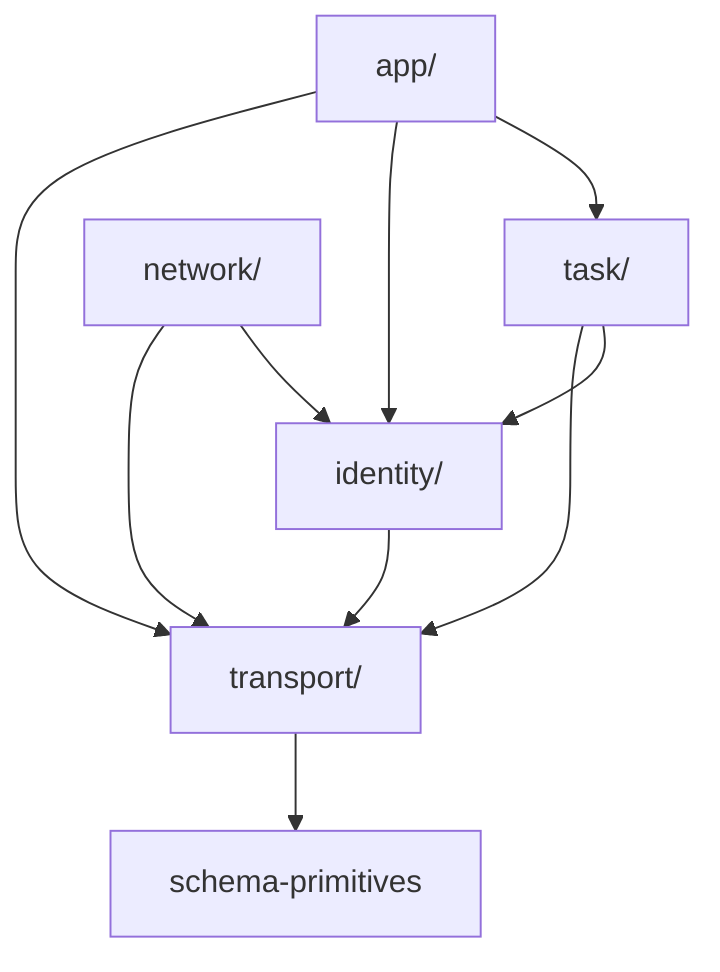
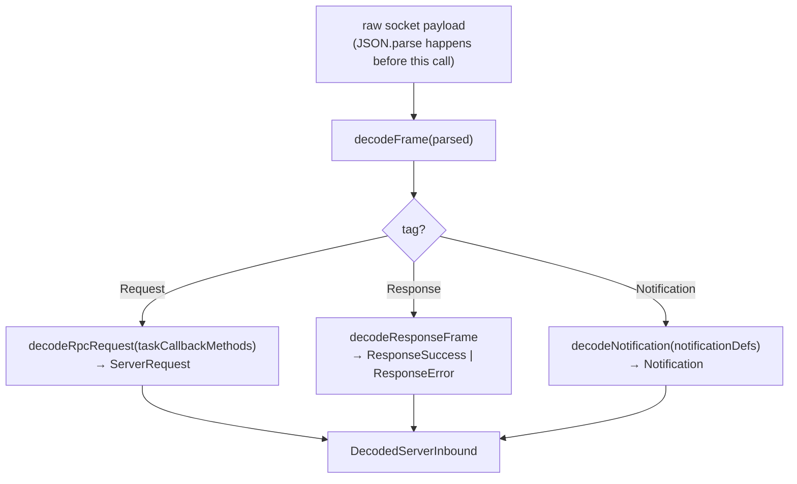

# protocol/src

_`packages/protocol/src`_

## Purpose

Public barrel — protocol layer DAG.

The protocol package is the leaf in the workspace dependency
graph, and internally it is split into five layers with their own
one-way dependency order. Re-exports below are arranged in DAG
order so the file itself is the manifest.



A `task/*` method may reference `identity/*` types (e.g.
`AgentId`); the reverse import is forbidden. The server's
Tag-allowlist hierarchy in `@moltzap/server-core` mirrors this
DAG: a handler may pull services only from layers at-or-below its
own home layer.

## Public surface

### [`agentClientRpcMethods`](./rpc-registry.ts#L74)

_Variable_

```ts
export const agentClientRpcMethods = [
  ...identityRpcMethods,
  ...networkRpcMethods,
  ...nonTmAuthorityTaskRpcMethods,
  ...appRpcMethods,
] as const
```

### [`AnyAgentClientRpcDefinition`](./rpc-registry.ts#L102)

_TypeAlias_

```ts
export type AnyAgentClientRpcDefinition =
  (typeof agentClientRpcMethods)[number] & RpcDefinition<string, any, any>;
```

### [`AnyNotificationDefinition`](./rpc-registry.ts#L109)

_TypeAlias_

```ts
export type AnyNotificationDefinition =
  (typeof notificationDefinitions)[number];
```

### [`AnyServerRpcDefinition`](./rpc-registry.ts#L100)

_TypeAlias_

```ts
export type AnyServerRpcDefinition = (typeof serverRpcMethods)[number] &
```

### [`AnyTaskCallbackRpcDefinition`](./rpc-registry.ts#L107)

_TypeAlias_

```ts
export type AnyTaskCallbackRpcDefinition = (typeof taskCallbackMethods)[number];
```

### [`AnyTaskMasterRpcDefinition`](./rpc-registry.ts#L104)

_TypeAlias_

```ts
export type AnyTaskMasterRpcDefinition = (typeof taskMasterRpcMethods)[number] &
```

### [`brandedId`](./schema-primitives.ts#L85)

_Function_

```ts
export function brandedId<const BrandName extends string>(brand: BrandName)
```

Convenience over `brandedString` that adds `format: "uuid"`. The
canonical way to define wire id types in this package
(`AgentId = brandedId("AgentId")`, `TaskId = brandedId("TaskId")`,
etc.). The format check runs against the FormatRegistry's UUID
regex registered at module load.

### [`brandedNumber`](./schema-primitives.ts#L68)

_Function_

```ts
export function brandedNumber<const BrandName extends string>(
  brand: BrandName,
  options: Parameters<typeof Type.Number>[0] = {},
)
```

Build a `TNumber` TypeBox schema whose static type is
`BrandedNumber&lt;BrandName>`. Same shape as `brandedString` for the
numeric case.

### [`BrandedNumber`](./schema-primitives.ts#L43)

_TypeAlias_

```ts
export type BrandedNumber<BrandName extends string> = number &
```

A `number` carrying a nominal `Brand.Brand&lt;BrandName>` tag.

### [`brandedString`](./schema-primitives.ts#L53)

_Function_

```ts
export function brandedString<const BrandName extends string>(
  brand: BrandName,
  options: Parameters<typeof Type.String>[0] = {},
)
```

Build a `TString` TypeBox schema whose static type is
`BrandedString&lt;BrandName>`. The brand exists only at the type level —
the AJV validator runs against the underlying string. Passes
`options` through to `Type.String` so callers can add `format`,
`minLength`, `maxLength`, `pattern`, etc.

### [`BrandedString`](./schema-primitives.ts#L39)

_TypeAlias_

```ts
export type BrandedString<BrandName extends string> = string &
```

A `string` carrying a nominal `Brand.Brand&lt;BrandName>` tag. Prevents
a `string` from accidentally type-fitting a slot expecting the brand.

### [`DateTimeString`](./schema-primitives.ts#L107)

_TypeAlias_

```ts
export type DateTimeString = Static<typeof DateTimeStringSchema>;
```

ISO-8601 date-time string. Validated by the FormatRegistry `date-time`
checker registered at module load (regex plus `Date.parse` finiteness).

### [`dateTimeStringSchema`](./schema-primitives.ts#L114)

_Function_

```ts
export function dateTimeStringSchema(): typeof DateTimeStringSchema
```

Returns the shared `DateTimeStringSchema` singleton. Functioned so
callers can keep `as const` references stable while the schema body
is owned here.

### [`decodeClientInbound`](./rpc-registry.ts#L254)

_Function_

```ts
export function decodeClientInbound(
  parsed: unknown,
): Effect.Effect<DecodedClientInbound, MalformedFrameError>
```

Typed entry point for server-inbound frames (used by the server to
decode what a client sends). Same shape as
decodeServerInbound but admits the FULL `rpcMethods` set
on the request arm.

Fails closed with `MalformedFrameError` on any mismatch, including
a response frame whose `id` is `null` (no pending call to settle).

### [`DecodedClientInbound`](./rpc-registry.ts#L152)

_TypeAlias_

```ts
export type DecodedClientInbound =
  | ({
      readonly _tag: "ClientRequest";
    } & DecodedRpcRequest<AnyServerRpcDefinition>)
```

Decoded shape of a frame inbound to the server (from client):
a client RPC request, a response (success XOR error) to a
server-initiated callback, or a notification.

### [`DecodedResponseError`](./rpc-registry.ts#L126)

_Class_

```ts
export class DecodedResponseError extends Data.TaggedClass("ResponseError")<{
  readonly frame: ResponseFrame;
  readonly id: JsonRpcId;
  readonly error: Extract<ResponseFrame, { error: unknown }>["error"];
}> {}
```

Discriminated error arm of a decoded JSON-RPC response — wire-frame
decoder discriminator, not an Effect tagged error (the wire `error`
sub-object carries `code`/`message`/`data`, no Effect machinery).

### [`DecodedResponseSuccess`](./rpc-registry.ts#L113)

_Class_

```ts
export class DecodedResponseSuccess extends Data.TaggedClass(
  "ResponseSuccess",
)<{
  readonly frame: ResponseFrame;
  readonly id: JsonRpcId;
  readonly result: unknown;
}> {}
```

Discriminated success arm of a decoded JSON-RPC response.

### [`DecodedServerInbound`](./rpc-registry.ts#L137)

_TypeAlias_

```ts
export type DecodedServerInbound =
  | DecodedResponseSuccess
  | DecodedResponseError
  | ({
      readonly _tag: "ServerRequest";
    } & DecodedRpcRequest<AnyTaskCallbackRpcDefinition>)
```

Decoded shape of a frame inbound to the client (from server):
a response (success XOR error), a server-initiated task-callback
request, or a notification.

### [`decodeServerInbound`](./rpc-registry.ts#L220)

_Function_

```ts
export function decodeServerInbound(
  parsed: unknown,
): Effect.Effect<DecodedServerInbound, MalformedFrameError>
```

Typed entry point for client-inbound frames (used by the client to
decode what the server sends). Fails closed with
`MalformedFrameError` on any wire-level mismatch.



Client-inbound `Request` frames are restricted to
`taskCallbackMethods` (the subset the server is allowed to call
back into the client — `dispatch/authorize`, etc.). Response
frames with `id === null` fail closed since a null id has no
pending call to resolve.

Sibling: decodeClientInbound — same pipeline, but admits
the full `rpcMethods` set on the request arm (server-side use).

### [`JsonValue`](./schema-primitives.ts#L135)

_TypeAlias_

```ts
export type JsonValue =
  | null
  | boolean
  | number
  | string
  | ReadonlyArray<JsonValue>
```

### [`JsonValueSchema`](./schema-primitives.ts#L123)

_Variable_

```ts
export const JsonValueSchema = Type.Recursive(
  (Self) =>
    Type.Union([
      Type.Null(),
      Type.Boolean(),
      Type.Number(),
      Type.String(),
      Type.Array(Self),
      Type.Record(Type.String(), Self),
    ]),
  { $id: "JsonValue" },
)
```

### [`notificationDefinitions`](./rpc-registry.ts#L93)

_Variable_

```ts
export const notificationDefinitions = [
  ...networkNotifications,
  ...identityNotifications,
  ...taskNotifications,
  ...appNotifications,
] as const
```

### [`PROTOCOL_VERSION`](./version.ts#L2)

_Variable_

```ts
export const PROTOCOL_VERSION = "2026.525.0"
```

### [`RegisteredTaggedError`](./rpc-registry.ts#L55)

_TypeAlias_

```ts
export type RegisteredTaggedError =
  | UnauthorizedError
  | ForbiddenError
  | NotFoundError
  | ConflictError
  | InvalidParamsError
  | NotInContactsError
  | TaskClosedError
  | TaskRejectedError
  | ConversationArchivedError
  | ConversationFullError
  | HookBlockedError;

// Spec D3 R11 — per-kind outbound catalogs.
//   `agentClientRpcMethods` — callable from `MoltZapAgentClient`.
//   `taskMasterRpcMethods`  — superset; adds TM-only operations.
//   `serverRpcMethods`      — server inbound; full union (still
//     includes the legacy `Conversations*` / plural `Tasks*` that
//     retire across Commits 6-10).
export const agentClientRpcMethods = [
  ...identityRpcMethods,
  ...networkRpcMethods,
  ...nonTmAuthorityTaskRpcMethods,
  ...appRpcMethods,
] as const;
```

Closed union of every wire-registered tagged-error class instance.
Drives `RpcCallError` so consumers can `Effect.catchTag(...)` against
concrete tags (e.g. "Forbidden", "NotInContacts"). Mirrors the static
registry built by `registerErrorClass` — keep in sync if a new class
lands.

### [`serverRpcMethods`](./rpc-registry.ts#L86)

_Variable_

```ts
export const serverRpcMethods = [
  ...identityRpcMethods,
  ...networkRpcMethods,
  ...taskRpcMethods,
  ...appRpcMethods,
] as const
```

### [`stringEnum`](./schema-primitives.ts#L97)

_Function_

```ts
export function stringEnum<T extends string[]>(values: [...T])
```

`Type.String({ enum: values })` typed as the union of the literal
values. Use instead of `Type.Union([Type.Literal("a"), Type.Literal("b")])`
— same wire shape, simpler schema, single AJV `enum` keyword.

### [`taskMasterRpcMethods`](./rpc-registry.ts#L81)

_Variable_

```ts
export const taskMasterRpcMethods = [
  ...agentClientRpcMethods,
  ...tmOnlyTaskRpcMethods,
] as const
```

## Files

- `rpc-registry.ts`
- `schema-primitives.ts`
- `version.ts`
