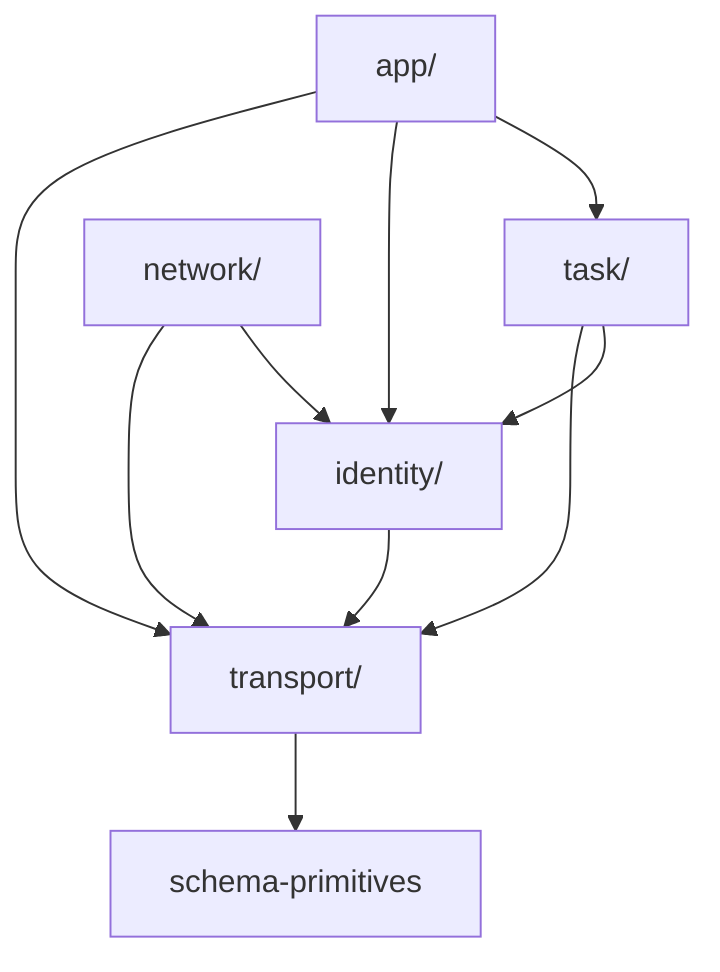

# protocol/src

_`packages/protocol/src`_

## Purpose

Public barrel — protocol layer DAG.

The protocol package is the leaf in the workspace dependency
graph, and internally it is split into five layers with their own
one-way dependency order. Re-exports below are arranged in DAG
order so the file itself is the manifest.



A `task/*` method may reference `identity/*` types (e.g.
`AgentId`); the reverse import is forbidden. The server's
Tag-allowlist hierarchy in `@moltzap/server-core` mirrors this
DAG: a handler may pull services only from layers at-or-below its
own home layer.

## Public surface

### [`AnyNotificationDefinition`](./rpc-registry.ts#L82)

_TypeAlias_

```ts
  ...tmOnlyTaskRpcMethods,
] as const;
```

### [`AnyRpcDefinition`](./rpc-registry.ts#L77)

_TypeAlias_

```ts
  ...appRpcMethods,
] as const;
```

### [`AnyTaskCallbackRpcDefinition`](./rpc-registry.ts#L80)

_TypeAlias_

```ts
export const taskMasterRpcMethods = [
  ...agentClientRpcMethods,
  ...tmOnlyTaskRpcMethods,
] as const;
```

### [`brandedId`](./schema-primitives.ts#L60)

_Function_

```ts
  }) as TString &
```

### [`brandedNumber`](./schema-primitives.ts#L50)

_Function_

```ts
 * `options` through to `Type.String` so callers can add `format`,
 * `minLength`, `maxLength`, `pattern`, etc.
 */
export function brandedString<const BrandName extends string>(
  brand: BrandName,
  options: Parameters<typeof Type.String>[0] =
```

### [`BrandedNumber`](./schema-primitives.ts#L37)

_TypeAlias_

```ts
 * a `string` from accidentally type-fitting a slot expecting the brand.
 */
export type BrandedString<BrandName extends string> = string &
```

### [`brandedString`](./schema-primitives.ts#L40)

_Function_

```ts
  Brand.Brand<BrandName>
```

### [`BrandedString`](./schema-primitives.ts#L35)

_TypeAlias_

```ts
export type BrandedString<BrandName extends string> = string &
```

### [`DateTimeString`](./schema-primitives.ts#L73)

_TypeAlias_

```ts
    ...options,
    description: options.description ?? `Branded ${brand}`,
```

### [`dateTimeStringSchema`](./schema-primitives.ts#L75)

_Function_

```ts
  }) as TNumber &
```

### [`decodeClientInbound`](./rpc-registry.ts#L197)

_Function_

```ts
 * ```mermaid
 * flowchart TD
 *   A["raw socket payload&lt;br>(JSON.parse happens before this call)"]
 *   A --> B["decodeFrame(parsed)"]
 *   B --> C{tag?}
 *   C -->|Request| D["decodeRpcRequest(taskCallbackMethods)&lt;br>→ ServerRequest"]
 *   C -->|Response| E["decodeResponseFrame&lt;br>→ ResponseSuccess | ResponseError"]
 *   C -->|Notification| F["decodeNotification(notificationDefs)&lt;br>→ Notification"]
 *   D --> G[DecodedServerInbound]
 *   E --> G
 *   F --> G
 * ```
 *
 * Client-inbound `Request` frames are restricted to
 * `taskCallbackMethods` (the subset the server is allowed to call
 * back into the client — `dispatch/authorize`, etc.). Response
 * frames with `id === null` fail closed since a null id has no
 * pending call to resolve.
 *
 * Sibling:
```

Typed entry point for server-inbound frames. Fails closed with
`MalformedFrameError` on any wire-level mismatch.

### [`DecodedClientInbound`](./rpc-registry.ts#L125)

_TypeAlias_

```ts
export class DecodedResponseError extends Data.TaggedClass("ResponseError")<{
  readonly frame: ResponseFrame;
  readonly id: JsonRpcId;
  readonly error: Extract<ResponseFrame, { error: unknown }>["error"];
}> {}
```

Decoded shape of a frame inbound to the server (from client):
a client RPC request, a response (success XOR error) to a
server-initiated callback, or a notification.

### [`DecodedResponseError`](./rpc-registry.ts#L99)

_Class_

```ts
export type AnyServerRpcDefinition = (typeof serverRpcMethods)[number] &
```

Discriminated error arm of a decoded JSON-RPC response — wire-frame
decoder discriminator, not an Effect tagged error (the wire `error`
sub-object carries `code`/`message`/`data`, no Effect machinery).

### [`DecodedResponseSuccess`](./rpc-registry.ts#L86)

_Class_

```ts
  ...identityRpcMethods,
  ...networkRpcMethods,
  ...taskRpcMethods,
  ...appRpcMethods,
] as const;
```

Discriminated success arm of a decoded JSON-RPC response.

### [`DecodedServerInbound`](./rpc-registry.ts#L110)

_TypeAlias_

```ts

/** Discriminated success arm of a decoded JSON-RPC response. */
export class DecodedResponseSuccess extends Data.TaggedClass(
  "ResponseSuccess",
)<{
  readonly frame: ResponseFrame;
  readonly id: JsonRpcId;
  readonly result: unknown;
}> {}
```

Decoded shape of a frame inbound to the client (from server):
a response (success XOR error), a server-initiated task-callback
request, or a notification.

### [`decodeServerInbound`](./rpc-registry.ts#L168)

_Function_

```ts
  if (frame.id === null)
```

Typed entry point for client-inbound frames. Fails closed with
`MalformedFrameError` on any wire-level mismatch.

### [`notificationDefinitions`](./rpc-registry.ts#L70)

_Variable_

```ts
//   `serverRpcMethods`      — server inbound
```

### [`PROTOCOL_VERSION`](./version.ts#L2)

_Variable_

```ts
export const PROTOCOL_VERSION = "2026.523.0"
```

### [`RegisteredTaggedError`](./rpc-registry.ts#L51)

_TypeAlias_

```ts
 * registry built by `registerErrorClass` — keep in sync if a new class
 * lands.
 */
export type RegisteredTaggedError =
  | UnauthorizedError
  | ForbiddenError
  | NotFoundError
  | ConflictError
  | InvalidParamsError
  | NotInContactsError
  | TaskClosedError
  | TaskRejectedError
  | ConversationArchivedError
  | ConversationFullError
  | HookBlockedError;
```

Closed union of every wire-registered tagged-error class instance.
Drives `RpcCallError` so consumers can `Effect.catchTag(...)` against
concrete tags (e.g. "Forbidden", "NotInContacts"). Mirrors the static
registry built by `registerErrorClass` — keep in sync if a new class
lands.

### [`rpcMethods`](./rpc-registry.ts#L63)

_Variable_

```ts
  | ConversationArchivedError
  | ConversationFullError
  | HookBlockedError
```

### [`stringEnum`](./schema-primitives.ts#L67)

_Function_

```ts
 */
export function brandedNumber<const BrandName extends string>(
  brand: BrandName,
  options: Parameters<typeof Type.Number>[0] =
```

## Files

- `rpc-registry.ts`
- `schema-primitives.ts`
- `version.ts`
