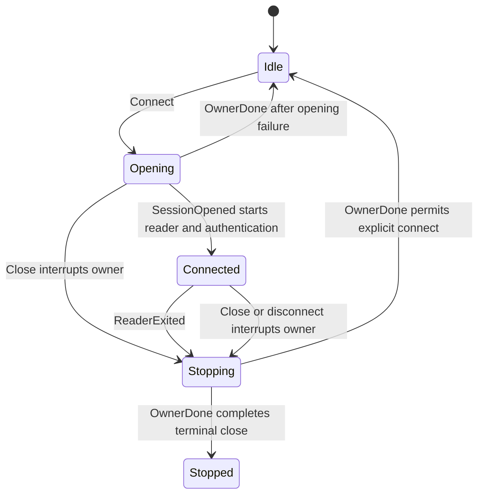

# protocol/socket

_`packages/protocol/src/socket`_

## Purpose

Socket lifecycle surface for protocol-owned clients and server.

Owns the concrete MoltZap agent client, app client, server socket lifecycle,
connection identifiers, close-info extraction, and socket-local lifecycle
helpers used by testing and server wiring.

## Public surface

### [`AgentClientOptions`](./agent-client.ts#L40)

_Interface_

```ts
export interface AgentClientOptions {
  readonly serverUrl: string;
  readonly agentKey: AgentKey;
  readonly onDisconnect?: (close: CloseInfo) => void;
}
```

Configures agent client.

### [`AppCallbackContext`](./app-client.ts#L35)

_Interface_

```ts
export interface AppCallbackContext {
  readonly requestId: string;
}
```

Carries context for app callback.

### [`AppCallbackHandlers`](./app-callbacks.ts#L43)

_TypeAlias_

```ts
export type AppCallbackHandlers<Ctx> = HandlerTable<
  AnyAppCallbackRpcDefinition,
  Ctx
>;
```

Closed handler table for an app moderating one or more conversations. Every
app callback member is required; vacuous-deny moderators still write the
handler explicitly.

### [`AppClientOptions`](./app-client.ts#L72)

_Interface_

```ts
export interface AppClientOptions {
  readonly serverUrl: string;
  readonly appKey: AppKey;
  readonly onDisconnect?: (close: CloseInfo) => void;
  readonly handlers: AppCallbackHandlers<AppCallbackContext>;
}
```

Configures app client.

### [`classifyCloseCause`](./close-info.ts#L50)

_Function_

```ts
export function classifyCloseCause(
  cause: Cause.Cause<Socket.SocketError>,
): CloseKind
```

Executes the classify close cause operation.

**Returns:** The classify close cause result.

### [`ClientConnectError`](./lifecycle.ts#L114)

_TypeAlias_

```ts
export type ClientConnectError<Rpcs extends ProtocolRpc> =
```

Represents client connect error conditions.

### [`ClientDefinitionError`](./lifecycle.ts#L101)

_TypeAlias_

```ts
export type ClientDefinitionError<D extends ClientRpcDefinition> =
```

Represents client definition error conditions.

### [`ClientDefinitionPayload`](./lifecycle.ts#L95)

_TypeAlias_

```ts
export type ClientDefinitionPayload<D extends ClientRpcDefinition> =
```

Represents client definition payload values.

### [`ClientDefinitionSuccess`](./lifecycle.ts#L98)

_TypeAlias_

```ts
export type ClientDefinitionSuccess<D extends ClientRpcDefinition> =
```

Represents client definition success values.

### [`ClientLifecycleOptions`](./lifecycle.ts#L193)

_Interface_

```ts
export interface ClientLifecycleOptions<
  Rpcs extends ProtocolRpc,
  Client extends TypedDispatchMap<Rpcs, RpcClientError>,
> {
  readonly serverUrl: string;
  readonly connectTag: ConnectTag<Rpcs>;
  readonly connectPayload: PayloadForTag<Rpcs, ConnectTag<Rpcs>>;
  readonly openSession: (
    options: ClientSocketSessionOptions,
  ) => Effect.Effect<
    ClientConnection<Client>,
    NotConnectedError,
    Socket.WebSocketConstructor
  >;
  readonly callbackHandlers: () => ReverseCallbackHandlers;
  readonly onDisconnect?: (close: CloseInfo) => void;
}
```

Configures client lifecycle.

### [`ClientRpcDefinition`](./lifecycle.ts#L91)

_Interface_

```ts
export interface ClientRpcDefinition<Rpcs extends Rpc.Any = Rpc.Any> {
  readonly clientRpc: Rpcs;
}
```

Describes client rpc definition.

### [`CloseInfo`](./close-info.ts#L5)

_Interface_

```ts
export interface CloseInfo {
  readonly code: number;
  readonly reason: string;
}
```

Describes close info.

### [`CloseKind`](./close-info.ts#L11)

_TypeAlias_

```ts
export type CloseKind = Data.TaggedEnum<{
  clean: {
    readonly code: number;
    readonly reason: string;
  };
  endOfStream: Record<never, never>;
  handshakeFailure: {
    readonly underlying: "Open" | "OpenTimeout";
  };
  transportFailure: {
    readonly underlying: "Read" | "Write";
  };
  unknown: Record<never, never>;
}>;
```

Represents close kind values.

### [`connectionId`](./connection.ts#L26)

_Variable_

```ts
export const connectionId = Schema.decodeSync(connectionIdSchema)
```

Validates and decodes connection id values.

### [`ConnectionId`](./connection.ts#L17)

_TypeAlias_

```ts
export type ConnectionId = string & Brand.Brand<"ConnectionId">;
```

Server-internal WebSocket connection identifier. Minted at WS accept
(`crypto.randomUUID()`); not on the wire. Branded so it cannot be
confused with `AgentId`, `AppId`, or other ids in service signatures.

Boundary: a single `as ConnectionId` cast at the WS-accept site is the
only acceptable construction in production code; downstream is brand-
typed end-to-end. Test fixtures use the `connectionId(raw)` constructor
exported from `@moltzap/protocol/testing`.

Schema-level format: branded string (no UUID predicate). The mint site
happens to use UUIDs, but conformance-test fixtures sometimes pass synthetic
strings; the brand boundary is the type system, not a format check.

### [`connectionIdSchema`](./connection.ts#L19)

_Variable_

```ts
export const connectionIdSchema: Schema.Schema<ConnectionId, string> =
  Schema.String.pipe(
    Schema.brand("ConnectionId"),
    Schema.annotations({ description: "Branded ConnectionId" }),
  )
```

Validates and decodes connection id values.

### [`ConnectResult`](./lifecycle.ts#L107)

_TypeAlias_

```ts
export type ConnectResult = ResultOf<typeof agentConnect>;
```

Represents the result of connect.

### [`DEFAULT_ABNORMAL_CLOSE`](./close-info.ts#L34)

_Variable_

```ts
export const DEFAULT_ABNORMAL_CLOSE: CloseInfo =
```

Default value for abnormal close.

### [`DEFAULT_GRACEFUL_CLOSE`](./close-info.ts#L29)

_Variable_

```ts
export const DEFAULT_GRACEFUL_CLOSE: CloseInfo =
```

Default value for graceful close.

### [`DispatchAuthorizeRequest`](./reverse-callbacks.ts#L14)

_TypeAlias_

```ts
export type DispatchAuthorizeRequest = Extract<
  ReverseCallbackRequest,
  { readonly definition: typeof dispatchAuthorize }
>;
```

Represents dispatch authorize request values.

### [`extractCloseInfo`](./close-info.ts#L99)

_Function_

```ts
export function extractCloseInfo(
  exit: Exit.Exit<void, Socket.SocketError>,
): CloseInfo
```

Executes the extract close info operation.

**Returns:** The extract close info result.

### [`HandlerSlot`](./app-callbacks.ts#L20)

_Interface_

```ts
export interface HandlerSlot<D extends AppCallbackDescriptor, Ctx> {
  readonly definition: D;
  readonly handle: (
    params: ParamsOf<D>,
    ctx: Ctx,
  ) => Effect.Effect<ResultOf<D>, DomainErrorsOf<D>>;
}
```

Per-definition app-callback handler slot. `Ctx` is the per-frame context the
client hands every handler.

### [`isDispatchAuthorizeRequest`](./reverse-callbacks.ts#L28)

_Function_

```ts
export const isDispatchAuthorizeRequest = (
  request: ReverseCallbackRequest,
): request is DispatchAuthorizeRequest
```

Provides the is dispatch authorize request runtime value.

**Returns:** Whether dispatch authorize request.

### [`isMessagesAuthorizeRequest`](./reverse-callbacks.ts#L38)

_Function_

```ts
export const isMessagesAuthorizeRequest = (
  request: ReverseCallbackRequest,
): request is MessagesAuthorizeRequest
```

Provides the is messages authorize request runtime value.

**Returns:** Whether messages authorize request.

### [`MessagesAuthorizeRequest`](./reverse-callbacks.ts#L19)

_TypeAlias_

```ts
export type MessagesAuthorizeRequest = Extract<
  ReverseCallbackRequest,
  { readonly definition: typeof messagesAuthorize }
>;
```

Represents messages authorize request values.

### [`MoltZapAgentClient`](./agent-client.ts#L47)

_Class_

```ts
export class MoltZapAgentClient extends ProtocolClientLifecycle<
  AgentCallableRpcs,
  AgentClientDispatch
> {
  constructor(options: AgentClientOptions) {
    super({
      serverUrl: options.serverUrl,
      connectTag: agentConnect.name,
      connectPayload: {
        agentKey: options.agentKey,
        minProtocol: PROTOCOL_VERSION,
        maxProtocol: PROTOCOL_VERSION,
      },
      openSession: openProtocolAgentClientSocket,
      callbackHandlers: makeAgentCallbackHandlers,
      onDisconnect: options.onDisconnect,
    });
  }

  call<Tag extends AgentCallableTag>(
    tag: Tag,
    payload: PayloadForTag<AgentCallableRpcs, Tag>,
    opts?: RpcCallOptions,
  ): Effect.Effect<
    SuccessForTag<AgentCallableRpcs, Tag>,
    ErrorForTag<AgentCallableRpcs, Tag> | NotConnectedError | RpcTimeoutError
  > {
    const timeoutMs = opts?.timeoutMs ?? RPC_TIMEOUT_MS;
    return this.callEffect(tag, payload, timeoutMs);
  }
}
```

Implements molt zap agent client.

### [`MoltZapAppClient`](./app-client.ts#L80)

_Class_

```ts
export class MoltZapAppClient extends ProtocolClientLifecycle<
  AppCallableRpcs,
  AppClientDispatch
> {
  constructor(options: AppClientOptions) {
    super({
      serverUrl: options.serverUrl,
      connectTag: appConnect.name,
      connectPayload: {
        appKey: options.appKey,
        minProtocol: PROTOCOL_VERSION,
        maxProtocol: PROTOCOL_VERSION,
      },
      openSession: openProtocolAppClientSocket,
      callbackHandlers: () => makeAppCallbackHandlers(options.handlers),
      onDisconnect: options.onDisconnect,
    });
  }

  call<Tag extends AppCallableTag>(
    tag: Tag,
    payload: PayloadForTag<AppCallableRpcs, Tag>,
    opts?: RpcCallOptions,
  ): Effect.Effect<
    SuccessForTag<AppCallableRpcs, Tag>,
    ErrorForTag<AppCallableRpcs, Tag> | NotConnectedError | RpcTimeoutError
  > {
    const timeoutMs = opts?.timeoutMs ?? RPC_TIMEOUT_MS;
    return this.callEffect(tag, payload, timeoutMs);
  }
}
```

Implements molt zap app client.

### [`MoltZapServer`](./server.ts#L298)

_Class_

```ts
export class MoltZapServer<
  AuthRequires,
  ConnectionProvides,
  ConnectionRequires,
  HookRequires = never,
> {
  private readonly options: MoltZapServerOptions<
    AuthRequires,
    ConnectionProvides,
    ConnectionRequires,
    HookRequires
  >;

  constructor(
    options: MoltZapServerOptions<
      AuthRequires,
      ConnectionProvides,
      ConnectionRequires,
      HookRequires
    >,
  ) {
    this.options = options;
  }

  handleSocket(
    socket: Socket.Socket,
  ): Effect.Effect<
    void,
    Socket.SocketError,
    ServerSocketRequirements<AuthRequires, ConnectionRequires, HookRequires>
  > {
    return Effect.scoped(this.openSocketSession(socket));
  }

  private openSocketSession(
    socket: Socket.Socket,
  ): Effect.Effect<
    void,
    Socket.SocketError,
    ScopedServerSocketRequirements<
      AuthRequires,
      ConnectionRequires,
      HookRequires
    >
  > {
    const options = this.options;
    const runSocketReader = this.runSocketReader.bind(this);
    return Effect.gen(function* () {
      const accepted = yield* makeAcceptedSocketSession(socket);
      const scope = yield* Effect.scope;
      const originator = yield* buildReverseClient({
        write: accepted.write,
        scope,
      });
      const session = makeMoltZapServerSession(accepted, originator);

      yield* options.onOpen(session);
      yield* Effect.logInfo("WebSocket connected").pipe(
        Effect.annotateLogs({ connId: session.connId }),
      );

      const disconnects = yield* Mailbox.make<number>();
      const sinkReady = yield* Deferred.make<ChannelSink>();
      yield* Layer.build(
        makeSocketRpcLayer({
          write: session.write,
          disconnects,
          sinkReady,
          handlers: options.handlers,
          authLayer: options.authLayer(session.connId),
          connectionLayer: options.connectionLayer(session.connId),
        }),
      );
      const serverSink = yield* Deferred.await(sinkReady);
      const reader = runMuxReader(
        socket,
        { server: serverSink, client: session.originator.sink },
        disconnects,
      );
      yield* runSocketReader(reader, session);
    }).pipe(Effect.withSpan("MoltZapServer.openSocketSession"));
  }

  private runSocketReader(
    reader: Effect.Effect<
      void,
      Socket.SocketError,
      ServerSocketRequirements<AuthRequires, ConnectionRequires, HookRequires>
    >,
    session: MoltZapServerSession,
  ): Effect.Effect<
    void,
    Socket.SocketError,
    ServerSocketRequirements<AuthRequires, ConnectionRequires, HookRequires>
  > {
    const options = this.options;
    return Effect.raceFirst(
      reader,
      Deferred.await(session.closeRequested),
    ).pipe(
      Effect.onExit((exit) =>
        Effect.gen(function* () {
          yield* options.onClose(exit, session);
          if (Exit.isFailure(exit)) {
            yield* Effect.logWarning("WebSocket error").pipe(
              Effect.annotateLogs({
                connId: session.connId,
                cause: Cause.pretty(exit.cause),
              }),
            );
          }
          yield* Effect.logInfo("WebSocket disconnected").pipe(
            Effect.annotateLogs({ connId: session.connId }),
          );
        }),
      ),
    );
  }
}
```

Implements molt zap server.

### [`MoltZapServerOptions`](./server.ts#L63)

_Interface_

```ts
export interface MoltZapServerOptions<
  AuthRequires,
  ConnectionProvides,
  ConnectionRequires,
  HookRequires = never,
> {
  readonly handlers: ServerHandlers;
  readonly authLayer: (
    connId: ConnectionId,
  ) => Layer.Layer<ServerRequirementMiddleware, never, AuthRequires>;
  readonly connectionLayer: (
    connId: ConnectionId,
  ) => Layer.Layer<ConnectionProvides, never, ConnectionRequires>;
  readonly onOpen: (
    session: MoltZapServerSession,
  ) => Effect.Effect<void, never, HookRequires>;
  readonly onClose: (
    exit: Exit.Exit<void, Socket.SocketError>,
    session: MoltZapServerSession,
  ) => Effect.Effect<void, never, HookRequires>;
}
```

Configures molt zap server.

### [`MoltZapServerSession`](./server.ts#L48)

_Interface_

```ts
export interface MoltZapServerSession {
  readonly connId: ConnectionId;
  readonly write: ServerSocketWrite;
  readonly closeRequested: Deferred.Deferred<undefined>;
  readonly shutdown: Effect.Effect<void>;
  readonly originator: ReverseClient;
}
```

Describes molt zap server session.

### [`newConnectionId`](./connection.ts#L32)

_Function_

```ts
export const newConnectionId = (): ConnectionId
```

Provides the new connection id runtime value.

**Returns:** The new connection id result.

### [`openProtocolAgentClientSocket`](./lifecycle.ts#L506)

_Function_

```ts
export const openProtocolAgentClientSocket = (
  options: ClientSocketSessionOptions,
): Effect.Effect<
  ClientConnection<AgentClientDispatch>,
  NotConnectedError,
  Socket.WebSocketConstructor
>
```

Provides the open protocol agent client socket runtime value.

**Returns:** The open protocol agent client socket result.

### [`openProtocolAppClientSocket`](./lifecycle.ts#L523)

_Function_

```ts
export const openProtocolAppClientSocket = (
  options: ClientSocketSessionOptions,
): Effect.Effect<
  ClientConnection<AppClientDispatch>,
  NotConnectedError,
  Socket.WebSocketConstructor
>
```

Provides the open protocol app client socket runtime value.

**Returns:** The open protocol app client socket result.

### [`ProtocolClientLifecycle`](./lifecycle.ts#L628)

_Class_

```ts
export class ProtocolClientLifecycle<
  Rpcs extends ProtocolRpc,
  Client extends TypedDispatchMap<Rpcs, RpcClientError>,
> {
  private readonly connectionRef: Ref.Ref<ClientConnection<Client> | null>;
  private readonly commands: Mailbox.Mailbox<
    ClientLifecycleCommand<Rpcs, Client>
  >;
  private readonly runtime: ManagedRuntime.ManagedRuntime<
    Socket.WebSocketConstructor,
    never
  >;
  private readonly subscribers: SubscriberRegistry;
  private readonly controllerDone: Deferred.Deferred<undefined>;
  private readonly closeCompletion: Deferred.Deferred<undefined>;
  private readonly options: ClientLifecycleOptions<Rpcs, Client>;
  private closed = false;
  private helloResult: ConnectResult | null = null;

  protected constructor(options: ClientLifecycleOptions<Rpcs, Client>) {
    this.options = options;
    this.runtime = ManagedRuntime.make(
      Layer.merge(
        NodeSocket.layerWebSocketConstructor,
        clientRuntimeLoggerLayer,
      ),
    );
    const initialized = this.runtime.runSync(
      Effect.gen(function* () {
        const connectionRef = yield* Ref.make<ClientConnection<Client> | null>(
          null,
        );
        const commands =
          yield* Mailbox.make<ClientLifecycleCommand<Rpcs, Client>>();
        const subscribers = yield* makeNotificationSubscriberRegistry<
          NotConnectedError,
          AnyNotificationDefinition
        >({
          closeCause: makeNotConnectedError,
          logPrefix: "subscriber",
          spanName: "makeSubscriberRegistry",
        });
        const controllerDone = yield* Deferred.make<undefined>();
        const closeCompletion = yield* Deferred.make<undefined>();
        return {
          connectionRef,
          commands,
          subscribers,
          controllerDone,
          closeCompletion,
        };
      }),
    );
    this.connectionRef = initialized.connectionRef;
    this.commands = initialized.commands;
    this.subscribers = initialized.subscribers;
    this.controllerDone = initialized.controllerDone;
    this.closeCompletion = initialized.closeCompletion;
    this.runtime.runFork(this.runController());
  }

  get helloOk(): ConnectResult | null {
    return this.helloResult;
  }

  connect(): Effect.Effect<ConnectResult, ClientConnectError<Rpcs>> {
    return Effect.suspend(() =>
      this.closed ? Effect.fail(makeNotConnectedError()) : this.connectEffect(),
    );
  }

  subscribe<
    D extends AnyNotificationDefinition,
    R extends NotificationParamsOf<D>,
  >(
    definition: D,
    refinement: (params: NotificationParamsOf<D>) => params is R,
  ): Stream.Stream<R, NotConnectedError>;
  subscribe<D extends AnyNotificationDefinition>(
    definition: D,
    refinement?: (params: NotificationParamsOf<D>) => boolean,
  ): Stream.Stream<NotificationParamsOf<D>, NotConnectedError>;
  subscribe<D extends AnyNotificationDefinition>(
    definition: D,
    refinement?: (params: NotificationParamsOf<D>) => boolean,
  ): Stream.Stream<NotificationParamsOf<D>, NotConnectedError> {
    if (refinement === undefined) {
      return notificationSubscribe(this.subscribers, definition);
    }
    return notificationSubscribe(this.subscribers, definition, refinement);
  }

  /**
   * Acquire a notification subscription before exposing its Stream.
   * The returned Stream is ready to receive immediately, and the caller's
   * Scope owns both unregistration and mailbox termination.
   * @param definition Protocol definition to process.
   * @returns The mailbox result.
   */
  subscribeScoped<D extends AnyNotificationDefinition>(
    definition: D,
  ): Effect.Effect<
    Stream.Stream<NotificationParamsOf<D>, NotConnectedError>,
    never,
    Scope.Scope
  > {
    const subscribers = this.subscribers;
    return Effect.gen(function* () {
      const mailbox = yield* Mailbox.make<
        NotificationParamsOf<D>,
        NotConnectedError
      >(SCOPED_SUBSCRIPTION_CAPACITY);
      const subscription = yield* subscribers.register(definition, {
        onFrame: (params) => mailbox.offer(params).pipe(Effect.asVoid),
        onClose: (cause) => mailbox.fail(cause).pipe(Effect.asVoid),
      });
      yield* Effect.addFinalizer(() =>
        subscription.unregister.pipe(
          Effect.zipRight(mailbox.end),
          Effect.asVoid,
```

Serializes connection generations through one controller. Each generation
has one scoped owner that acquires the socket, runs its reader, and reports
`OwnerDone` only after every session finalizer has completed. The start gate
prevents an acquired reader from running unless its generation is still
current.



### [`ReverseCallbackError`](./server.ts#L153)

_TypeAlias_

```ts
export type ReverseCallbackError<D extends AnyAppCallbackRpcDefinition> =
```

Represents reverse callback error conditions.

### [`ReverseCallbackHandlers`](./lifecycle.ts#L229)

_TypeAlias_

```ts
export type ReverseCallbackHandlers = {
  readonly [D in ReverseCallbackDefinition as D["name"]]: Rpc.ToHandlerFn<
    D["clientRpc"],
    never
  >;
};
```

Represents reverse callback handlers values.

### [`ReverseCallbackPayload`](./server.ts#L147)

_TypeAlias_

```ts
export type ReverseCallbackPayload<D extends AnyAppCallbackRpcDefinition> =
```

Represents reverse callback payload values.

### [`ReverseCallbackRequest`](./server.ts#L156)

_TypeAlias_

```ts
export type ReverseCallbackRequest =
  | {
      readonly definition: typeof dispatchAuthorize;
      readonly params: ReverseCallbackPayload<typeof dispatchAuthorize>;
    }
```

Represents reverse callback request values.

### [`ReverseCallbackSuccess`](./server.ts#L150)

_TypeAlias_

```ts
export type ReverseCallbackSuccess<D extends AnyAppCallbackRpcDefinition> =
```

Represents reverse callback success values.

### [`ReverseCallbackTag`](./server.ts#L142)

_TypeAlias_

```ts
export type ReverseCallbackTag<D extends AnyAppCallbackRpcDefinition> = Extract<
  D["clientRpc"]["_tag"],
  ReverseTag
>;
```

Represents reverse callback tag values.

### [`ReverseCallError`](./server.ts#L137)

_TypeAlias_

```ts
export type ReverseCallError = NotConnectedError | RpcTimeoutError;
```

Represents reverse call error conditions.

### [`ReverseClient`](./server.ts#L201)

_Interface_

```ts
export interface ReverseClient {
  readonly call: <Tag extends ReverseTag>(
    tag: Tag,
    payload: PayloadForTag<ReverseRpcs, Tag>,
  ) => Effect.Effect<
    SuccessForTag<ReverseRpcs, Tag>,
    ErrorForTag<ReverseRpcs, Tag> | ReverseCallError
  >;
  readonly callback: (
    request: ReverseCallbackRequest,
  ) => Effect.Effect<
    ReverseCallbackRequestSuccess,
    ReverseCallbackRequestError | ReverseCallError
  >;
  readonly notify: <D extends AnyNotificationDefinition>(
    definition: D,
    params: NotificationPayloadOf<D>,
  ) => Effect.Effect<void, ReverseCallError>;
  readonly sink: ChannelSink;
}
```

Describes reverse client.

### [`RPC_TIMEOUT_MS`](./lifecycle.ts#L77)

_Variable_

```ts
export const RPC_TIMEOUT_MS = 30_000
```

Provides the rpc timeout ms runtime value.

### [`RpcCallOptions`](./lifecycle.ts#L86)

_Interface_

```ts
export interface RpcCallOptions {
  readonly timeoutMs?: number;
}
```

Configures rpc call.

### [`ServerSocketWrite`](./server.ts#L43)

_TypeAlias_

```ts
export type ServerSocketWrite = (
  raw: string,
) => Effect.Effect<void, Socket.SocketError>;
```

Represents server socket write values.

## Files

- `agent-client.ts`
- `app-callbacks.ts`
- `app-client.ts`
- `close-info.ts`
- `connection.ts`
- `lifecycle.ts`
- `reverse-callbacks.ts`
- `server.ts`
