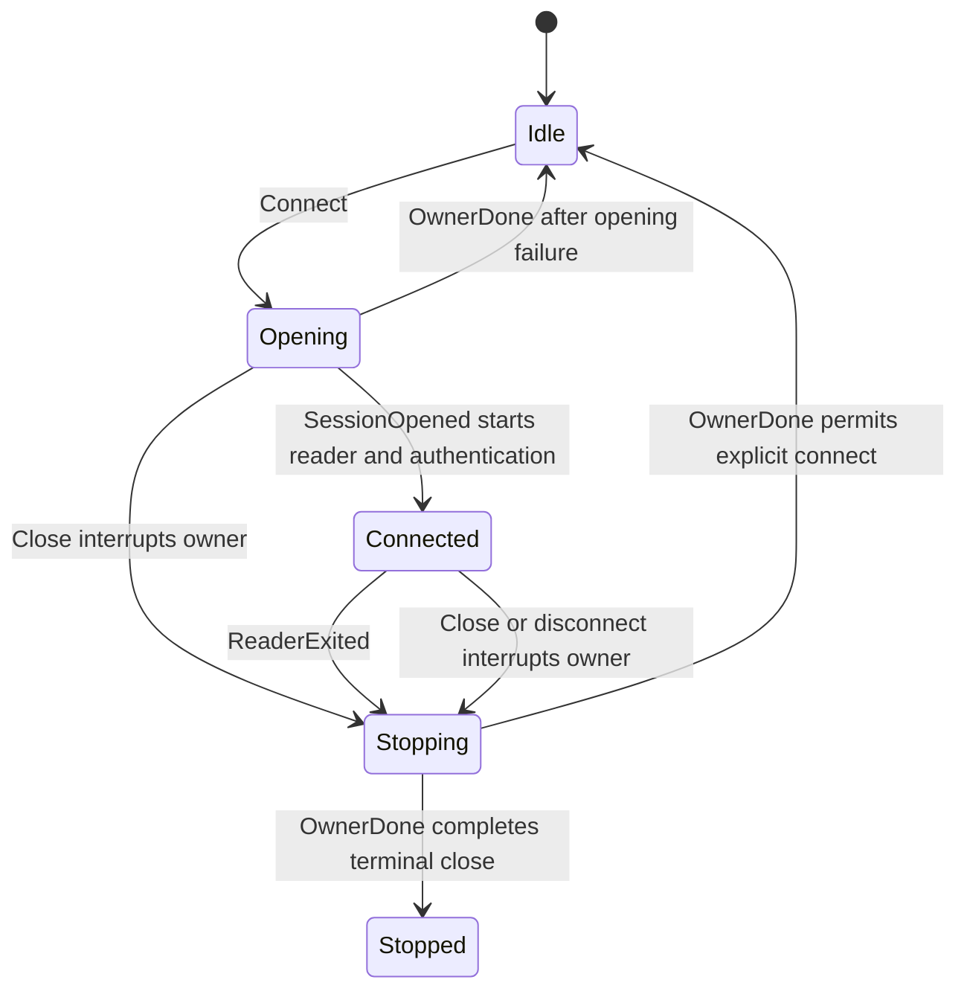

# protocol/socket

_`packages/protocol/src/socket`_

## Purpose

Public socket client and server compatibility surface.

## Public surface

### [`AgentClientOptions`](./lifecycle.ts#L1344)

_Interface_

```ts
export interface AgentClientOptions {
  readonly serverUrl: string;
  readonly agentKey: AgentKey;
  readonly onDisconnect?: (close: CloseInfo) => void;
}
```

Configures an agent client.

### [`ClientConnectError`](./lifecycle.ts#L108)

_TypeAlias_

```ts
export type ClientConnectError<Rpcs extends ProtocolRpc> =
```

Represents client connect error conditions.

### [`ClientDefinitionError`](./lifecycle.ts#L95)

_TypeAlias_

```ts
export type ClientDefinitionError<D extends ClientRpcDefinition> =
```

Represents client definition error conditions.

### [`ClientDefinitionPayload`](./lifecycle.ts#L89)

_TypeAlias_

```ts
export type ClientDefinitionPayload<D extends ClientRpcDefinition> =
```

Represents client definition payload values.

### [`ClientDefinitionSuccess`](./lifecycle.ts#L92)

_TypeAlias_

```ts
export type ClientDefinitionSuccess<D extends ClientRpcDefinition> =
```

Represents client definition success values.

### [`ClientLifecycleOptions`](./lifecycle.ts#L187)

_Interface_

```ts
export interface ClientLifecycleOptions<
  Rpcs extends ProtocolRpc,
  Client extends TypedDispatchMap<Rpcs, RpcClientError>,
> {
  readonly serverUrl: string;
  readonly connectTag: ConnectTag<Rpcs>;
  readonly connectPayload: PayloadForTag<Rpcs, ConnectTag<Rpcs>>;
  readonly openSession: (
    options: ClientSocketSessionOptions,
  ) => Effect.Effect<
    ClientConnection<Client>,
    NotConnectedError,
    Socket.WebSocketConstructor
  >;
  readonly onDisconnect?: (close: CloseInfo) => void;
}
```

Configures client lifecycle.

### [`ClientRpcDefinition`](./lifecycle.ts#L85)

_Interface_

```ts
export interface ClientRpcDefinition<Rpcs extends Rpc.Any = Rpc.Any> {
  readonly clientRpc: Rpcs;
}
```

Describes client rpc definition.

### [`CloseInfo`](./close-info.ts#L5)

_Interface_

```ts
export interface CloseInfo {
  readonly code: number;
  readonly reason: string;
}
```

Describes close info.

### [`connectionId`](./server.ts#L56)

_Variable_

```ts
export const connectionId = Schema.decodeSync(connectionIdSchema)
```

Validates and decodes connection id values.

### [`ConnectionId`](./server.ts#L46)

_TypeAlias_

```ts
export type ConnectionId = string & Brand.Brand<"ConnectionId">;
```

Server-internal WebSocket connection identifier. The socket boundary mints
one at accept time and downstream services carry the brand end-to-end.
Synthetic strings remain valid for conformance fixtures because the brand,
rather than a UUID predicate, is the boundary.

### [`connectionIdSchema`](./server.ts#L49)

_Variable_

```ts
export const connectionIdSchema: Schema.Schema<ConnectionId, string> =
  Schema.String.pipe(
    Schema.brand("ConnectionId"),
    Schema.annotations({ description: "Branded ConnectionId" }),
  )
```

Validates and decodes connection id values.

### [`ConnectResult`](./lifecycle.ts#L101)

_TypeAlias_

```ts
export type ConnectResult = ResultOf<typeof agentConnect>;
```

Represents the result of connect.

### [`DEFAULT_GRACEFUL_CLOSE`](./close-info.ts#L29)

_Variable_

```ts
export const DEFAULT_GRACEFUL_CLOSE: CloseInfo =
```

Default value for graceful close.

### [`extractCloseInfo`](./close-info.ts#L97)

_Function_

```ts
export function extractCloseInfo(
  exit: Exit.Exit<void, Socket.SocketError>,
): CloseInfo
```

Executes the extract close info operation.

**Returns:** The extract close info result.

### [`MoltZapAgentClient`](./lifecycle.ts#L1351)

_Class_

```ts
export class MoltZapAgentClient extends ProtocolClientLifecycle<
  AgentCallableRpcs,
  AgentClientDispatch
> {
  constructor(options: AgentClientOptions) {
    super({
      serverUrl: options.serverUrl,
      connectTag: agentConnect.name,
      connectPayload: {
        agentKey: options.agentKey,
        minProtocol: PROTOCOL_VERSION,
        maxProtocol: PROTOCOL_VERSION,
      },
      openSession: openProtocolAgentClientSocket,
      onDisconnect: options.onDisconnect,
    });
  }

  call<Tag extends AgentCallableTag>(
    tag: Tag,
    payload: PayloadForTag<AgentCallableRpcs, Tag>,
    opts?: RpcCallOptions,
  ): Effect.Effect<
    SuccessForTag<AgentCallableRpcs, Tag>,
    ErrorForTag<AgentCallableRpcs, Tag> | NotConnectedError | RpcTimeoutError
  > {
    const timeoutMs = opts?.timeoutMs ?? RPC_TIMEOUT_MS;
    return this.callEffect(tag, payload, timeoutMs);
  }
}
```

Provides the concrete agent client over the shared socket lifecycle.

### [`MoltZapServer`](./server.ts#L262)

_Class_

```ts
export class MoltZapServer<
  AuthRequires,
  ConnectionProvides,
  ConnectionRequires,
  HookRequires = never,
> {
  private readonly options: MoltZapServerOptions<
    AuthRequires,
    ConnectionProvides,
    ConnectionRequires,
    HookRequires
  >;

  constructor(
    options: MoltZapServerOptions<
      AuthRequires,
      ConnectionProvides,
      ConnectionRequires,
      HookRequires
    >,
  ) {
    this.options = options;
  }

  handleSocket(
    socket: Socket.Socket,
  ): Effect.Effect<
    void,
    Socket.SocketError,
    ServerSocketRequirements<AuthRequires, ConnectionRequires, HookRequires>
  > {
    return Effect.scoped(this.openSocketSession(socket));
  }

  private openSocketSession(
    socket: Socket.Socket,
  ): Effect.Effect<
    void,
    Socket.SocketError,
    ScopedServerSocketRequirements<
      AuthRequires,
      ConnectionRequires,
      HookRequires
    >
  > {
    const options = this.options;
    const runSocketReader = this.runSocketReader.bind(this);
    return Effect.gen(function* () {
      const accepted = yield* makeAcceptedSocketSession(socket);
      const scope = yield* Effect.scope;
      const originator = yield* buildReverseClient({
        write: accepted.write,
        scope,
      });
      const session = makeMoltZapServerSession(accepted, originator);

      yield* options.onOpen(session);
      yield* Effect.logInfo("WebSocket connected").pipe(
        Effect.annotateLogs({ connId: session.connId }),
      );

      const disconnects = yield* Mailbox.make<number>();
      const sinkReady = yield* Deferred.make<ChannelSink>();
      yield* Layer.build(
        makeSocketRpcLayer({
          write: session.write,
          disconnects,
          sinkReady,
          handlers: options.handlers,
          authLayer: options.authLayer(session.connId),
          connectionLayer: options.connectionLayer(session.connId),
        }),
      );
      const serverSink = yield* Deferred.await(sinkReady);
      const reader = runMuxReader(
        socket,
        { server: serverSink, client: session.originator.sink },
        disconnects,
      );
      yield* runSocketReader(reader, session);
    }).pipe(Effect.withSpan("MoltZapServer.openSocketSession"));
  }

  private runSocketReader(
    reader: Effect.Effect<
      void,
      Socket.SocketError,
      ServerSocketRequirements<AuthRequires, ConnectionRequires, HookRequires>
    >,
    session: MoltZapServerSession,
  ): Effect.Effect<
    void,
    Socket.SocketError,
    ServerSocketRequirements<AuthRequires, ConnectionRequires, HookRequires>
  > {
    const options = this.options;
    return Effect.raceFirst(
      reader,
      Deferred.await(session.closeRequested),
    ).pipe(
      Effect.onExit((exit) =>
        Effect.gen(function* () {
          yield* options.onClose(exit, session);
          if (Exit.isFailure(exit)) {
            yield* Effect.logWarning("WebSocket error").pipe(
              Effect.annotateLogs({
                connId: session.connId,
                cause: Cause.pretty(exit.cause),
              }),
            );
          }
          yield* Effect.logInfo("WebSocket disconnected").pipe(
            Effect.annotateLogs({ connId: session.connId }),
          );
        }),
      ),
    );
  }
}
```

Implements molt zap server.

### [`MoltZapServerOptions`](./server.ts#L82)

_Interface_

```ts
export interface MoltZapServerOptions<
  AuthRequires,
  ConnectionProvides,
  ConnectionRequires,
  HookRequires = never,
> {
  readonly handlers: ServerHandlers;
  readonly authLayer: (
    connId: ConnectionId,
  ) => Layer.Layer<ServerRequirementMiddleware, never, AuthRequires>;
  readonly connectionLayer: (
    connId: ConnectionId,
  ) => Layer.Layer<ConnectionProvides, never, ConnectionRequires>;
  readonly onOpen: (
    session: MoltZapServerSession,
  ) => Effect.Effect<void, never, HookRequires>;
  readonly onClose: (
    exit: Exit.Exit<void, Socket.SocketError>,
    session: MoltZapServerSession,
  ) => Effect.Effect<void, never, HookRequires>;
}
```

Configures molt zap server.

### [`MoltZapServerSession`](./server.ts#L67)

_Interface_

```ts
export interface MoltZapServerSession {
  readonly connId: ConnectionId;
  readonly write: ServerSocketWrite;
  readonly closeRequested: Deferred.Deferred<undefined>;
  readonly shutdown: Effect.Effect<void>;
  readonly originator: ReverseClient;
}
```

Describes molt zap server session.

### [`ProtocolClientLifecycle`](./lifecycle.ts#L545)

_Class_

```ts
export class ProtocolClientLifecycle<
  Rpcs extends ProtocolRpc,
  Client extends TypedDispatchMap<Rpcs, RpcClientError>,
> {
  private readonly connectionRef: Ref.Ref<ClientConnection<Client> | null>;
  private readonly commands: Mailbox.Mailbox<
    ClientLifecycleCommand<Rpcs, Client>
  >;
  private readonly runtime: ManagedRuntime.ManagedRuntime<
    Socket.WebSocketConstructor,
    never
  >;
  private readonly subscribers: SubscriberRegistry;
  private readonly controllerDone: Deferred.Deferred<undefined>;
  private readonly closeCompletion: Deferred.Deferred<undefined>;
  private readonly options: ClientLifecycleOptions<Rpcs, Client>;
  private closed = false;
  private helloResult: ConnectResult | null = null;

  protected constructor(options: ClientLifecycleOptions<Rpcs, Client>) {
    this.options = options;
    this.runtime = ManagedRuntime.make(
      Layer.merge(
        NodeSocket.layerWebSocketConstructor,
        clientRuntimeLoggerLayer,
      ),
    );
    const initialized = this.runtime.runSync(
      Effect.gen(function* () {
        const connectionRef = yield* Ref.make<ClientConnection<Client> | null>(
          null,
        );
        const commands =
          yield* Mailbox.make<ClientLifecycleCommand<Rpcs, Client>>();
        const subscribers = yield* makeNotificationSubscriberRegistry<
          NotConnectedError,
          AnyNotificationDefinition
        >({
          closeCause: makeNotConnectedError,
          logPrefix: "subscriber",
          spanName: "makeSubscriberRegistry",
        });
        const controllerDone = yield* Deferred.make<undefined>();
        const closeCompletion = yield* Deferred.make<undefined>();
        return {
          connectionRef,
          commands,
          subscribers,
          controllerDone,
          closeCompletion,
        };
      }),
    );
    this.connectionRef = initialized.connectionRef;
    this.commands = initialized.commands;
    this.subscribers = initialized.subscribers;
    this.controllerDone = initialized.controllerDone;
    this.closeCompletion = initialized.closeCompletion;
    this.runtime.runFork(this.runController());
  }

  get helloOk(): ConnectResult | null {
    return this.helloResult;
  }

  connect(): Effect.Effect<ConnectResult, ClientConnectError<Rpcs>> {
    return Effect.suspend(() =>
      this.closed ? Effect.fail(makeNotConnectedError()) : this.connectEffect(),
    );
  }

  subscribe<
    D extends AnyNotificationDefinition,
    R extends NotificationParamsOf<D>,
  >(
    definition: D,
    refinement: (params: NotificationParamsOf<D>) => params is R,
  ): Stream.Stream<R, NotConnectedError>;
  subscribe<D extends AnyNotificationDefinition>(
    definition: D,
    refinement?: (params: NotificationParamsOf<D>) => boolean,
  ): Stream.Stream<NotificationParamsOf<D>, NotConnectedError>;
  subscribe<D extends AnyNotificationDefinition>(
    definition: D,
    refinement?: (params: NotificationParamsOf<D>) => boolean,
  ): Stream.Stream<NotificationParamsOf<D>, NotConnectedError> {
    if (refinement === undefined) {
      return notificationSubscribe(this.subscribers, definition);
    }
    return notificationSubscribe(this.subscribers, definition, refinement);
  }

  /**
   * Acquire a notification subscription before exposing its Stream.
   * The returned Stream is ready to receive immediately, and the caller's
   * Scope owns both unregistration and mailbox termination.
   * @param definition Protocol definition to process.
   * @returns The mailbox result.
   */
  subscribeScoped<D extends AnyNotificationDefinition>(
    definition: D,
  ): Effect.Effect<
    Stream.Stream<NotificationParamsOf<D>, NotConnectedError>,
    never,
    Scope.Scope
  > {
    const subscribers = this.subscribers;
    return Effect.gen(function* () {
      const mailbox = yield* Mailbox.make<
        NotificationParamsOf<D>,
        NotConnectedError
      >(SCOPED_SUBSCRIPTION_CAPACITY);
      const subscription = yield* subscribers.register(definition, {
        onFrame: (params) => mailbox.offer(params).pipe(Effect.asVoid),
        onClose: (cause) => mailbox.fail(cause).pipe(Effect.asVoid),
      });
      yield* Effect.addFinalizer(() =>
        subscription.unregister.pipe(
          Effect.zipRight(mailbox.end),
          Effect.asVoid,
```

Serializes connection generations through one controller. Each generation
has one scoped owner that acquires the socket, runs its reader, and reports
`OwnerDone` only after every session finalizer has completed. The start gate
prevents an acquired reader from running unless its generation is still
current.



### [`ReverseClient`](./server.ts#L172)

_Interface_

```ts
export interface ReverseClient {
  readonly call: <Tag extends ReverseTag>(
    tag: Tag,
    payload: PayloadForTag<ReverseRpcs, Tag>,
  ) => Effect.Effect<
    SuccessForTag<ReverseRpcs, Tag>,
    ErrorForTag<ReverseRpcs, Tag> | ReverseCallError
  >;
  readonly notify: <D extends AnyNotificationDefinition>(
    definition: D,
    params: NotificationPayloadOf<D>,
  ) => Effect.Effect<void, ReverseCallError>;
  readonly sink: ChannelSink;
}
```

Describes reverse client.

### [`RpcCallOptions`](./lifecycle.ts#L80)

_Interface_

```ts
export interface RpcCallOptions {
  readonly timeoutMs?: number;
}
```

Configures rpc call.

## Files

- `close-info.ts`
- `lifecycle.ts`
- `server.ts`
