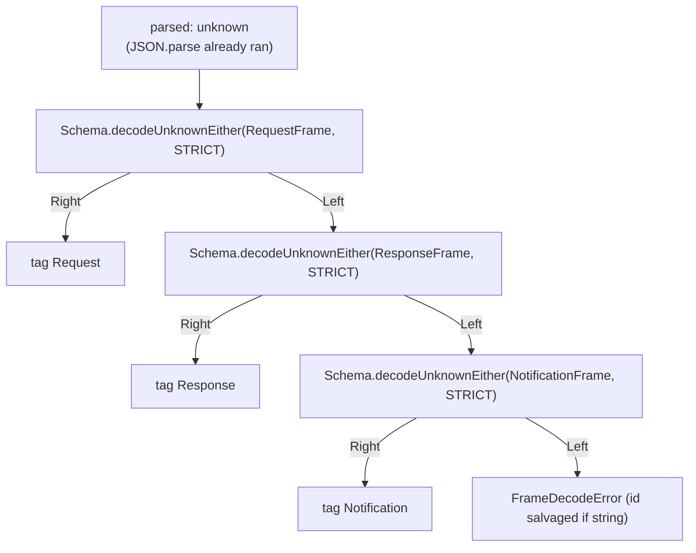
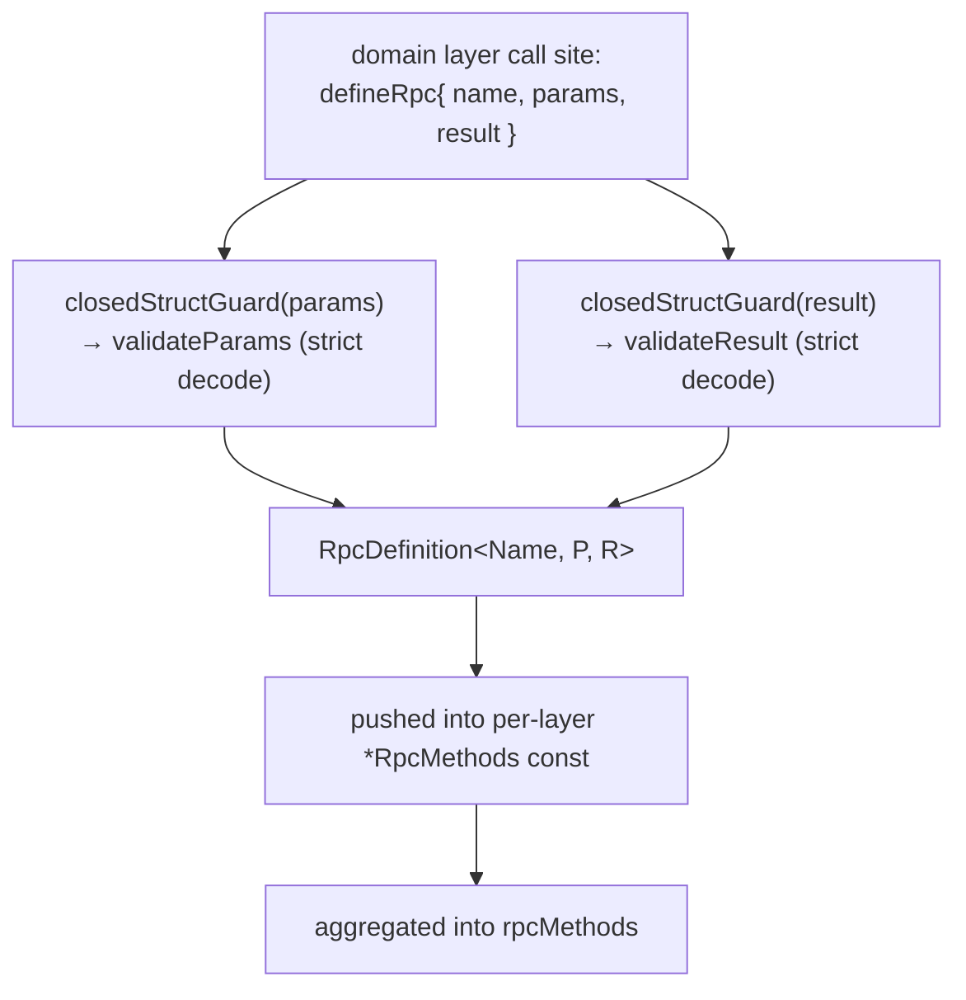
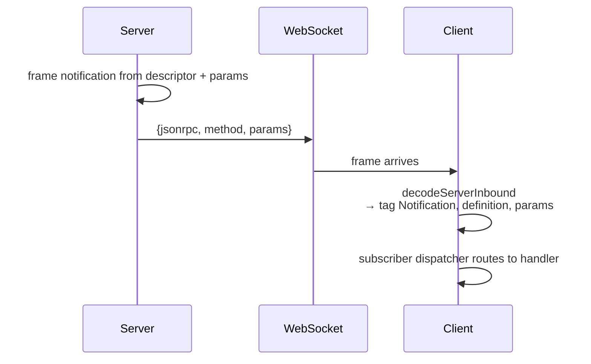

# protocol/transport

_`packages/protocol/src/transport`_

## Purpose

Public barrel for JSON-RPC transport descriptors and runtime helpers.

## Public surface

### [`AgentClaimed`](./principal.ts#L73)

_Class_

```ts
export class AgentClaimed extends Context.Tag(
  "@moltzap/protocol/requirement/AgentClaimed",
)<AgentClaimed, PrincipalMarker>() {
  static get errors() {
    return [ForbiddenError] as const;
  }
}
```

Refinement requirement (agent-only): the agent arm must be claimed/active.
Type-paired with AgentPrincipal — the server reads
`connection.auth.agentStatus`; it is meaningless without a preceding agent
principal. Fails `Forbidden` on a not-yet-claimed agent.

### [`AgentPrincipal`](./principal.ts#L46)

_Class_

```ts
export class AgentPrincipal extends Context.Tag(
  "@moltzap/protocol/requirement/AgentPrincipal",
)<AgentPrincipal, PrincipalMarker>() {
  static get errors() {
    return principalGateErrorClasses;
  }
}
```

Principal requirement: narrow the live connection to the agent arm. The first
element of an agent-callable method's `requires`. Fails `Unauthorized` /
`Forbidden` (the principal-gate errors) on a non-agent arm.

### [`AlreadyConnected`](./wire-errors.ts#L76)

_Class_

```ts
export class AlreadyConnected extends Schema.TaggedError<AlreadyConnected>()(
  "AlreadyConnected",
  { ...errorPayloadFields, principal: Schema.Literal("agent", "app") },
) {
  static readonly message =
    "Principal already has an active connection. Disconnect the prior session first.";
}
```

A principal (agent or app) already holds an active connection. The
`principal` discriminator names which arm the conflict is on.

### [`AppPrincipal`](./principal.ts#L59)

_Class_

```ts
export class AppPrincipal extends Context.Tag(
  "@moltzap/protocol/requirement/AppPrincipal",
)<AppPrincipal, PrincipalMarker>() {
  static get errors() {
    return principalGateErrorClasses;
  }
}
```

Principal requirement: narrow the live connection to the app arm. The first
element of an app-callable method's `requires`. Fails `Unauthorized` /
`Forbidden` on a non-app arm.

### [`CallErrorsOf`](./method.ts#L181)

_TypeAlias_

```ts
export type CallErrorsOf<
  D extends RpcDefinition<
    string,
    Schema.Schema.AnyNoContext,
    Schema.Schema.AnyNoContext
  >,
> =
```

The full typed error channel of a per-method call: the method's handler-domain
errors, every requirement's declared errors, plus the always-possible
transport errors. This is exactly what the typed client surfaces on
`client["method/name"](payload)`'s Effect — the same union the wire
`errorSchema` decodes, plus transport.

### [`ChannelProtocol`](./mux.ts#L284)

_Interface_

```ts
export interface ChannelProtocol<Impl> {
  readonly impl: Impl;
  readonly sink: ChannelSink;
}
```

A built channel protocol: the exact impl record the corresponding
`Protocol.make` callback returns, plus the ChannelSink the
demux registers so inbound frames on this channel reach the engine.
The two are split so the `Protocol.make` callback returns only `impl`
(no excess fields), while the demux owns `sink`.

### [`ChannelSink`](./mux.ts#L116)

_Interface_

```ts
interface ChannelSink {
  readonly parser: RpcSerialization.Parser;
  readonly inject: (frame: unknown) => Effect.Effect<void>;
}
```

The per-channel inbound sinks the demux routes decoded wire strings
into. Each sink owns its endpoint's Parser and the engine-side
`write` injector the Parser feeds.

### [`clientProtocolCanary`](./mux.types-check.ts#L47)

_Variable_

```ts
export const clientProtocolCanary = RpcClient.Protocol.make((write) =>
  clientBuilder(write).pipe(Effect.map((built) => built.impl)),
)
```

### [`ConflictError`](./wire-errors.ts#L57)

_Class_

```ts
export class ConflictError extends Schema.TaggedError<ConflictError>()(
  "Conflict",
  errorPayloadFields,
) {
  static readonly message = "Conflict";
}
```

Conflict on a resource (cross-cutting; e.g., duplicate registration).

### [`DecodedFrame`](./wire.ts#L137)

_TypeAlias_

```ts
export type DecodedFrame =
  | { readonly _tag: "Request"; readonly frame: RequestFrame }
```

### [`DecodedNotification`](./rpc-groups.ts#L54)

_TypeAlias_

```ts
export type DecodedNotification<
  D extends AnyNotificationDefinition,
  R = unknown,
> = D extends AnyNotificationDefinition
```

A decoded notification carries the discriminator + descriptor + typed
params + the original wire `jsonrpc`. It does NOT extend `NotificationFrame`
— re-encoding builds a fresh frame from the descriptor + params, not by
re-serializing this struct, so the strict-additionalProperties wire schema
stays unstuck.

The optional second parameter `R` narrows the `params` field to the refined
type — used by `MoltZapAgentClient.subscribe`'s user-defined-type-guard
overload. The default sentinel `unknown` resolves to the per-branch
`NotificationParamsOf<D>` shape, preserving the one-arg form for every
consumer.

The default uses an `unknown` sentinel rather than `NotificationParamsOf<D>`
because TS does not distribute type-alias defaults through the
`D extends AnyNotificationDefinition` distributive conditional below —
a `NotificationParamsOf<D>` default would resolve once over the input
union and break per-branch params narrowing for `D` unions like
`DispatchesConsumed | DispatchesExpired`. Carrying `R` as a sentinel and
resolving inside the conditional keeps the original `params` shape per
distribution branch when the one-arg form is used.

### [`DecodedRpcRequest`](./rpc-groups.ts#L22)

_TypeAlias_

```ts
export type DecodedRpcRequest<D extends AnyServerRpcDefinition> =
```

### [`decodeFrame`](./wire.ts#L170)

_Function_

```ts
export function decodeFrame(
  parsed: unknown,
): Effect.Effect<DecodedFrame, FrameDecodeError>
```

Classify one already-`JSON.parse`d value as a JSON-RPC Request, Response,
or Notification frame — fail-closed on anything else.

The discrimination runs `Schema.decodeUnknownEither(...,
{ onExcessProperty: "error" })` against each frame schema in precedence order
(Request → Response → Notification). The `{ onExcessProperty: "error" }`
option rejects excess keys: a frame with an extra top-level key fails decode
at EVERY arm and falls through to `FrameDecodeError` — the conformance
`extra-property` / `oversized` mutators depend on this.



### [`decodeNotification`](./rpc-groups.ts#L124)

_Function_

```ts
export function decodeNotification<
  const Definitions extends readonly AnyNotificationDefinition[],
>(
  definitions: Definitions,
  frame: NotificationFrame,
): Effect.Effect<
  DecodedNotification<Definitions[number]>,
  NotificationDecodeError
>
```

### [`decodeRpcRequest`](./rpc-groups.ts#L99)

_Function_

```ts
export function decodeRpcRequest<
  const Definitions extends readonly AnyServerRpcDefinition[],
>(
  definitions: Definitions,
  frame: RequestFrame,
): Effect.Effect<
  DecodedRpcRequest<Definitions[number]>,
  RpcRequestDecodeError
>
```

### [`decodeRpcResult`](./method.ts#L395)

_Function_

```ts
export function decodeRpcResult<
  Name extends string,
  P extends Schema.Schema.AnyNoContext,
  R extends Schema.Schema.AnyNoContext,
>(
  definition: RpcDefinition<Name, P, R>,
  data: unknown,
): Effect.Effect<Schema.Schema.Type<R>, RpcResultDecodeError>
```

### [`defineNotification`](./method.ts#L370)

_Function_

```ts
export function defineNotification<
  Name extends string,
  P extends Schema.Schema.AnyNoContext,
>(def: { name: Name; params: P }): NotificationDefinition<Name, P>
```

Sibling of defineRpc for server-to-client notifications.
Same pipeline minus the result schema — notifications are
fire-and-forget, no `id` field, no `result`.

### [`defineRpc`](./method.ts#L275)

_Function_

```ts
export function defineRpc<
  Name extends string,
  P extends Schema.Schema.AnyNoContext,
  R extends Schema.Schema.AnyNoContext,
  const Requires extends ReadonlyArray<RequirementShape> = readonly [],
  const Errs extends ReadonlyArray<RpcErrorClass> = readonly [],
>(def: {
  name: Name;
  params: P;
  result: R;

  /**
   * REQUIRED. The ordered authority list. The FIRST element is exactly one
   * principal requirement (`AgentPrincipal` | `AppPrincipal`); an optional
   * `AgentClaimed` refinement (agent-only) follows; the rest are capability
   * tags, in run order. The public `network/connect` is the lone method with
   * `requires: []`. Each requirement folds its declared `errors` into the
   * method's effective wire error union.
   */
  requires: Requires;

  /**
   * REQUIRED. The handler-domain tagged-error classes this method can fail
   * with — only what the handler itself raises. The principal-gate errors
   * (`Unauthorized`/`Forbidden` for authenticated methods) and each cap's own
   * `errors` are added automatically. A method with no handler-domain error
   * declares `[]`.
   */
  errors: Errs;
}): RpcDefinition<Name, P, R, Requires, Errs>
```

Create one wire method's frozen descriptor: name, Effect `Schema` shapes,
the effective wire error union, and strict decode-time validators. Every wire
boundary in moltzap is born from a single `defineRpc` call at module-load
time so the strict decoders are built eagerly and the runtime never
re-derives them.



- Every slot is REQUIRED in the handler table; omitting any key fails TS2741
  at the factory call.
- Capabilities are NOT descriptor metadata; `defineRpc` carries only the
  wire shape, and the server's per-method `*AuthMw` runs the caps.
- The validators reject excess keys (`closedStructGuard`), preserving the
  AJV `strict` + `additionalProperties:false` rejection the conformance
  suite's `extra-property` / `oversized` mutators assert.

Method names are branded `JsonRpcMethod&lt;"the.name">` so a runtime
string can never accidentally type-fit a method position. See
`wire.ts → JsonRpcMethod` for the brand.

Sibling: defineNotification — same pipeline minus the
result schema and the error union.

### [`dispatchCall`](./typed-dispatch.ts#L62)

_Function_

```ts
export function dispatchCall<Rpcs extends Rpc.Any, E, K extends Rpcs["_tag"]>(
  map: TypedDispatchMap<Rpcs, E>,
  tag: K,
  payload: PayloadForTag<Rpcs, K>,
): Effect.Effect<SuccessForTag<Rpcs, K>, ErrorForTag<Rpcs, K> | E>
```

Dispatch one call through the typed map at tag `K` — cast-free. `map[tag]` is
the method's typed call; applying it to `payload` yields the per-tag result +
error. Leaf call sites pass a literal tag and recover the precise types; a
caller generic over `K` keeps the correlation because the map is keyed on the
literal tag, not on a widened def union.

### [`DomainErrorsOf`](./method.ts#L157)

_TypeAlias_

```ts
export type DomainErrorsOf<
  D extends RpcDefinition<
    string,
    Schema.Schema.AnyNoContext,
    Schema.Schema.AnyNoContext
  >,
> =
```

The handler-domain error instance union a descriptor declares.

### [`effectiveErrorClasses`](./method.ts#L205)

_Function_

```ts
export function effectiveErrorClasses(
  requires: ReadonlyArray<RequirementShape>,
  handlerErrors: ReadonlyArray<RpcErrorClass>,
): ReadonlyArray<RpcErrorClass>
```

The effective wire-error class list for a method: every requirement's declared
errors (in `requires` order) then the handler-domain errors, deduped by
identity (a class shared across a requirement and the handler list appears
once). This is the single source the wire `errorSchema`, the server gate, and
the typed client all read.

### [`encodeErrorResponse`](./wire.ts#L268)

_Function_

```ts
export function encodeErrorResponse(
  id: JsonRpcId | null,
  error: ResponseFrameError,
): ResponseFrame
```

Public wire-error response encoder. Constructs a JSON-RPC error
response for any wire id (no method binding). Method-tied success
responses are framed by the server engine via the per-method result
schema; this helper is the method-agnostic error path.

### [`ErrorForTag`](./typed-dispatch.ts#L38)

_TypeAlias_

```ts
export type ErrorForTag<
  Rpcs extends Rpc.Any,
  K extends Rpcs["_tag"],
> = Rpc.Error<RpcForTag<Rpcs, K>>;
```

The method's own tagged-error union for one tag (from its `errorSchema`).

### [`errors`](./method.ts#L33)

_Property_

```ts
  readonly errors: ReadonlyArray<RpcErrorClass>;
```

### [`ForbiddenError`](./wire-errors.ts#L41)

_Class_

```ts
export class ForbiddenError extends Schema.TaggedError<ForbiddenError>()(
  "Forbidden",
  errorPayloadFields,
) {
  static readonly message = "Forbidden";
}
```

Authenticated but not authorized for this resource.

### [`FrameDecodeError`](./wire.ts#L142)

_Class_

```ts
export class FrameDecodeError extends Data.TaggedError("FrameDecodeError")<{
  readonly raw: unknown;
  readonly id: JsonRpcId | null;
}> {}
```

### [`InvalidParamsError`](./wire-errors.ts#L65)

_Class_

```ts
export class InvalidParamsError extends Schema.TaggedError<InvalidParamsError>()(
  "InvalidParamsError",
  errorPayloadFields,
) {
  static readonly message = "Invalid params";
}
```

Boundary validation error — params failed schema validation.

### [`isDecodedNotification`](./rpc-groups.ts#L155)

_Function_

```ts
export function isDecodedNotification<D extends AnyNotificationDefinition>(
  definition: D,
  notification: DecodedNotification<AnyNotificationDefinition>,
): notification is DecodedNotification<D>
```

### [`JSON_RPC_VERSION`](./wire.ts#L11)

_Variable_

```ts
export const JSON_RPC_VERSION = "2.0" as const
```

### [`JsonRpcId`](./wire.ts#L18)

_TypeAlias_

```ts
export type JsonRpcId = Schema.Schema.Type<typeof JsonRpcIdSchema>;
```

### [`jsonRpcMethod`](./wire.ts#L29)

_Function_

```ts
export const jsonRpcMethod = <const Name extends string>(
  method: Name,
): JsonRpcMethod<Name>
```

Internal factory for descriptor construction (`defineRpc`,
`defineNotification`). Not on the package barrel — callers pass plain
strings to frame builders, which brand internally.

### [`JsonRpcMethod`](./wire.ts#L19)

_TypeAlias_

```ts
export type JsonRpcMethod<Name extends string = string> = Name &
```

### [`key`](./method.ts#L32)

_Property_

```ts
  readonly key: string;
  readonly errors: ReadonlyArray<RpcErrorClass>;
```

### [`makeClientChannelProtocol`](./mux.ts#L346)

_Function_

```ts
export function makeClientChannelProtocol(options: {
  readonly channel: MuxChannel;
  readonly write: WireWrite;
}): (
  write: (data: FromServerEncoded) => Effect.Effect<void>,
)
```

Build the client-side `RpcClient.Protocol` impl over one socket
channel. Mirrors makeServerChannelProtocol for the client
engine: `send` encodes a `FromClientEncoded` through the channel's
Parser and writes the enveloped wire string; the sink's `inject`
feeds decoded inbound `FromServerEncoded` frames into the engine. The
client engine has no `disconnects` Mailbox — socket close fails the
client call channel through the underlying socket.

### [`makeServerChannelProtocol`](./mux.ts#L301)

_Function_

```ts
export function makeServerChannelProtocol(options: {
  readonly channel: MuxChannel;
  readonly write: WireWrite;
  readonly disconnects: Mailbox.Mailbox<number>;
}): (
  write: (clientId: number, data: FromClientEncoded) => Effect.Effect<void>,
)
```

Build the server-side `RpcServer.Protocol` impl over one socket
channel. Pass the resulting builder the engine's `write` injector
(the argument `RpcServer.Protocol.make` hands its callback); the
builder returns the impl record `Protocol.make` expects plus the
ChannelSink the demux registers.

`send` encodes a `FromServerEncoded` through the channel's Parser and
writes the enveloped wire string. The sink's `inject` feeds decoded
inbound `FromClientEncoded` frames into the engine via `write`.
Socket close is surfaced through the shared `disconnects` Mailbox.

### [`makeTypedTransportCall`](./typed-dispatch.ts#L82)

_Function_

```ts
export function makeTypedTransportCall<Rpcs extends Rpc.Any, TransportError>(
  client: TypedDispatchMap<Rpcs, RpcClientError>,
  onTransportError: () => TransportError,
): <Tag extends Rpcs["_tag"]>(
  tag: Tag,
  payload: PayloadForTag<Rpcs, Tag>,
)
```

Bind a non-flat `RpcClient` (viewed as a TypedDispatchMap) into a
per-method `call(tag, payload)` that folds the engine's transport-level
`RpcClientError` (a closed socket) into the caller's own `TransportError`.

Generic over `Rpcs`: the body type-checks `dispatchCall` against the abstract
`SuccessForTag&lt;Rpcs, Tag>`, so the per-tag success reduces at every concrete
instantiation — including the combined callback ∪ notification group — with
no value-boundary cast. Every endpoint that stands a non-flat client (the
agent + app clients, the server's reverse client) shares this one bridge, so
the transport-error fold is written once.

### [`MalformedFrameError`](./wire-errors.ts#L89)

_Class_

```ts
export class MalformedFrameError extends Schema.TaggedError<MalformedFrameError>()(
  "MalformedFrameError",
  {
    raw: Schema.String,
    cause: Schema.optional(Schema.Unknown),
  },
) {}
```

Inbound frame failed to parse as JSON or did not match the expected shape.
Transport-internal — not a wire `error` union member (never crosses the wire
as a method failure).

### [`MUX_CLIENT_ID`](./mux.ts#L244)

_Variable_

```ts
const MUX_CLIENT_ID = 0
```

The single physical client every endpoint on one socket shares. The
server `Protocol` keys per-client state by id; a mux carries one
socket, so every channel reports the same id.

### [`MuxChannel`](./mux.ts#L51)

_TypeAlias_

```ts
export type MuxChannel = "c2s" | "s2c";

/**
 * The channel-tagged envelope every multiplexed frame rides in. `ch`
 * routes the frame to one endpoint's Parser; `f` is that endpoint's
 * encoded wire string (a `JSON.stringify`'d RPC frame). The mux owns
 * this framing, so the per-endpoint Parser runs with
 * `includesFraming=false`.
 */
const MuxEnvelopeSchema = Schema.Struct({
  ch: Schema.Literal("c2s", "s2c"),
  f: Schema.String,
});
```

A logical endpoint's slot on the shared socket. `c2s` carries the
client→server RPC group; `s2c` carries the server-originated callback
group (the role-inverted endpoint). Adding a logical endpoint adds a
channel here so the demux stays exhaustive.

### [`MuxEnvelope`](./mux.ts#L70)

_TypeAlias_

```ts
export type MuxEnvelope = typeof MuxEnvelopeSchema.Type;

const decodeEnvelope = Schema.decodeUnknownEither(MuxEnvelopeSchema);
```

The envelope's decoded form. `ch` is narrowed to MuxChannel;
`f` is the per-endpoint encoded wire string awaiting that endpoint's
Parser.

### [`NotConnectedError`](./rpc-errors.ts#L15)

_Class_

```ts
export class NotConnectedError extends Data.TaggedError("NotConnectedError")<{
  readonly message: string;
}> {}
```

The socket is not in the OPEN state when an RPC was attempted.

### [`NotFoundError`](./wire-errors.ts#L49)

_Class_

```ts
export class NotFoundError extends Schema.TaggedError<NotFoundError>()(
  "NotFound",
  errorPayloadFields,
) {
  static readonly message = "Not found";
}
```

Resource not found (cross-cutting; domain-specific NotFound errors live with their domain).

### [`NotificationDecodeError`](./rpc-groups.ts#L95)

_TypeAlias_

```ts
export type NotificationDecodeError =
  | UnknownNotificationMethodError
  | InvalidNotificationParamsError;

export function decodeRpcRequest<
  const Definitions extends readonly AnyServerRpcDefinition[],
>(
  definitions: Definitions,
  frame: RequestFrame,
): Effect.Effect<
  DecodedRpcRequest<Definitions[number]>,
  RpcRequestDecodeError
> {
  const definition = definitions.find((d) => d.name === frame.method);
  if (definition === undefined) {
    return Effect.fail(new UnknownRpcMethodError({ frame }));
  }
  const params = frame.params ?? {};
  if (!definition.validateParams(params)) {
    return Effect.fail(new InvalidRpcParamsError({ frame, definition }));
  }
  return Effect.succeed({
    frame,
    id: frame.id,
    definition,
    params,
  } as DecodedRpcRequest<Definitions[number]>);
}
```

### [`NotificationDefinition`](./method.ts#L348)

_Interface_

```ts
export interface NotificationDefinition<
  Name extends string,
  P extends Schema.Schema.AnyNoContext,
> {
  readonly name: JsonRpcMethod<Name>;
  readonly paramsSchema: P;
  readonly validateParams: (data: unknown) => data is Schema.Schema.Type<P>;
}
```

A frozen descriptor for one server-to-client notification.
Notifications are fire-and-forget — no `id`, no response, no
pending-call registry. The transport-side runtimes don't track
them; consumers subscribe externally via per-method handlers.



Descriptor role at the transport layer: the wire `name` + params schema +
strict decode-time validator. Routing semantics live in consumers (e.g.
`@moltzap/client/runtime/subscribers.ts`).

### [`notificationFrame`](./wire.ts#L276)

_Function_

```ts
export function notificationFrame<
  Name extends string,
  P extends Schema.Schema.AnyNoContext,
>(
  definition: NotificationDefinition<Name, P>,
  params: Schema.Schema.Type<P>,
): NotificationFrame &
```

### [`NotificationFrame`](./wire.ts#L94)

_TypeAlias_

```ts
export type NotificationFrame = Schema.Schema.Type<
  typeof NotificationFrameSchema
>;
```

### [`notificationFrameSchema`](./wire.ts#L106)

_Function_

```ts
export function notificationFrameSchema(): typeof NotificationFrameSchema
```

### [`NotificationParamsOf`](./method.ts#L358)

_TypeAlias_

```ts
export type NotificationParamsOf<
  D extends NotificationDefinition<string, Schema.Schema.AnyNoContext>,
> =
```

Type-only accessor for a notification's params payload.

### [`ParamsOf`](./method.ts#L112)

_TypeAlias_

```ts
export type ParamsOf<
  D extends RpcDefinition<
    string,
    Schema.Schema.AnyNoContext,
    Schema.Schema.AnyNoContext
  >,
> =
```

Type-only accessor for a definition's params payload.

### [`PayloadForTag`](./typed-dispatch.ts#L26)

_TypeAlias_

```ts
export type PayloadForTag<
  Rpcs extends Rpc.Any,
  K extends Rpcs["_tag"],
> = Rpc.PayloadConstructor<RpcForTag<Rpcs, K>>;
```

The payload type one tag accepts.

### [`principalGateErrorClasses`](./wire-errors.ts#L98)

_Variable_

```ts
export const principalGateErrorClasses = [
  UnauthorizedError,
  ForbiddenError,
] as const
```

The principal-gate error classes every authenticated method's gate can fail with.

### [`PrincipalMarker`](./principal.ts#L37)

_Interface_

```ts
export interface PrincipalMarker {
  readonly _principalMarker: never;
}
```

Vestigial service type for the principal requirement tags. The tags are pure
markers in a `requires` list — nothing provides or reads a value through their
`Context.Tag` slot (the principal gate has no `provides`; the request
principal rides `CurrentPrincipal`). A dedicated empty marker keeps the wire
layer free of the domain `Principal` type without weakening the tag identity
the classifiers discriminate on.

### [`PrincipalRequirement`](./principal.ts#L82)

_TypeAlias_

```ts
export type PrincipalRequirement = typeof AgentPrincipal | typeof AppPrincipal;
```

The two principal-requirement tags — the only valid `requires` heads.

### [`requestFrame`](./wire.ts#L206)

_Function_

```ts
export function requestFrame<
  Name extends string,
  P extends Schema.Schema.AnyNoContext,
  R extends Schema.Schema.AnyNoContext,
>(
  id: string,
  definition: RpcDefinition<Name, P, R>,
  params: Schema.Schema.Type<P>,
): RequestFrame &
```

### [`RequestFrame`](./wire.ts#L92)

_TypeAlias_

```ts
export type RequestFrame = Schema.Schema.Type<typeof RequestFrameSchema>;
```

### [`requestFrameSchema`](./wire.ts#L98)

_Function_

```ts
export function requestFrameSchema(): typeof RequestFrameSchema
```

### [`RequirementErrorsOf`](./method.ts#L150)

_TypeAlias_

```ts
export type RequirementErrorsOf<
  Requires extends ReadonlyArray<RequirementShape>,
> = InstanceType<Requires[number]["errors"][number]>;
```

The union of every requirement's error instances for a `requires` tuple: each
requirement (principal, agent-claimed refinement, capability) declares its own
`static errors`, read directly off each entry's RequirementShape (no
structural cast). The lone empty `requires` (`network/connect`) yields `never`.

### [`RequirementShape`](./method.ts#L31)

_TypeAlias_

```ts
export type RequirementShape = {
  readonly key: string;
  readonly errors: ReadonlyArray<RpcErrorClass>;
};
```

The STRUCTURAL shape of one `requires` entry at the wire layer: a requirement
tag carries a `key` (its `Context.Tag` identifier) and a `static errors` tuple
the descriptor folds into the wire error union. The descriptor factory needs
only this shape — it reads `.errors` and treats the tag as an opaque marker.

The GENUINE closed union of the actual requirement tags (principal | claimed |
capability) and the compile-error-on-unregistered-cap guarantee live in the
engine layer (`engine/requirements.ts` → `Requirement` / `capRequirementsOf`),
above the domains: that is where a cap with no registered middleware fails to
compile, at the engine-member binding. Keeping the wire-layer constraint
structural is what lets the domains call `defineRpc` without the wire layer
importing the capability tags upward.

### [`ResponseErrorsOf`](./method.ts#L142)

_TypeAlias_

```ts
export type ResponseErrorsOf = NotConnectedError | RpcTimeoutError;

/**
 * The union of every requirement's error instances for a `requires` tuple: each
 * requirement (principal, agent-claimed refinement, capability) declares its own
 * `static errors`, read directly off each entry's {@link RequirementShape} (no
 * structural cast). The lone empty `requires` (`network/connect`) yields `never`.
 */
export type RequirementErrorsOf<
  Requires extends ReadonlyArray<RequirementShape>,
> = InstanceType<Requires[number]["errors"][number]>;
```

The transport-level errors any descriptor-driven call can surface regardless
of the method: the socket was not connected, or the response frame never
arrived. They originate at the client transport, not the handler, so they are
NOT in a descriptor's effective error union; the typed client adds them to
every per-method call's error channel.

### [`responseFrame`](./wire.ts#L243)

_Function_

```ts
export function responseFrame(
  id: string | null,
  body: ResponseFrameBody,
): ResponseFrame
```

### [`ResponseFrame`](./wire.ts#L93)

_TypeAlias_

```ts
export type ResponseFrame = Schema.Schema.Type<typeof ResponseFrameSchema>;
```

### [`ResponseFrameBody`](./wire.ts#L239)

_TypeAlias_

```ts
export type ResponseFrameBody =
  | { result: unknown }
```

### [`responseFrameSchema`](./wire.ts#L102)

_Function_

```ts
export function responseFrameSchema(): typeof ResponseFrameSchema
```

### [`ResultOf`](./method.ts#L124)

_TypeAlias_

```ts
export type ResultOf<
  D extends RpcDefinition<
    string,
    Schema.Schema.AnyNoContext,
    Schema.Schema.AnyNoContext
  >,
> =
```

Type-only accessor for a definition's result payload.

### [`routeInbound`](./mux.ts#L216)

_Function_

```ts
export function routeInbound(
  raw: string | Uint8Array,
  sinks: Partial<Record<MuxChannel, ChannelSink>>,
  reply?: WireWrite,
): Effect.Effect<void>
```

### [`RpcDefinition`](./method.ts#L54)

_Interface_

```ts
export interface RpcDefinition<
  Name extends string,
  P extends Schema.Schema.AnyNoContext,
  R extends Schema.Schema.AnyNoContext,
  Requires extends
    ReadonlyArray<RequirementShape> = ReadonlyArray<RequirementShape>,
  Errs extends ReadonlyArray<RpcErrorClass> = ReadonlyArray<RpcErrorClass>,
> {
  readonly name: JsonRpcMethod<Name>;
  readonly paramsSchema: P;
  readonly resultSchema: R;

  /**
   * The ordered authority list. The FIRST element is exactly one principal
   * requirement (`AgentPrincipal` | `AppPrincipal`); an optional `AgentClaimed`
   * refinement (agent-only) follows; the rest are capability tags, in run
   * order. Empty for the lone unauthenticated method (`network/connect`). The
   * client groups partition on the head; the server stacks one `RpcMiddleware`
   * per element; each element's `errors` fold into the wire error union.
   */
  readonly requires: Requires;

  /**
   * The handler-domain tagged-error classes this method can fail with — only
   * the errors the HANDLER raises, not the requirement (principal/cap) errors
   * (those come from each requirement's own `errors`). The method's effective
   * wire error union is the dedup'd union of both; see
   * {@link effectiveErrorClasses} / {@link errorSchema}.
   */
  readonly errors: Errs;

  /**
   * The wire `error` Schema the `@effect/rpc` engine encodes/decodes this
   * method's failures against: `Schema.Union(...effectiveErrorClasses)`. The
   * union discriminates on each error's `_tag`, so the per-method decode picks
   * the exact tagged-error class with no code lookup and no global registry.
   * `Schema.Never` when the method has no effective errors (only the lone
   * unauthenticated `network/connect`, which still inherits transport errors at
   * the client surface via {@link ResponseErrorsOf}).
   */
  readonly errorSchema: Schema.Schema.AnyNoContext;

  /**
   * The wire `error` Schema for the HANDLER-DOMAIN errors ALONE
   * (`Schema.Union(...errors)`) — what the server engine member sets as its
   * `error`. The principal-gate and cap errors are NOT here; they ride each
   * stacked middleware's own `failure`, and the engine unions them into the
   * method's error (`Rpc.ErrorSchema = _Error | _Middleware`). The catalog/client
   * group uses the full {@link errorSchema} (the client carries no middleware,
   * so it needs the aggregate union for its typed error channel).
   */
  readonly handlerErrorSchema: Schema.Schema.AnyNoContext;

  readonly validateParams: (data: unknown) => data is Schema.Schema.Type<P>;
  readonly validateResult: (data: unknown) => data is Schema.Schema.Type<R>;
}
```

Typed manifest for one RPC method: wire name + Effect `Schema` shapes +
decode-time validators + the `requires` authority list. Type-only payload
accessors are exposed via `ParamsOf&lt;D>`/`ResultOf&lt;D>` — there is no
runtime `Params`/`Result` property.

The `paramsSchema`/`resultSchema` are Effect `Schema` values (`P`/`R extends
Schema.Schema.AnyNoContext` — the wire schemas have no decode context).
`validateParams`/`validateResult` are strict, excess-rejecting type guards
(`closedStructGuard`): a bare `Schema.is` would ACCEPT extra keys, so the
guards wrap a `Schema.decodeUnknownEither(schema)(value, { onExcessProperty:
"error" })` to reject excess properties at the trust boundary.

`requires` is the ONE authority axis: the client groups partition on its head
(the principal requirement), the server stacks one `RpcMiddleware` per
requirement, and the descriptor folds each requirement's `errors` into the
effective wire error union.

### [`RpcErrorClass`](./method.ts#L14)

_TypeAlias_

```ts
export type RpcErrorClass = Schema.Schema.AnyNoContext &
  (new (...args: never[]) => { readonly _tag: string });
```

A wire-discriminable tagged-error CLASS: a `Schema.TaggedError`-derived class
usable both as the runtime constructor and as a `Schema` for the wire `error`
union. The `_tag` literal is the union discriminant the engine decodes against;
a method's `error` Schema is `Schema.Union(...effective error classes)`, so the
per-method decode picks the right class by `_tag` with no code lookup.

### [`RpcErrorPayload`](./wire-errors.ts#L27)

_Interface_

```ts
export interface RpcErrorPayload {
  readonly message?: string;
  readonly data?: unknown;
}
```

The supplemental-payload type a tagged-error instance accepts at construction:
an optional overriding message and optional `data`.

### [`RpcForTag`](./typed-dispatch.ts#L20)

_TypeAlias_

```ts
export type RpcForTag<
  Rpcs extends Rpc.Any,
  K extends Rpcs["_tag"],
> = Rpc.ExtractTag<Rpcs, K>;
```

The `Rpc` member of `Rpcs` whose tag is `K`.

### [`RpcRequestDecodeError`](./rpc-groups.ts#L78)

_TypeAlias_

```ts
export type RpcRequestDecodeError =
  | UnknownRpcMethodError
  | InvalidRpcParamsError;

class UnknownNotificationMethodError extends Data.TaggedError(
  "UnknownNotificationMethodError",
)<{
  readonly frame: NotificationFrame;
}> {}
```

### [`RpcResultDecodeError`](./method.ts#L384)

_Class_

```ts
export class RpcResultDecodeError extends Data.TaggedError(
  "RpcResultDecodeError",
)<{
  readonly definition: RpcDefinition<
    string,
    Schema.Schema.AnyNoContext,
    Schema.Schema.AnyNoContext
  >;
  readonly data: unknown;
}> {}
```

### [`RpcTimeoutError`](./rpc-errors.ts#L20)

_Class_

```ts
export class RpcTimeoutError extends Data.TaggedError("RpcTimeoutError")<{
  readonly method: JsonRpcMethod;
  readonly timeoutMs: number;
}> {}
```

The RPC exceeded the per-call timeout without a response frame.

### [`runMuxReader`](./mux.ts#L382)

_Function_

```ts
export function runMuxReader(
  socket: Socket.Socket,
  sinks: Partial<Record<MuxChannel, ChannelSink>>,
  disconnects: Mailbox.Mailbox<number>,
  reply?: WireWrite,
): Effect.Effect<void, Socket.SocketError>
```

Drive the shared socket's read loop, routing every inbound chunk to
the channel sink named by its envelope. The owner forks this and
surfaces socket close to the server engine's `disconnects` Mailbox so
per-client teardown runs.

### [`serverProtocolCanary`](./mux.types-check.ts#L37)

_Variable_

```ts
export const serverProtocolCanary = RpcServer.Protocol.make((write) =>
  serverBuilder(write).pipe(Effect.map((built) => built.impl)),
)
```

### [`SuccessForTag`](./typed-dispatch.ts#L32)

_TypeAlias_

```ts
export type SuccessForTag<
  Rpcs extends Rpc.Any,
  K extends Rpcs["_tag"],
> = Rpc.Success<RpcForTag<Rpcs, K>>;
```

The success type one tag returns.

### [`TypedDispatchMap`](./typed-dispatch.ts#L49)

_TypeAlias_

```ts
export type TypedDispatchMap<Rpcs extends Rpc.Any, E> = {
  readonly [K in Rpcs["_tag"]]: (
    payload: PayloadForTag<Rpcs, K>,
  ) => Effect.Effect<SuccessForTag<Rpcs, K>, ErrorForTag<Rpcs, K> | E>;
};
```

The per-method dispatch map a non-flat `RpcClient.make(group)` conforms to:
keyed by every member tag, each value the method's typed call
`(payload) => Effect&lt;success, methodErrors | E>`. `E` is the engine's
transport error (`RpcClientError`) the caller folds into its own channel.

### [`UnauthorizedError`](./wire-errors.ts#L33)

_Class_

```ts
export class UnauthorizedError extends Schema.TaggedError<UnauthorizedError>()(
  "Unauthorized",
  errorPayloadFields,
) {
  static readonly message = "Not authenticated. Send network/connect first.";
}
```

Not authenticated — `network/connect` has not run on this socket.

### [`validateNotificationFrame`](./wire.ts#L132)

_Function_

```ts
export const validateNotificationFrame = (v: unknown): v is NotificationFrame
```

### [`validateRequestFrame`](./wire.ts#L128)

_Function_

```ts
export const validateRequestFrame = (v: unknown): v is RequestFrame
```

### [`validateResponseFrame`](./wire.ts#L130)

_Function_

```ts
export const validateResponseFrame = (v: unknown): v is ResponseFrame
```

### [`WireWrite`](./mux.ts#L79)

_TypeAlias_

```ts
export type WireWrite = (
  chunk: string,
) => Effect.Effect<void, Socket.SocketError>;
```

The raw-write surface the mux drives. Mirrors the effect returned by
`Socket.Socket["writer"]`: one call writes one chunk to the wire and
fails with a Socket.SocketError if the socket is gone.

## Files

- `method.ts`
- `mux.ts`
- `mux.types-check.ts`
- `principal.ts`
- `rpc-errors.ts`
- `rpc-groups.ts`
- `typed-dispatch.ts`
- `wire-errors.ts`
- `wire.ts`
