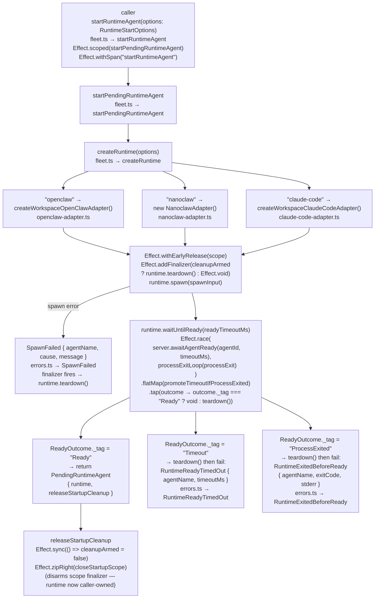
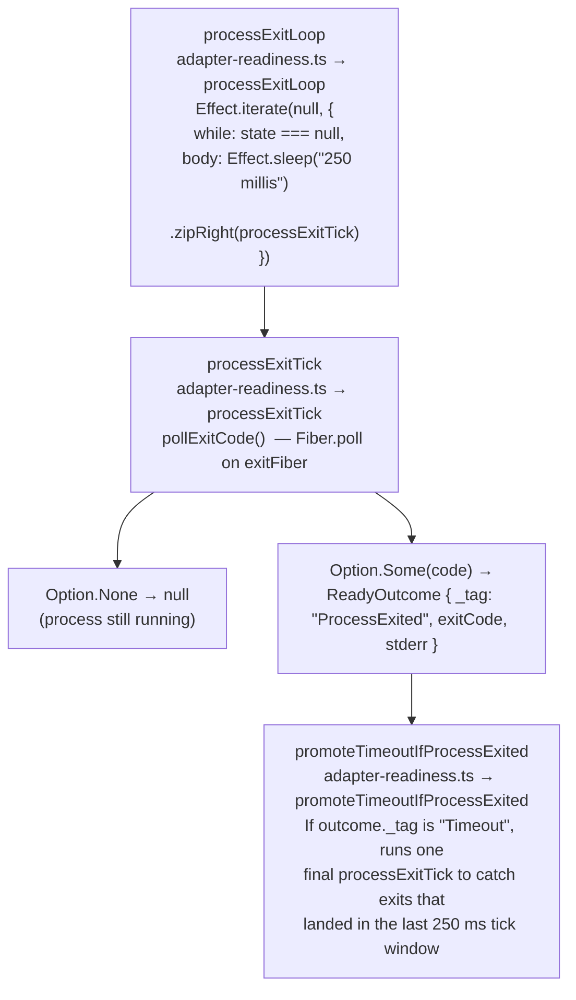

# Single-Runtime Startup Sequence

← Back to [package ARCHITECTURE](../../ARCHITECTURE.md)

## Overview

`startRuntimeAgent` is the entry point for launching one agent. It delegates to
`startPendingRuntimeAgent`, which wires a finalizer-guarded scope around the
spawn + readiness check so that any failure path tears down automatically.

## Readiness Polling Detail (`adapter-readiness.ts`)

`awaitAgentReadyByPolling` is the default `RuntimeServerHandle.awaitAgentReady`
implementation for in-process callers (in `await-agent-ready.ts`). It polls
`connections.getByAgent(agentId)` every 500 ms until at least one connection
has `auth !== null`. Out-of-process callers replace it with a WebSocket presence
subscription (see the `@example` block in `await-agent-ready.ts`).

## See Also

- [Fleet Launch](./02-fleet-launch.md)
- [Per-Adapter Spawn Details](./03-per-adapter-spawn.md)
- [Error Matrix](./06-error-matrix.md)
- [Process State Machine](./07-process-state-machine.md)
