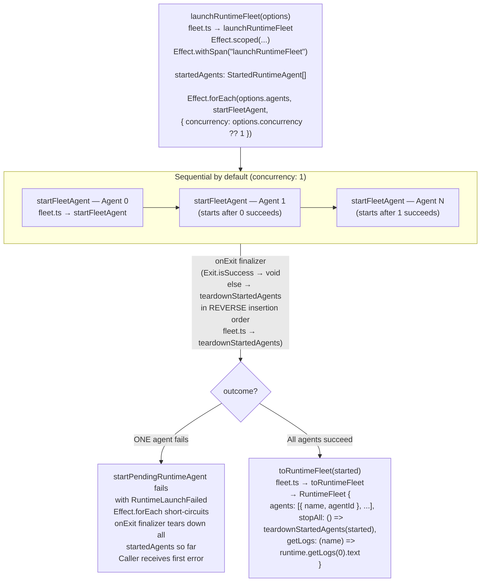
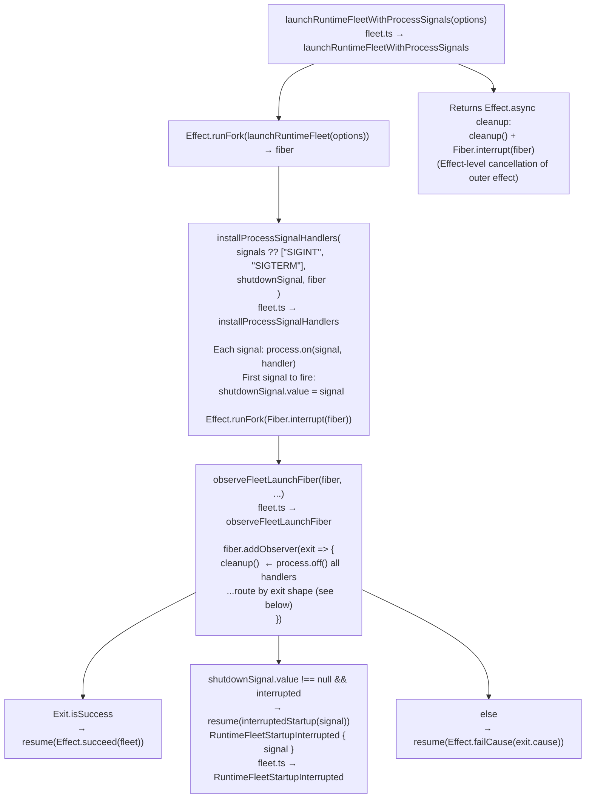

# Fleet Launch Sequence

← Back to [package ARCHITECTURE](../../ARCHITECTURE.md)

## Overview

`launchRuntimeFleet` launches N agents, by default sequentially
(`concurrency: 1`). `launchRuntimeFleetWithProcessSignals` wraps it with
OS-signal handlers.

## Signal-Handler Variant

`RuntimeFleetStartupInterrupted` is the only error type that is **not** in
`errors.ts`; it is local to `fleet.ts` because it only arises in the signals
variant and carries the interrupting `Signal` value.

## See Also

- [Single-Runtime Startup](./01-single-runtime-startup.md)
- [Shutdown Propagation](./05-shutdown-propagation.md)
- [Error Matrix](./06-error-matrix.md)
