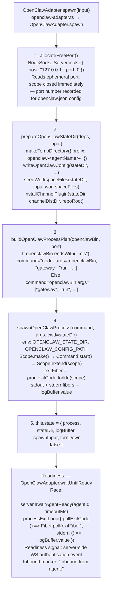
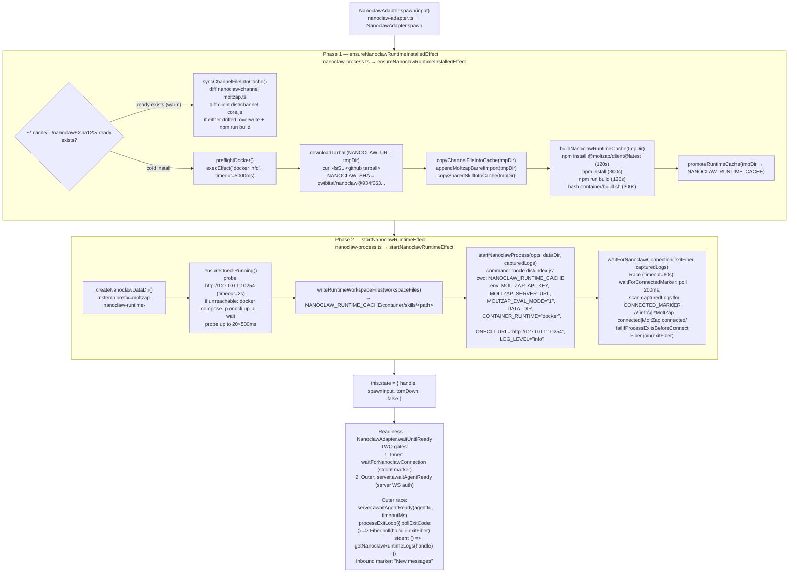

# Per-Adapter Spawn Details

← Back to [package ARCHITECTURE](../../ARCHITECTURE.md)

## 3.1 OpenClaw Adapter (`openclaw-adapter.ts`)

**Annotations:**
- `allocateFreePort` — `openclaw-adapter.ts → allocateFreePort`
- `prepareOpenClawStateDir` — `openclaw-adapter.ts → prepareOpenClawStateDir`
- `writeOpenClawConfig` — `openclaw-adapter.ts → writeOpenClawConfig`; writes `stateDir/openclaw.json` with model, workspace, moltzap channel account, gateway mode/auth
- `seedWorkspaceFiles` — `openclaw-adapter.ts → seedWorkspaceFiles`
- `installChannelPlugin` — `openclaw-adapter.ts → installChannelPlugin`; resolves `effect` dep via `resolveChannelDependency`; installs via `openclaw.plugin.json`
- `buildOpenClawProcessPlan` — `openclaw-adapter.ts → buildOpenClawProcessPlan`
- `spawnOpenClawProcess` — `openclaw-adapter.ts → spawnOpenClawProcess`
- `OpenClawAdapter.waitUntilReady` — `openclaw-adapter.ts → OpenClawAdapter.waitUntilReady`; inbound marker `openclaw-adapter.ts → inbound log marker`

## 3.2 Nanoclaw Adapter (`nanoclaw-adapter.ts` + `nanoclaw-process.ts`)

Nanoclaw is unique: it runs agent subprocesses **inside Docker containers**
via the OneCLI gateway. The adapter has a two-phase startup: first ensure the
runtime cache is installed, then launch.

**Annotations:**
- `ensureNanoclawRuntimeInstalledEffect` — `nanoclaw-process.ts → ensureNanoclawRuntimeInstalledEffect`
- `syncChannelFileIntoCache` — `nanoclaw-process.ts → syncChannelFileIntoCache`
- `preflightDocker` — `nanoclaw-process.ts → preflightDocker`
- `downloadTarball` — `nanoclaw-process.ts → downloadTarball`; `NANOCLAW_SHA` — `nanoclaw-process.ts → NANOCLAW_SHA`
- `copyChannelFileIntoCache`, `appendMoltzapBarrelImport`, `copySharedSkillIntoCache` — `nanoclaw-process.ts`
- `buildNanoclawRuntimeCache` — `nanoclaw-process.ts → buildNanoclawRuntimeCache`
- `startNanoclawRuntimeEffect` — `nanoclaw-process.ts → startNanoclawRuntimeEffect`
- `ensureOnecliRunning` — `nanoclaw-process.ts → ensureOnecliRunning`
- `startNanoclawProcess` — `nanoclaw-process.ts → startNanoclawProcess`
- `waitForNanoclawConnection` — `nanoclaw-process.ts → waitForNanoclawConnection`; `CONNECTED_MARKER` — `nanoclaw-process.ts → CONNECTED_MARKER`
- `NanoclawAdapter.waitUntilReady` — `nanoclaw-adapter.ts → NanoclawAdapter.waitUntilReady`; inbound marker — `nanoclaw-adapter.ts → inbound log marker`

## 3.3 ClaudeCode Adapter (`claude-code-adapter.ts`)

```mermaid
flowchart TD
    CCS["ClaudeCodeAdapter.spawn(input)<br>claude-code-adapter.ts → ClaudeCodeAdapter.spawn"]
    CC1["1. prepareClaudeCodeStateDir(deps, input)<br>makeTempDirectory({ prefix: &quot;claude-code-&lt;agentName&gt;-&quot; })<br>seedWorkspaceFiles(stateDir, input.workspaceFiles)<br>installClaudeCodeChannelPlugin(deps, stateDir)<br>  resolves @modelcontextprotocol/sdk + effect deps<br>  via resolveChannelDependency (parent node_modules walk)<br>  no openclaw.plugin.json — cc-channel has no OpenClaw manifest<br>  returns extDir (channel path inside stateDir)"]
    CC2["2. writeClaudeCodeMcpConfig(opts)<br>serverUrl: strip /ws, ws→http, wss→https<br>channelServerName = &quot;@moltzap/claude-code-channel/&lt;agentName&gt;&quot;<br>writes stateDir/mcp-config.json:<br>  { mcpServers: { moltzap: {<br>    command: &quot;node&quot;,<br>    args: [extDir/dist/cli.js],<br>    env: { MOLTZAP_API_KEY, MOLTZAP_SERVER_URL,<br>           MOLTZAP_SERVER_NAME: channelServerName }<br>  }}}"]
    CC3["3. spawnConfiguredClaude(deps, stateDir, mcpConfigPath, logBuffer)<br>buildClaudeArgs: --strict-mcp-config<br>  --mcp-config &lt;mcpConfigPath&gt;<br>  --print --input-format stream-json<br>  --output-format stream-json --verbose<br>  --dangerously-skip-permissions<br>  --add-dir &lt;stateDir/workspace&gt;<br>spawnClaudeProcess(claudeBin, args,<br>  cwd=stateDir, env={ CLAUDE_CODE_HOME: stateDir },<br>  stdin=&quot;inherit&quot;)<br>Scope.make() → Command.start() → Scope.extend(scope)<br>exitFiber = proc.exitCode.forkIn(scope)<br>stdout + stderr fibers → logBuffer.value"]
    CC4["4. this.state = { process, stateDir, spawnInput,<br>   logBuffer, tornDown: false }"]
    CCR["Readiness — ClaudeCodeAdapter.waitUntilReady<br>Race:<br>  server.awaitAgentReady(agentId, timeoutMs)<br>    (cc-channel's MCP stdio server authenticates on start)<br>  processExitLoop({ pollExitCode: () =&gt; pollClaudeExitCode(proc),<br>                    stderr: () =&gt; logBuffer.value })<br>Binary: claudeBin (&quot;claude&quot; CLI, @anthropic-ai/claude-code)<br>Claude spawns cc-channel as MCP stdio child automatically<br>  (SIGTERM on claude propagates to cc-channel naturally —<br>   no process-group kill needed, unlike openclaw)<br>Readiness signal: server-side WS authentication event<br>Inbound marker: &quot;notifications/claude/channel&quot;<br>  (cc-channel sends MCP notifications/claude/channel<br>   per inbound message; visible in --verbose output)"]

    CCS --> CC1 --> CC2 --> CC3 --> CC4 --> CCR
```

**Annotations:**
- `prepareClaudeCodeStateDir` — `claude-code-adapter.ts → prepareClaudeCodeStateDir`
- `installClaudeCodeChannelPlugin` — `claude-code-adapter.ts → installClaudeCodeChannelPlugin`
- `writeClaudeCodeMcpConfig` — `claude-code-process.ts → writeClaudeCodeMcpConfig`
- `buildClaudeArgs` — `claude-code-adapter.ts → buildClaudeArgs`
- `spawnClaudeProcess` — `claude-code-adapter.ts → spawnClaudeProcess`
- `ClaudeCodeAdapter.waitUntilReady` — `claude-code-adapter.ts → ClaudeCodeAdapter.waitUntilReady`; inbound marker — `claude-code-adapter.ts → inbound log marker`

## See Also

- [Single-Runtime Startup](./01-single-runtime-startup.md)
- [Workspace Path Resolution](./04-workspace-path-resolution.md)
- [Shutdown Propagation](./05-shutdown-propagation.md)
- [Process State Machine](./07-process-state-machine.md)
