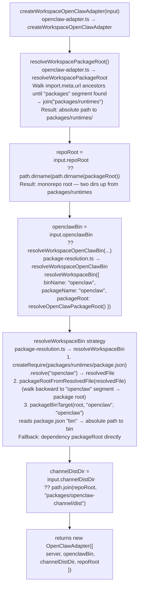
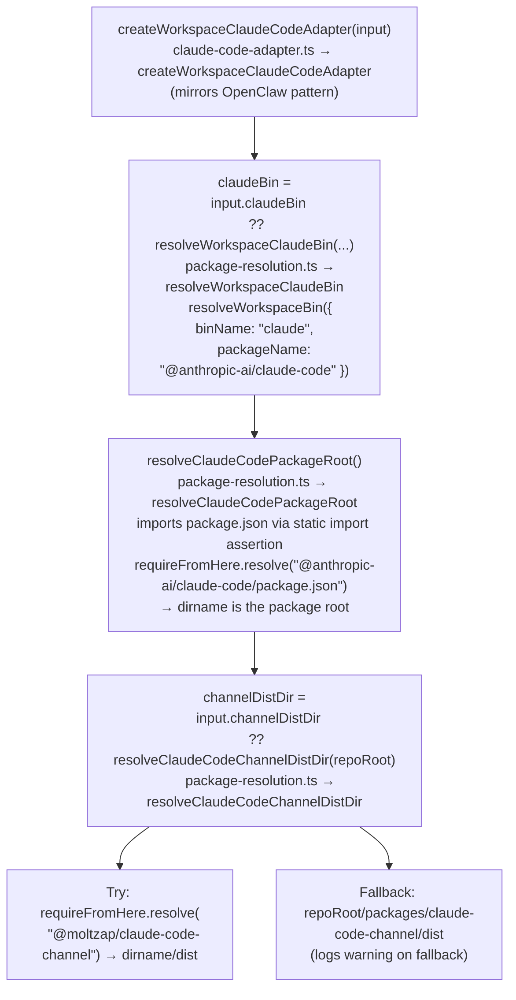

# Workspace Adapter — Binary Path Resolution

← Back to [package ARCHITECTURE](../../ARCHITECTURE.md)

## Overview

Both OpenClaw and ClaudeCode have `createWorkspace*` factory functions that
resolve the binary and channel dist paths from the monorepo layout at module
load time (synchronously via `Effect.runSync`).

## OpenClaw (`openclaw-adapter.ts → createWorkspaceOpenClawAdapter`)

## ClaudeCode (`claude-code-adapter.ts → createWorkspaceClaudeCodeAdapter`)

## PATH-Based (Non-Workspace) Variant

Pass explicit `openclawBin`/`claudeBin`/`channelDistDir` to the constructor
directly. The "workspace" factory is simply a convenience that resolves all
three from the monorepo at construction time rather than requiring callers to
compute paths themselves.

## See Also

- [Per-Adapter Spawn Details](./03-per-adapter-spawn.md)
