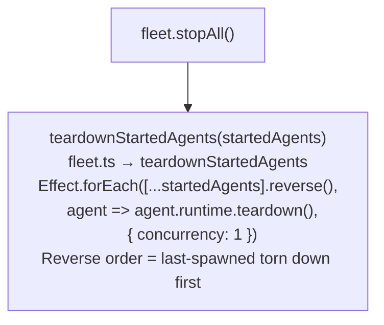
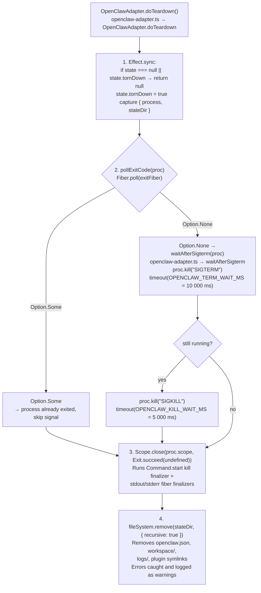
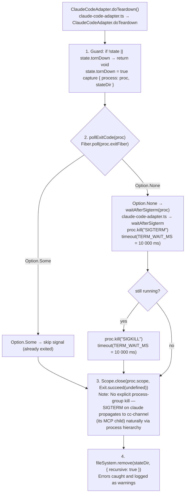
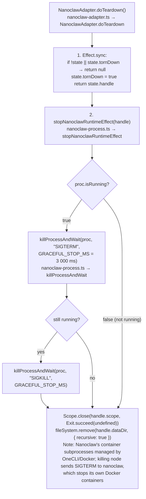
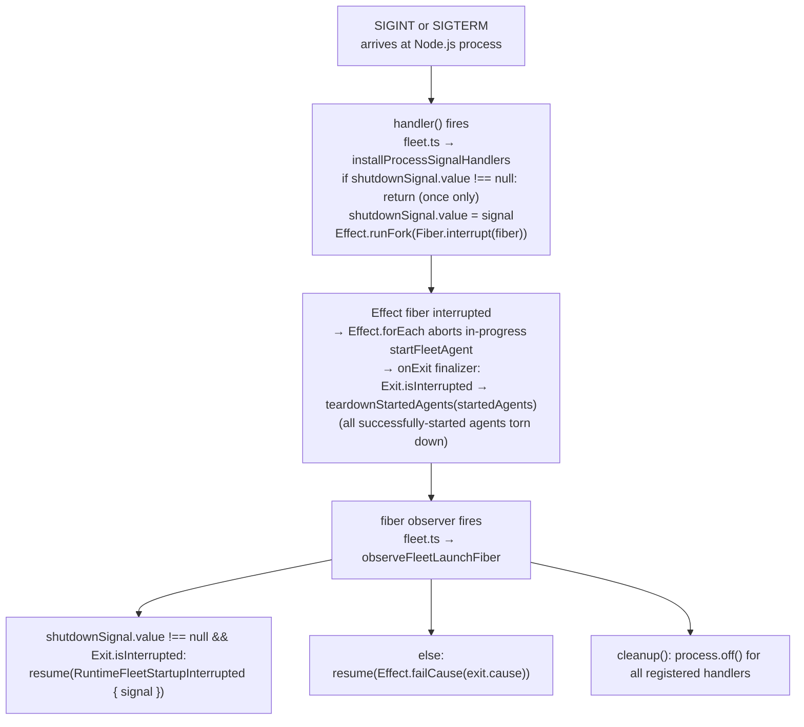

# Shutdown Propagation

← Back to [package ARCHITECTURE](../../ARCHITECTURE.md)

## Caller-Initiated via `RuntimeFleet.stopAll()`

## OpenClaw Teardown (`openclaw-adapter.ts → OpenClawAdapter.doTeardown`)

## ClaudeCode Teardown (`claude-code-adapter.ts → ClaudeCodeAdapter.doTeardown`)

## Nanoclaw Teardown (`nanoclaw-adapter.ts → NanoclawAdapter.doTeardown`)

## OS Signal Propagation (`launchRuntimeFleetWithProcessSignals`)

## See Also

- [Fleet Launch](./02-fleet-launch.md)
- [Per-Adapter Spawn Details](./03-per-adapter-spawn.md)
- [Process State Machine](./07-process-state-machine.md)
