# Per-Process State Machine

← Back to [package ARCHITECTURE](../../ARCHITECTURE.md)

## Overview

Each adapter instance tracks a single logical process lifecycle through an
internal `AdapterState` object with a `tornDown` boolean guard.

```mermaid
stateDiagram-v2
    [*] --> NOT_STARTED

    NOT_STARTED --> SPAWNED : spawn() ok
    NOT_STARTED --> NOT_STARTED : spawn() err — SpawnFailed propagates; state remains null
    SPAWNED --> READY : Ready outcome
    SPAWNED --> TORN_DOWN : Timeout outcome — teardown() called before RuntimeReadyTimedOut fail
    SPAWNED --> TORN_DOWN : ProcessExited outcome — teardown() called before RuntimeExitedBeforeReady fail
    READY --> TORN_DOWN : teardown()
    TORN_DOWN --> TORN_DOWN : teardown() — no-op, idempotent
```

**State descriptions:**

- **NOT_STARTED** — `state = null`. Initial state after adapter construction. `waitUntilReady()` returns Ready immediately (no-op guard). `getLogs()` returns `{ text: "", nextOffset: 0 }`. `teardown()` is a no-op.
- **SPAWNED** — `state = { process, stateDir, logBuffer, tornDown: false }`. Entered when `Runtime.spawn()` completes successfully. `exitFiber` is running; stdout/stderr fibers are running. `waitUntilReady()` races server auth vs. process exit poll.
- **READY** — Same `AdapterState` shape as SPAWNED; no distinct field. `waitUntilReady()` returned `ReadyOutcome { _tag: "Ready" }`. Caller now owns the Runtime; `teardown()` must be called explicitly (or via `fleet.stopAll()`).
- **TORN_DOWN** — `state.tornDown = true` (set atomically inside `doTeardown`). Process sent SIGTERM/SIGKILL; scope closed; `stateDir` removed. `teardown()` is idempotent — subsequent calls return void immediately (the `tornDown` guard short-circuits at entry).

## See Also

- [Single-Runtime Startup](./01-single-runtime-startup.md)
- [Shutdown Propagation](./05-shutdown-propagation.md)
- [Error Matrix](./06-error-matrix.md)
