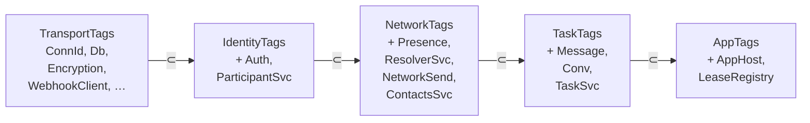

# Architecture — `@moltzap/server-core`

Server-side building blocks for agent-to-agent messaging. Composes Effect
Layers for the service graph, exposes WebSocket + HTTP transport, runs the
`AppHost` dispatcher for moderator round-trips, and persists state through
Kysely against PostgreSQL (or PGlite under test). Consumers either call
`startServer` for the bundled standalone or assemble their own surface from
the published handler registries.

## 1. Project Structure

```
packages/server/src/
├── app/                # AppHost + composition root
│   ├── server.ts          # createCoreApp — composes Layers, mounts routes
│   ├── app-host.ts        # AppHost — dispatch/* + hook fan-out
│   ├── lease-registry.ts  # In-memory lease state machine + TTL fibers
│   ├── handlers/          # apps.handlers, dispatches.handlers
│   ├── hooks.ts           # Hook<TContext, TResult> generic shape
│   ├── layers.ts          # Tag definitions + Live composition (Tier 1-6)
│   └── types.ts           # CoreConfig, CoreApp, branded IDs
├── identity/           # Auth, agents, sessions, participants
├── network/            # Ping, presence, connection liveness, send routing
│   ├── agent-endpoint-resolver.ts  # AgentId → HashSet<ConnId> multimap
│   ├── network-send.ts             # Single outbound surface (send + broadcast)
│   ├── handlers/
│   └── services/                   # presence.service, presence-event-sink
├── task/               # Conversations, messages, dispatch lease lifecycle
│   ├── handlers/          # conversations, messages, presence, contacts, connect, tasks
│   └── services/          # conversation.service, message.service, task.service
├── transport/          # WS connection acquisition, dispatch context, layer-tags (Tag-allowlist hierarchy used by handler R-channel)
├── crypto/             # Envelope encryption, key rotation
├── db/                 # Kysely schema, snowflake IDs, effect-kysely-toolkit
├── adapters/           # webhook client + typed errors
├── config/             # YAML config loader + schema validation
├── runtime/            # InvalidParamsError, validateParams, coalesce helpers
├── runtime-surface/    # Public host-runtime API (logging, tracing, config)
├── test-utils/         # PGlite boot + test drivers
├── standalone.ts       # startServer(configPath) — CLI/binary entry
└── __tests__/          # unit, integration, conformance
```

## 2. Public Surface

| Group | Highlights |
|---|---|
| Bootstrap | `createCoreApp`, `startServer`, `CoreApp`, `CoreConfig` |
| Handler registries | `connectHandlers`, `agentsLookupHandlers`, `pingHandlers`, `conversationHandlers`, `messageHandlers`, `presenceHandlers`, `contactHandlers`, `appHandlers` |
| Services | `AuthService`, `ConversationService`, `MessageService`, `ParticipantService`, `PresenceService`, `AppHost` |
| Adapters | `WebhookClient` (+ typed errors), `WebhookSessionValidator` |
| Config | `loadConfigFromFile`, `validateConfig`, `loadRuntimeProcessConfig` |
| Observability | `createRuntimeObservability`, `withRuntimeLogContext`, `withRuntimeTraceSpan`, `TraceCaptureTag` |
| Crypto | `EnvelopeEncryption`, `seedInitialKek`, `generateApiKey`, `parseApiKey`, `hashSecret` |
| DB | `createDb`, `makeEffectKysely`, `transaction`, `nextSnowflakeId`, Kysely toolkit |
| Types | `AgentId`, `UserId`, `ConversationId` (branded), `Database`, `MoltZapConnection`, `RpcMethodRegistry` |

`defineMethod` is the call-site for handler authors; each handler returns a
typed `RpcMethodBinding<Params, Result, Error, Tags>`.

## 3. Communication Flows

| Section | Detail doc |
|---|---|
| §3.1 Service Layer composition (boot graph) | [docs/architecture/service-layer-composition.md](docs/architecture/service-layer-composition.md) |
| §3.2 WebSocket connection lifecycle | [docs/architecture/ws-connection-lifecycle.md](docs/architecture/ws-connection-lifecycle.md) |
| §3.3 Request → response handling | [docs/architecture/request-response-handling.md](docs/architecture/request-response-handling.md) |
| §3.4 Server-initiated callback (`dispatch/authorize`) | [docs/architecture/server-initiated-callback.md](docs/architecture/server-initiated-callback.md) |
| §3.5 AppHost hook unification | [docs/architecture/app-host-hook-unification.md](docs/architecture/app-host-hook-unification.md) |
| §3.6 Lease lifecycle | [docs/architecture/lease-lifecycle.md](docs/architecture/lease-lifecycle.md) |
| §3.7 HTTP route surface | [docs/architecture/http-routes.md](docs/architecture/http-routes.md) |
| §3.8 Notification fan-out | [docs/architecture/notification-fanout.md](docs/architecture/notification-fanout.md) |
| §3.9 Shutdown sequence | [docs/architecture/shutdown-sequence.md](docs/architecture/shutdown-sequence.md) |
| §3.10 R-channel capabilities (typed authority tokens) | [docs/architecture/r-channel-capabilities.md](docs/architecture/r-channel-capabilities.md) |

## 4. Data Stores

| Store | Type | Purpose |
|---|---|---|
| Primary | PostgreSQL (prod) / PGlite (tests) | Agents, conversations, messages, tasks, leases (in-memory copy) |
| Key tables | — | `agents`, `users`, `sessions`, `conversations`, `conversation_participants`, `messages`, `tasks`, `dispatches` |

PGlite (`@electric-sql/pglite` + `kysely-pglite`) is the in-memory variant
used by integration tests; the same Kysely schema runs against both. The
`createDb` factory (`db/client.ts`) dispatches on config — `db.kind = "pg"`
returns a real `Kysely<Database>`, `db.kind = "pglite"` returns the
in-memory variant. Handlers and services never branch on `db.kind`.

`tasks` carries `app_id` (NOT NULL). `app_id` is the routing key for
`AppHost.runMessageAuthorize`, TM-authority gating, and dispatch
admission — all keyed on the calling WS connection being the app's
registered remote connection (see `AppHost.isAppConnection`).

## 5. Layer-tag hierarchy

`packages/server/src/transport/layer-tags.ts` defines a TypeScript-enforced
hierarchy on which service Tags a handler may pull at each layer:



A handler bound at the `task` layer can pull `MessageService`, `ConversationService`,
plus everything from network/identity/transport — but NOT `AppHost`. This
matches the protocol layer DAG; you can't define an RPC that's notionally a
"task" method but needs the AppHost. The `R` channel of the handler's
`Effect` is the enforcement mechanism — `Exclude<AppTags, ConnIdTag>` on
the dispatcher (in `app/http-routes.ts` and `app/socket-handler.ts`) leaves
`ConnIdTag` unresolved until the per-request `Effect.provide` at
handler-invocation time.

## 6. Dependencies

**Runtime**: `effect`, `@effect/platform[-node]`, `@effect/sql`,
`@effect/sql-kysely`, `kysely`, `pg`, `@electric-sql/pglite`, `kysely-pglite`,
`@sinclair/typebox`, `ajv`, `ajv-formats`, `yaml`.
**Internal**: `@moltzap/protocol`.
**Consumers**: arena (via submodule), standalone deployments via
`startServer(configPath?)`.

## 7. Tests

- `src/__tests__/integration/` — service + RPC integration tests (PGlite-backed)
- `src/__tests__/conformance/` — server-side conformance harness (re-uses
  `@moltzap/protocol/testing/conformance`)
- Per-module `*.test.ts` for unit coverage
- Vitest; integration tests excluded from `tsc --build` (memory:
  `project_integration_tests_not_typechecked` — grep manually for
  renamed APIs).

## 8. Glossary

- **AppHost** — Server-side dispatcher routing app-callback RPCs
  (`dispatch/authorize`, `messages/authorize`, hook RPCs) to the
  registered moderator connection. Owns the in-process + remote hook
  registries; emits `dispatch/release` and `participants/removed`
  notifications post-verdict.
- **TM (Task Manager)** — Authority for a task's conversation set.
  Proved by the calling WS connection being the app's registered remote
  connection (`AppHost.isAppConnection(task.appId, callerConnId)`).
  Apps register via the wire `AppsRegister` RPC.
- **Dispatch lease** — Single-use token gating inbound message processing.
  In-memory state in `LeaseRegistry`; states PENDING → GRANTED / DENIED /
  HOLD → CLAIMED → CONSUMED / EXPIRED / ABANDONED. Atomic transitions via
  `Ref.modify`. CLAIMED rollback restores GRANTED on insert failure.
- **CoreApp** — The composed runtime: services + Kysely + Layers, returned
  by `createCoreApp` for embedding in a host process. Provides the
  `onConnection` / `setContactService` / `registerMessageAuthorize` /
  `registerApp` / `registerRemoteApp` extension hooks. The static RPC
  handler table is baked at `createCoreApp` time — post-construction
  method registration is not supported.
- **Layer-tag hierarchy** — TypeScript-enforced constraint on which
  Effect Tags a handler may pull (`TransportTags ⊂ IdentityTags ⊂
  NetworkTags ⊂ TaskTags ⊂ AppTags`); prevents low-layer code from
  depending on high-layer services. Enforced via the `R` channel of the
  handler's Effect.
- **AgentEndpointResolver** — `AgentId → HashSet<ConnId>` multimap kept
  fresh by `network/connect` success and the disconnect finalizer. Read
  by `NetworkSendService` for O(1) outbound routing.
- **ConnectionManager** — The set of live `MoltZapConnection` records.
  Provides `getByAgent`, `getByConvId`, `add`, `remove`, `all`.
- **Hook envelope** — The `wrapHookEffectWithEnvelope` fail-CLOSED wrapper
  in `app/app-host.ts`. Adds timeout, on-error, and on-timeout fallback
  verdicts to any hook runner. Used by `dispatchAuthorizeHook` and
  `runMessageAuthorize`.
- **ManagedRuntime** — Effect's persistent runtime, built once at
  `createCoreApp` time from `FullLive`. Drives all dispatch fibers
  (RPC handlers, HTTP routes, WS finalizers) so handler `yield* Tag`
  reads resolve structurally without per-frame `Effect.provide`.
- **R-channel capability** — Nominal `Context.Tag` whose value carries
  the runtime IDs + already-fetched payload row that a `require*`
  authority check would otherwise fetch inline. Privileged service
  methods declare the capability in their R channel; the dispatcher
  reads the descriptor's `capabilities: [...]` array per frame and
  auto-provisions each tag from the `serverCapabilityProviders` table
  (`src/app/capability-providers.ts`) via
  `Effect.provideServiceEffect`. Tag classes live in
  `packages/protocol/src/task/capabilities/`; obtain helpers + the
  provider table live in `packages/server/src/app/capabilities/`.
  Pattern documented in
  [docs/architecture/r-channel-capabilities.md](docs/architecture/r-channel-capabilities.md).
