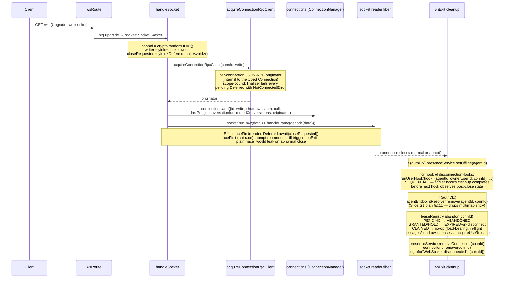

# WebSocket Connection Lifecycle (per-connection Scope)

← Back to [package ARCHITECTURE](../../ARCHITECTURE.md)

The `/ws` route (in `app/http-routes.ts → makeWsRoute`) upgrades the HTTP
request to a Socket, then hands it to `handleSocket` (constructed by
`app/socket-handler.ts → makeSocketHandler`, wired in `app/server.ts:100`).
`handleSocket` builds a single Scoped Effect for the connection's entire
lifetime:

## See also

- [§03 Request → response handling](./03-request-response-handling.md)
- [§06 Lease lifecycle](./06-lease-lifecycle.md) — `leaseRegistry.abandon` detail
- [§09 Shutdown sequence](./09-shutdown-sequence.md) — `conn.shutdown` signal
