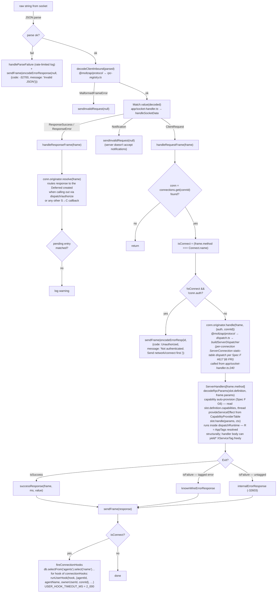

# Request → Response Handling

← Back to [package ARCHITECTURE](../../ARCHITECTURE.md)

`handleSocketData(raw)` (in `app/socket-handler.ts`) decodes once via
`decodeClientInbound` (from `@moltzap/protocol`), then `Match.value`
routes by the discriminated tag. The named flow steps below
(`handleResponseFrame`, `handleRequestFrame`) are inline branches of
`handleSocketData`, not standalone functions — they're labeled here to
match the sequence the code walks.

## See also

- [§02 WebSocket connection lifecycle](./02-ws-connection-lifecycle.md) — how the socket and reader fiber are set up
- [§04 Server-initiated callback](./04-server-initiated-callback.md) — `handleResponseFrame` settles server-originated Deferreds
- [§07 HTTP routes](./07-http-routes.md) — parallel HTTP surface
- [§10 R-channel capabilities](./10-r-channel-capabilities.md) — typed capability tokens the handler body `yield*`s, drained at the handler boundary via `Effect.provideServiceEffect` from the slot's `CapabilityProviderTable`
