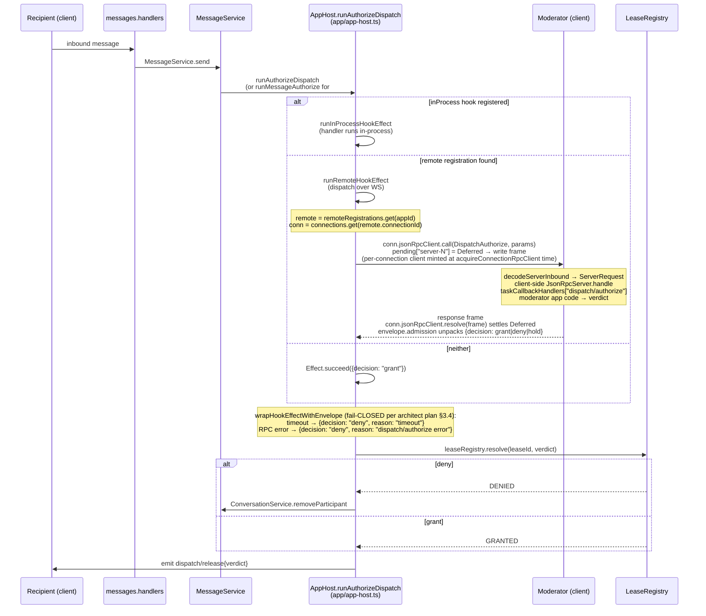

# Server-Initiated Callback (the `dispatch/authorize` path)

← Back to [package ARCHITECTURE](../../ARCHITECTURE.md)

When an inbound `messages/send` needs admission, `AppHost.runAuthorizeDispatch`
forks a fiber that calls **out** to the moderator. The reverse direction
uses the same `@moltzap/protocol` runtimes — `JsonRpcClient` on the server
side, `JsonRpcServer` on the moderator's client side:

The same shape applies to `runMessageAuthorize` (#560) — it's the second
caller of the unified `wrapHookEffectWithEnvelope` (`app/app-host.ts → runMessageAuthorize`),
keyed by `EndpointAddress` instead of `appId`, with verdicts in the
Forward/Block shape instead of grant/deny/hold.

## See also

- [§05 AppHost hook unification](./05-app-host-hook-unification.md) — `wrapHookEffectWithEnvelope` and the registry shape
- [§06 Lease lifecycle](./06-lease-lifecycle.md) — `leaseRegistry.resolve` state transitions
- [§03 Request → response handling](./03-request-response-handling.md) — `handleResponseFrame` that settles the Deferred
