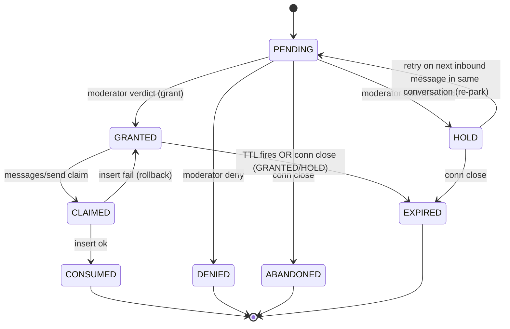
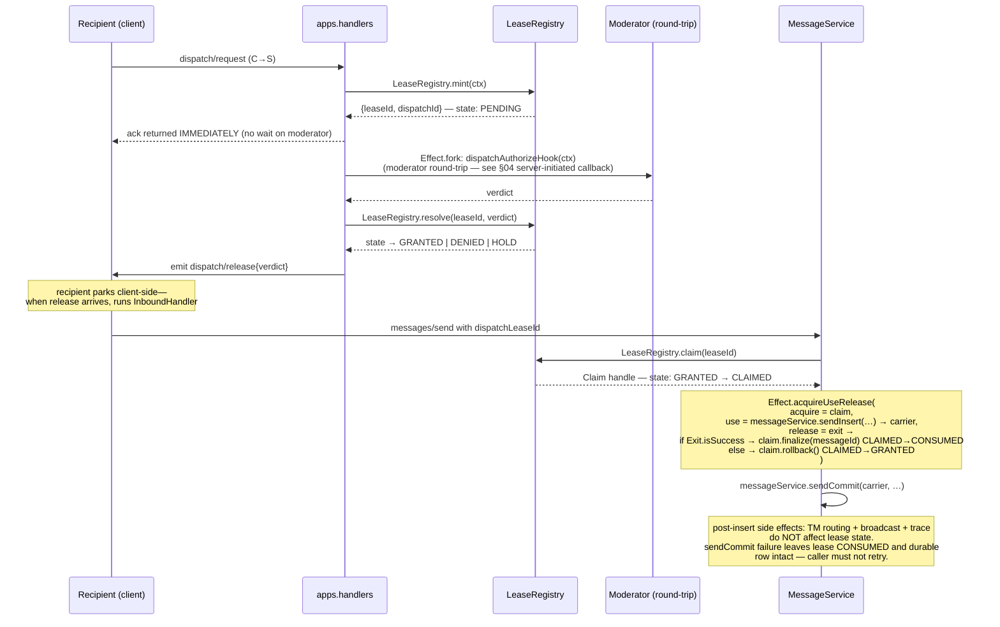

# Lease Lifecycle

← Back to [package ARCHITECTURE](../../ARCHITECTURE.md)

The `LeaseRegistry` is an in-process `Ref<Map<LeaseId, LeaseEntry>>` with
per-lease TTL fibers; no DB row. State transitions are atomic via `Ref.modify`:

The eight terminal/non-terminal states (PENDING, CLAIMED, GRANTED,
CONSUMED, DENIED, EXPIRED, ABANDONED, HOLD) match `LeaseState` in
`app/lease-registry.ts:111-118`. Connection-close GRANTED/HOLD transitions
go to plain EXPIRED — there is no distinct `EXPIRED_ON_DISCONNECT` state.

Connection close cleanup (`leaseRegistry.abandon(connId)` in the disconnect
finalizer): scans all leases bound to that connection, walks the same
table — PENDING→ABANDONED, GRANTED/HOLD→EXPIRED, CLAIMED
no-op. The CLAIMED no-op is load-bearing — without it, a recipient
disconnect mid-insert could roll back a committed durable row, permitting
a duplicate retry.

## See also

- [§02 WebSocket connection lifecycle](./02-ws-connection-lifecycle.md) — where `leaseRegistry.abandon` is called in the disconnect finalizer
- [§04 Server-initiated callback](./04-server-initiated-callback.md) — moderator round-trip that produces the verdict
- [§05 AppHost hook unification](./05-app-host-hook-unification.md) — how verdicts are shaped by `wrapHookEffectWithEnvelope`
