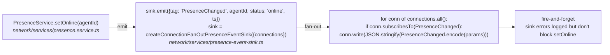

# Notification Fan-out (PresenceService example)

← Back to [package ARCHITECTURE](../../ARCHITECTURE.md)

Most notifications originate inside a service and reach the wire via
`ConnectionManager.broadcast` or per-connection `conn.write`. The
`PresenceEventSink` indirection lets the service emit events without
knowing about `ConnectionManager` directly:

This pattern (service emits typed events, sink fans out) repeats for
participants/{added,removed}, message delivery webhook fan-out, and
dispatch/release. The single-write-side helps trace lookups: every wire
emission has one originating service.

## See also

- [§02 WebSocket connection lifecycle](./02-ws-connection-lifecycle.md) — `conn.write` set up at connection time
- [§04 Server-initiated callback](./04-server-initiated-callback.md) — `dispatch/release` notification emitted post-verdict
