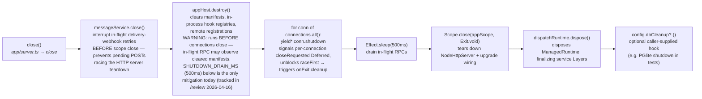

# Shutdown Sequence

← Back to [package ARCHITECTURE](../../ARCHITECTURE.md)

`CoreApp.close()` (in `app/server.ts → close`) tears down in a specific order so
in-flight work has a chance to finish before its dependencies vanish:

## See also

- [§01 Service layer composition](./01-service-layer-composition.md) — `dispatchRuntime` and `FullLive` that are disposed here
- [§02 WebSocket connection lifecycle](./02-ws-connection-lifecycle.md) — `conn.shutdown` / `closeRequested` Deferred detail
