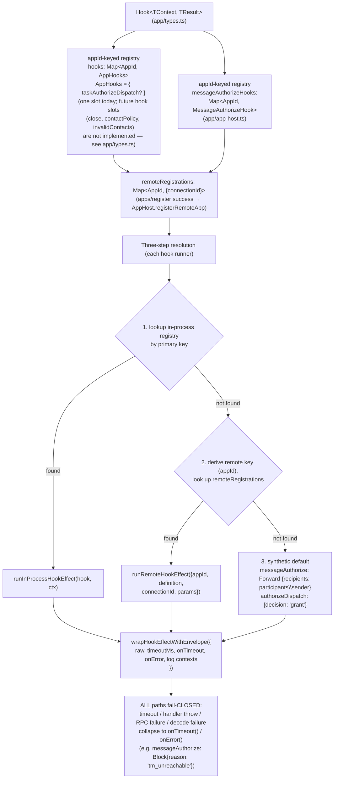

# AppHost Hook Unification

← Back to [package ARCHITECTURE](../../ARCHITECTURE.md)

The `Hook<TContext, TResult>` abstraction (hook context types in
`app/types.ts`) lets every "send context, get verdict" S→C interaction
use the same registry + resolution + envelope shape:

## See also

- [Server-initiated callback](./server-initiated-callback.md) — `dispatchAuthorizeHook` and `runMessageAuthorize` as the two callers of `wrapHookEffectWithEnvelope`
- [Lease lifecycle](./lease-lifecycle.md) — what happens after a verdict is delivered
