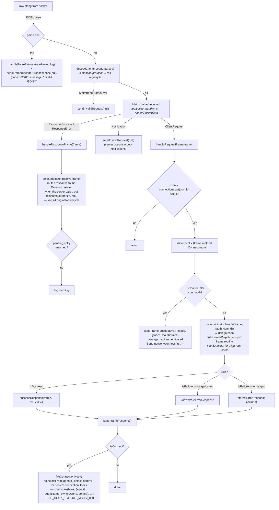
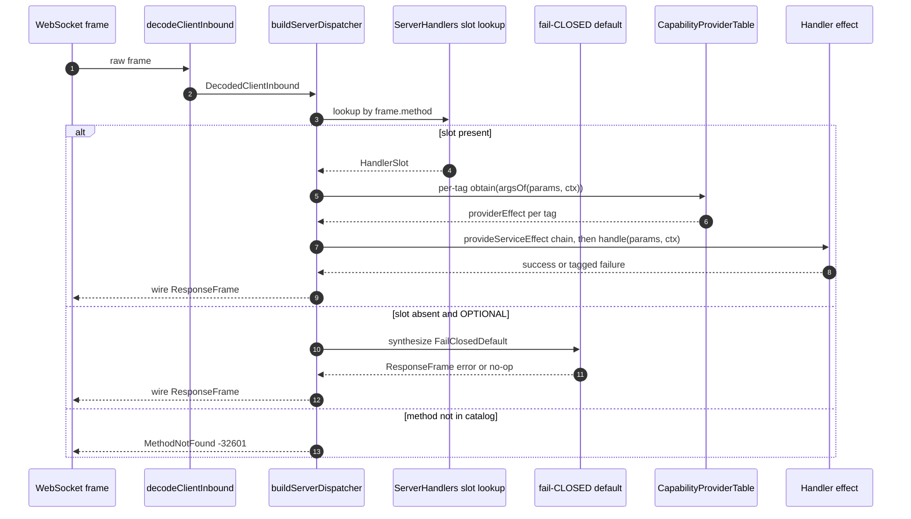

# Request → Response Handling (server-side frame flow)

← Back to [package ARCHITECTURE](../../ARCHITECTURE.md)

This is the canonical doc for how an inbound WebSocket frame reaches a
handler on the server side. It covers:

1. The wrapper concerns that `socket-handler.ts` owns (parse, auth gate,
   connect-hook fan-out).
2. The per-frame dispatch the typed dispatcher runs.
3. A worked example for `messages/send`.
4. The internal originator lifecycle that backs both inbound responses and
   outbound `dispatch/authorize` callbacks.

The anchoring design: per-connection-kind static handler tables
(`ServerHandlers<Ctx, Caps>`) with REQUIRED / OPTIONAL slots enforced at
the type level; no runtime register/unregister surface. The compiler-side
invariants live as `@ts-expect-error` canaries in
`protocol/transport/typed-dispatcher.types-check.ts` — read that file for
the type contract.

## 1. The wrapper: `socket-handler.ts → handleSocketData`

`handleSocketData(raw)` decodes the frame once via `decodeClientInbound`
(from `@moltzap/protocol`), then `Match.value` routes by the
discriminated tag. The named flow steps below
(`handleResponseFrame`, `handleRequestFrame`) are inline branches of
`handleSocketData`, not standalone functions — they're labeled here to
match the sequence the code walks.



What the wrapper owns (these don't belong in the dispatcher itself):

- Parse-failure handling with rate-limited logging.
- The `MalformedFrameError → sendInvalidRequest(null)` path.
- The "must be authenticated before non-Connect RPC" gate.
- The `Exit → wire frame` projection (success / known-tagged-error /
  internal-error).
- `fireConnectionHooks` after a successful Connect (with
  `USER_HOOK_TIMEOUT_MS = 2_000` ms per user hook).

## 2. The dispatcher: `protocol/dispatch.ts → buildServerDispatcher`

The dispatcher is constructed once at `createCoreApp` time and bound to
the connection's scope. Per-frame it does:



**Slot disposition is fixed at protocol-definition time** by the
`optional?: FailClosedDefault` field on each `defineRpc(...)` call.
Absent → REQUIRED. Present → OPTIONAL carrying its fail-CLOSED default;
the dispatcher reads that default when the handler-table value equals
the matching sentinel (`forbidden` / `noOpNotification`).

| Slot | Disposition | Default | Justification |
|---|---|---|---|
| `MessagesAuthorize` (TM) | OPTIONAL | `forbidden` (-32001) | Authorization hook; default-deny is the safe outcome. |
| `DispatchAuthorize` (TM) | OPTIONAL | `forbidden` (-32001) | Same. |
| Mutating server methods (`MessagesSend`, `TasksCreate`, …) | REQUIRED | — | Server has no fallback. |
| Read-only server methods (`AgentsLookup`, `AgentsList`, …) | REQUIRED | — | Same. |
| Notification-receiver slots (future kinds) | OPTIONAL | `noOpNotification` | Notifications have no response. |

A caller cannot "register an empty handler" to bypass authorization —
the slot's sentinel value IS authorization-failing, and the handler
table mapped type forces every slot key to appear in every literal
(no `?:` field-level optional).

**Capability auto-provision is live.** Each task-layer `defineRpc`
carries a `capabilities: [{ tag, argsOf }, ...]` array; the dispatcher
reads it per frame, calls `serverCapabilityProviders[tag.key]` for each
entry (from `packages/server/src/app/capability-providers.ts`), and
threads `Effect.provideServiceEffect(tag, providerEffect)` over the
handler. Handler bodies `yield* TmAuthority` / `yield* TaskReadAccess`
/ etc. directly — no hand-piped `provideServiceEffect` chains in
`tasks.handlers.ts` / `conversations.handlers.ts`.

`MessagesSend` is the one structural exception: its wire schema accepts
`(conversationId | to | replyToId)` and the handler resolves
`conversationId` via DB lookup before the `MessageSendPermission`
obtain helper can run, so its capability stays hand-piped at the call
site. See `packages/protocol/src/task/messages.ts → MessagesSend`
descriptor body for the rationale.

## 3. Worked example: `messages/send` end-to-end

Client-side caller all the way to client-side resolved value:

```text
CLIENT                                              SERVER
──────                                              ──────
caller
  │  service.send({...})
  ▼
MoltZapWsClient.call(MessagesSend, params)
  │
  ▼  originator.ts → call (idPrefix "rpc")
  │
  │  next id = "rpc-42"
  │  frame = {jsonrpc:"2.0", id:"rpc-42",
  │           method:"messages/send", params:{...}}
  │  insert pending[rpc-42] = {Deferred}
  │  write(JSON.stringify(frame))
  │  await Deferred
  │                                                 ─── WS frame ──▶
  │                                                                 decodeClientInbound(json)
  │                                                                   → {_tag: "ClientRequest",
  │                                                                      definition: MessagesSend,
  │                                                                      params}
  │                                                                 socket-handler.ts wrapper (see §1)
  │                                                                   auth gate, then
  │                                                                   conn.originator.handle(frame, ctx)
  │                                                                   ▼ dispatch.ts (see §2)
  │                                                                 ServerHandlers["messages/send"]
  │                                                                   ▼
  │                                                                 decodeRpcParams → ParamsOf<MessagesSend>
  │                                                                   ▼
  │                                                                 ServerHandlers["messages/send"]
  │                                                                   .handle(params, dispatchCtx)
  │                                                                   ▼
  │                                                                 MessageService.send(...)
  │                                                                   ▼
  │                                                                 Exit.isSuccess → result
  │                                                                   ▼
  │                                                                 successResponse(frame, ms, result)
  │                                                                   ▼ logInfo "RPC request completed"
  │                                                <── WS frame ──   responseFrame(id, {result})
  │
  ▼  socket onmessage → decodeServerInbound → ResponseSuccess
  │
  ▼  client.resolve(frame)
  │  → pendingRef.modify(take("rpc-42"))
  │  → Deferred.succeed(result)
  │
  ▼  await unblocks
  │  decodeRpcResult(MessagesSend, result)
  │
  ▼  ResultOf<MessagesSend> returned to caller
```

On the error arm the server returns `{error: {code, message, data}}`,
`completePendingFrame` calls `wireErrorToRpcCallError`, and the caller
sees a `Deferred.fail` with either a `RegisteredTaggedError` (if the wire
code is in the registry) or `RpcServerError` (anything else).

## 4. Internal originator lifecycle

The originator is the outbound half of every `Connection`. It owns the
pending-request map and the request-id counter for outbound `call(...)`
invocations — both directions. On the server side it's how
`AppHost.runAuthorizeDispatch` calls out for verdicts
(see [server/04](./server-initiated-callback.md)). On the client side
it's how `MoltZapWsClient.sendRpc` works (idPrefix `"rpc"` there). Lives
at `protocol/transport/originator.ts → makeOriginator`, scope-bound so
closing the scope runs `failAllPending(NotConnectedError)`.

```text
caller
   │
   ▼  call(definition, params)                              originator.ts → call
   │
   ▼  counterRef.modify(n → [n+1, n+1])
   │       generates `${idPrefix}-${next}` JsonRpcId
   │       (server idPrefix = `srv-${connectionId}` per
   │        server/src/transport/connection.ts:69;
   │        client idPrefix = "rpc" per ws-client.ts:509)
   │
   ▼  requestFrame(id, definition, params) → RequestFrame
   │
   ▼  Deferred.make<unknown, RpcCallError>()
   │
   ▼  pendingRef.update(set(id, {method, definition, deferred}))
   │       ─── pending map insert BEFORE write (load-bearing: a slow
   │           network can return a response before write() resumes;
   │           late-insert would lose it)
   │
   ▼  config.write(JSON.stringify(frame))
   │       │
   │       ├─ ok        →  proceed to Deferred.await
   │       │
   │       └─ failure   →  Deferred.fail(NotConnectedError);
   │                       Effect.fail bubbles, ensuring() removes from map
   │
   ▼  Deferred.await(deferred)
   │       ↑
   │       │  ── unblocked by `resolve(frame)` when matching inbound arrives
   │       │
   │       ▼  decodeRpcResult(definition, result)
   │             │
   │             ├─ success → ResultOf<D>
   │             │
   │             └─ RpcResultDecodeError → RpcServerError
   │                                       code: -32603,
   │                                       "Invalid result for method: …"
   │
   └─ ensuring(pendingRef.remove(id))  ── runs on success, failure, OR interrupt
                                          (cleanup must run even on caller-side
                                          interrupt to prevent pending-map leak)
```

Inbound response routing (`originator.ts → resolve`):

```text
ResponseFrame arrives at the transport
   │
   ▼  conn.originator.resolve(frame)  ← called from §1's "handleResponseFrame"
   │
   ▼  frame.id === null  →  return false (drop; nothing to settle)
   │
   ▼  pendingRef.modify(takePendingEntry(frame.id))
   │       atomic Get-then-Remove
   │
   ▼  Option.match
        │
        ├─ None  →  return false   ── late frame, deferred already cleaned up
        │
        └─ Some(entry)  →  completePendingFrame
                              │
                              ├─ frame.error  →  Deferred.fail(wireErrorToRpcCallError)
                              │                      │
                              │                      └─ errorClassFor(code) → tagged-class
                              │                          ctor; else RpcServerError fallback
                              │
                              └─ frame.result →  Deferred.succeed(result)
```

The pending-map uses atomic `Ref.modify` for both insert and take, so two
inbound responses with the same id (server bug) at worst resolve once and
then race-lose harmlessly (second take sees `None`). The four invariants
are: pending-insert-before-write, scope-finalizer fails everything on
disconnect, atomic insert/take, late-frame-drop on empty take.

## See also

- [WebSocket connection lifecycle](./ws-connection-lifecycle.md) — how the socket and reader fiber are set up
- [Server-initiated callback](./server-initiated-callback.md) — `AppHost.runAuthorizeDispatch` fork + verdict routing + `leaseRegistry.resolve`
- [HTTP routes](./http-routes.md) — parallel HTTP surface
- [R-channel capabilities](./r-channel-capabilities.md) — typed capability tokens the handler body `yield*`s, auto-provisioned at frame dispatch from the shared `serverCapabilityProviders` table (`packages/server/src/app/capability-providers.ts`). MessagesSend is the lone hand-piped exception (conversationId resolution must precede the obtain helper)
