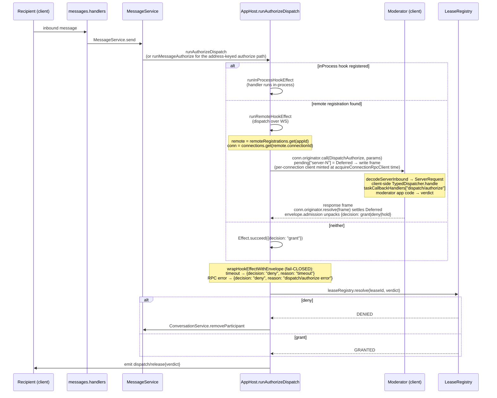

# Server-Initiated Callback (the `dispatch/authorize` path)

← Back to [package ARCHITECTURE](../../ARCHITECTURE.md)

When an inbound `messages/send` needs admission, `AppHost.runAuthorizeDispatch`
forks a fiber that calls **out** to the moderator. The reverse direction
uses the same `@moltzap/protocol` runtimes — `Originator` on the server
side, the typed `Connection.handle` on the moderator's client side.

Server-to-client request frames are restricted to `taskCallbackMethods`
(the strict subset of `rpcMethods` the server is allowed to call back
into the client — `DispatchAuthorize`, `MessagesAuthorize`). The client's
`decodeServerInbound` rejects any other method as `MalformedFrameError`,
so a misconfigured server can't smuggle a non-callback request through
the client's inbound path. The originator lifecycle that backs the
`conn.originator.call(...)` step here is the same one used by inbound
requests — see [Request → response handling](./request-response-handling.md)
for the pending-map mechanics, id-prefix, and finalizer ordering.

The same shape applies to `runMessageAuthorize` — second caller of the
unified `wrapHookEffectWithEnvelope` in `app/app-host.ts`, keyed by
`appId` with verdicts in the Forward/Block shape instead of
grant/deny/hold.

## See also

- [Request → response handling](./request-response-handling.md) — wire-side wrapper, dispatcher contract, originator lifecycle
- [AppHost hook unification](./app-host-hook-unification.md) — `wrapHookEffectWithEnvelope` and the registry shape
- [Lease lifecycle](./lease-lifecycle.md) — `leaseRegistry.resolve` state transitions
