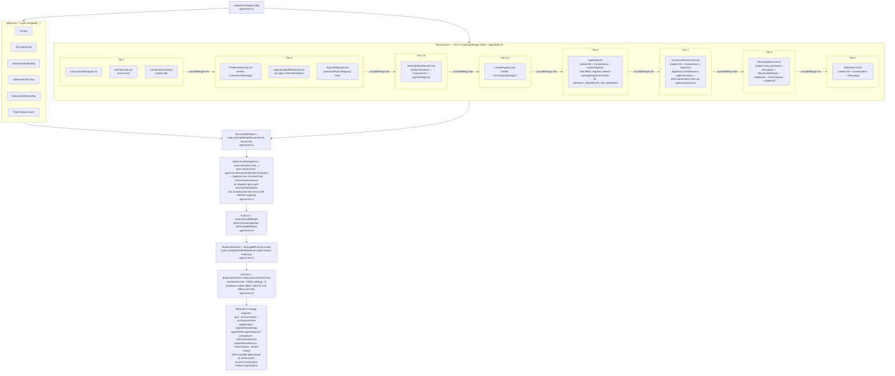

# Service Layer Composition (boot graph)

← Back to [package ARCHITECTURE](../../ARCHITECTURE.md)

`createCoreApp` builds the full service graph via Effect Layers, composed
bottom-up. Each tier's outputs feed the next tier's inputs through
`Layer.provideMerge` (which keeps lower-tier Tags visible to the rest of
the graph, vs `Layer.provide` which would consume them):

The `Layer.provideMerge` discipline (vs `Layer.provide`) is load-bearing:
every downstream tier sees ALL upstream Tags in its R-channel resolution,
not just the immediately-above tier. That lets RPC handler bodies pull any
service via `yield* XServiceTag` and have it resolved structurally by the
shared `dispatchRuntime` — no per-frame `Effect.provide`.

## Convention: package-private gate methods (Spec E Decision B / Option A)

Each service class exposes a thin SQL gate per privileged operation
— `loadOpenTask`, `loadTaskWithReadAccess`,
`assertConversationInTask`, `assertConversationParticipant`, etc. These
are **NOT** part of the service's exported public surface. They are
`@internal` exported methods (the TS `private` modifier was dropped per
Architect Decision B / Option A — `private` would block the obtain
logic in `app/capability-providers.ts` (and the composite helpers in
`task/services/`) from reaching the underlying check via the service
Tag, regardless of DI path). The JSDoc `@internal` tag is the
package-internal convention; lint enforcement is not currently wired.
See [r-channel-capabilities.md](./r-channel-capabilities.md) for the
capability pattern overview.

Naming convention: gate methods use the `assert*` / `load*` prefix, not
`require*` (Spec E #601 rename — the `require[A-Z]` prefix was reserved
for the deleted pre-Spec-E runtime checks). The audit grep
`packages/server/src/**/*.ts | grep require[A-Z]` returns 0 hits in
services prod code; that gate is the structural invariant Decision B
encodes.

## See also

- [WebSocket connection lifecycle](./ws-connection-lifecycle.md)
- [Lease lifecycle](./lease-lifecycle.md)
- [Shutdown sequence](./shutdown-sequence.md)
- [R-channel capabilities](./r-channel-capabilities.md) — `obtain*` smart constructors that consume the `assert*` / `load*` gates documented above
