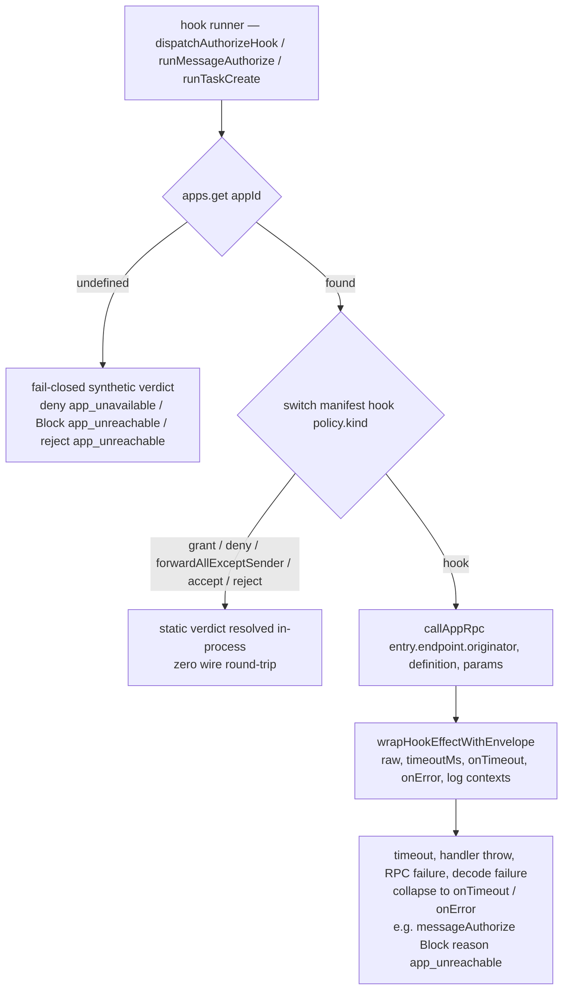

# server-core/identity/apps

_`packages/server/src/identity/apps`_

## Purpose

App identity and endpoint registration barrel.

## Public surface

### [`AppEndpoint`](./registry.ts#L16)

_Interface_

```ts
export interface AppEndpoint {
  readonly connId: ConnectionId;
  readonly originator: Originator;
}
```

The minimal server→app dispatch surface a registration needs: the
connection id (for close-time cleanup via `unregisterByConnection`) and
the outbound Originator (the `sendRpcToClient` channel). Minted from
the live `AppConnection` arm's `{ connId, originator }` at `app/connect`.
The boot-installed default app carries an INERT endpoint
(`default-app.ts → makeDefaultAppEndpoint`) whose originator defects — its
manifest declares only static policies, which AppHost resolves in-process,
so the originator is never invoked.

### [`AppHost`](./host.ts#L178)

_Class_

```ts
export class AppHost {
  /**
   * Single source of truth for app registrations. Each `AppId` maps to
   * one `AppRegistration` carrying its `AppEndpoint` (`{ connId, originator }`)
   * — minted from the live `AppConnection` arm for connected apps, or an
   * inert endpoint for the boot-installed default app (`DEFAULT_APP_ID`).
   * AppHost dispatches via the endpoint's `originator` only for a policy whose
   * `kind` is `"hook"`; an app whose policies are all static (the default app)
   * never has its originator invoked. See `./app-registration.ts`.
   */
  private apps = new AppRegistry();

  private contactService: ContactService | null = null;

  /**
   * Optional lease registry for the dispatch-admission surface.
   * Set post-construction by the layer wiring (see {@link setLeaseRegistry}).
   * Consumed exclusively by `enqueueDispatchRequest`. Kept optional so
   * existing tests that construct AppHost directly without a registry
   * still work.
   */
  private leaseRegistry: LeaseRegistry | null = null;

  /**
   * Optional conversation service for the deny arm. Wired post-construction by
   * the server layer (see {@link setConversationService}). Used by the forked
   * moderator round-trip to call `removeParticipant` on verdict-deny /
   * synthesized timeout-deny — on a `deny` verdict the registry calls
   * `conversationService.removeParticipant(...)`.
   * Synthesized infra-hold (no hook registered) does NOT call
   * removeParticipant — that is the prereq-2 hold case.
   */
  private conversationService: ConversationServiceForAppHost | null = null;

  constructor(
    private db: Db,
    private connections: ConnectionManager,
  ) {}

  /** Wire the lease registry post-construction. */
  setLeaseRegistry(registry: LeaseRegistry): void {
    this.leaseRegistry = registry;
  }

  /**
   * Wire the conversation service post-construction. The server layer
   * sets this after both AppHost and ConversationService have been
   * constructed (the layer order has ConversationService depending on
   * AppHost, so the inverse cannot be a constructor arg without
   * breaking the cycle).
   */
  setConversationService(svc: ConversationServiceForAppHost): void {
    this.conversationService = svc;
  }

  /** Test-only / handler-side accessor. */
  getLeaseRegistry(): LeaseRegistry | null {
    return this.leaseRegistry;
  }

  /**
   * Register an app under the given endpoint. The registry rejects
   * overwrites unconditionally — returns false when `appId` is already
   * registered. `appId` is the SERVER-MINTED identity (the authenticated
   * `AppConnection.auth.appId` on the implicit-registration path, or
   * `DEFAULT_APP_ID` at boot), NOT `manifest.appId`. Callers
   * (the appKey-Connect path and `installDefaultApp`) decide how to surface
   * false (typed `UnauthorizedError` over the wire; exception at boot).
   */
  registerApp(
    appId: AppId,
    manifest: AppManifest,
    endpoint: AppEndpoint,
  ): boolean {
    const ok = this.apps.register(appId, manifest, endpoint);
    if (ok) {
      Effect.runFork(
        Effect.logInfo("App registered").pipe(
          Effect.annotateLogs({
            appId,
            connectionId: endpoint.connId,
          }),
        ),
      );
    }
    return ok;
  }

  /**
   * Drop a registration. Idempotent (no-op if absent). The
   * boot-installed default app is never unregistered in production —
   * its inert endpoint has a stable server-minted id no client caller
   * can match, so {@link unregisterAppsForConnection} never targets it.
   */
  unregisterApp(appId: AppId): void {
    if (this.apps.unregister(appId)) {
      Effect.runFork(
        Effect.logInfo("App unregistered").pipe(Effect.annotateLogs({ appId })),
      );
    }
  }

  /**
   * Drop every registration whose connection matches `connId`. Called
   * by `MoltZapServer`/`socket/server-socket.ts` close cleanup on WS disconnect. The
   * default app's inert endpoint has a server-minted id that no
   * client connection can ever match, so this method never targets
   * boot-installed apps.
   */
  unregisterAppsForConnection(connId: ConnectionId): void {
    this.apps.unregisterByConnection(connId);
  }

  /**
   * Read-side accessor for handlers + requirement obtain helpers.
   * Returns the registration record (manifest + connection) or
   * undefined if no entry exists.
   */
  lookupApp(appId: AppId): AppRegistration | undefined {
    return this.apps.get(appId);
```

Hook registry + fail-closed envelope for every "send context, get
verdict" S→C interaction. A single AppRegistry keyed by
`AppId` carries each app's `AppEndpoint`; the same envelope backs
`dispatch/authorize` (lease verdict), `messages/authorize` (delivery
verdict), and `task/create` (task gate). Each hook runner uses the
two-arm resolution below and the envelope to keep the wire surface
uniform.



Every fail-mode collapses to a deny-shaped verdict so callers never
see an Effect failure on the hook channel — the envelope IS the
contract. The static-policy arms and the fail-closed unknown-app arm
are pure (no app round-trip); only the `kind: "hook"` arm touches the
wire, and it is the only arm under the timeout envelope.

### [`AppRegistration`](./registry.ts#L32)

_Interface_

```ts
export interface AppRegistration {
  readonly appId: AppId;
  readonly manifest: AppManifest;
  readonly endpoint: AppEndpoint;
}
```

A registered app. There is NO `InProcess` vs `Remote` distinction —
every app, including the boot-installed default, carries an
AppEndpoint. Connected apps hold the `{ connId, originator }`
minted from the `AppConnection` arm their `app/connect` call arrived on;
the default app holds an inert endpoint (see
`default-app.ts → makeDefaultAppEndpoint`) and declares only static
policies, which AppHost resolves in-process rather than over the
`sendRpcToClient(entry.endpoint.originator, …)` path a `kind: "hook"` policy
uses. AppHost sees ONE registration shape regardless.

### [`AppRegistry`](./registry.ts#L47)

_Class_

```ts
export class AppRegistry {
  private entries = new Map<AppId, AppRegistration>();

  /**
   * Returns true if the registration was installed, false if `appId`
   * is already present. Never overwrites — the caller MUST unregister
   * first if they want to replace.
   *
   * Keyed by the SERVER-MINTED `appId` (the authenticated
   * `AppConnection.auth.appId`, or `DEFAULT_APP_ID` at boot), NOT by
   * `manifest.appId`. The DB issues `app_id` via `gen_random_uuid()`;
   * the manifest's `appId` field does not participate in routing.
   * `task/request` targets the appId the registrant received from
   * `/api/v1/apps/register`, which is this same server-minted identity.
   */
  register(
    appId: AppId,
    manifest: AppManifest,
    endpoint: AppEndpoint,
  ): boolean {
    if (this.entries.has(appId)) return false;
    this.entries.set(appId, { appId, manifest, endpoint });
    return true;
  }

  unregister(appId: AppId): boolean {
    return this.entries.delete(appId);
  }

  /**
   * Drop every entry whose connection matches `connectionId`. Used
   * by the WS-close path to clean up any apps the closing connection
   * registered.
   */
  unregisterByConnection(connectionId: string): void {
    for (const [appId, entry] of this.entries) {
      if (entry.endpoint.connId === connectionId) {
        this.entries.delete(appId);
      }
    }
  }

  get(appId: AppId): AppRegistration | undefined {
    return this.entries.get(appId);
  }

  has(appId: AppId): boolean {
    return this.entries.has(appId);
  }
}
```

Single source of truth for app registrations. The registry has no
notion of "boot" vs "connected" — both go through register.
The registry itself enforces the no-overwrite invariant: any
attempt to register on top of an existing entry returns false.
Callers (`app/connect`, `installDefaultApp`) map a
`false` return to whatever surfacing they need — typed
`ForbiddenError` for the connect path, an exception for boot.

### [`ConversationServiceForAppHost`](./host.ts#L65)

_Interface_

```ts
export interface ConversationServiceForAppHost {
  removeParticipant(
    conversationId: ConversationId,
    agentId: AgentId,
  ): Effect.Effect<void, unknown, NetworkSendServiceTag>;
  getParticipantAgentIds(
    conversationId: ConversationId,
  ): Effect.Effect<readonly AgentId[]>;
}
```

Structural slice of `ConversationService` that AppHost +
`installDefaultApp` depend on. Defined locally rather than
importing the concrete service to avoid a circular import — the
layer order has ConversationService depending on AppHost.

 - `removeParticipant`: the deny arm (forked moderator round-trip drops the
   recipient on deny).
 - `getParticipantAgentIds`: default-app `messages/authorize`
   forward-all policy reads the conversation's participant set
   here instead of re-implementing the SQL.

### [`installDefaultApp`](./default-app.ts#L108)

_Function_

```ts
export function installDefaultApp(appHost: AppHost): void
```

Boot-time installation of the default app. Registers the static-only
manifest under DEFAULT_APP_ID; AppHost resolves every policy
verdict in-process (see DEFAULT_APP_MANIFEST). No app
round-trip is ever made.

TM-admin RPCs (rebound to the app principal) remain unreachable on
`DEFAULT_APP_ID` tasks because no client `AppConnection` can ever own
the default app — its endpoint is a server-minted inert endpoint, not
a connected HTTP-registered app.

No `ConversationService` arg: the `forwardAllExceptSender` policy
reads participants through the ConversationService back-edge AppHost
already holds (wired by `server.ts → setConversationService`
immediately before this call).

## Files

- `default-app.ts`
- `host.ts`
- `registry.ts`
