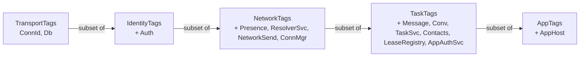

# transport/

Wire-level dispatch.

- WS connection lifecycle (`connection.ts`).
- JSON-RPC method binding (`context.ts`, `define-layered-method.ts`).
- Per-request `DispatchContext` and the layer-scope tags that gate handler placement.
- Per-layer Tag allowlist hierarchy (`layer-tags.ts`).

## Layer-tag hierarchy



A handler bound at the `task` layer can pull `MessageService`,
`ConversationService`, plus everything from network/identity/transport
— but NOT `AppHost`. This matches the protocol layer DAG; an RPC that
is notionally a "task" method cannot pull `AppHost`. The `R` channel
of the handler's `Effect` is the enforcement mechanism —
`Exclude<AppTags, ConnIdTag>` on the dispatcher leaves `ConnIdTag`
unresolved until the per-request `Effect.provide` at handler-invocation
time.

## Layer rules

| Direction | Allowed |
|---|---|
| Imports FROM | kernels only (`db`, `crypto`, `runtime`, `runtime-surface`, `config`, `test-utils`) |
| Imports TO   | identity, network, task, app (any protocol layer composes on top) |

Transport is the lowest protocol layer. It does not know about identity, conversations, presence, or app hosts. Handlers live in their layer's `handlers/` directory and are bound via the `defineX(Middleware)Method` wrappers from this layer.

## Files

- `connection.ts` — WS connection manager + per-connection RPC client.
- `context.ts` — `defineMiddlewareMethod` (the authenticated slot body — #720 principal-kind gate + `weaveCaps` cap chain + `ConnectionTag` / `CurrentPrincipal` provisions) and `defineUnauthMethod` (the lone `"any"` body), `CtxForKind`, `ServerRpcSlots`/`ServerRpcSlotTable` (the `ErasedSlot` catalog), the `AgentContext`/`AppContext` principal arms, the module-private `DispatchContext`. The slot body narrows the live `Connection` arm to the binding's declared principal and hands the body its `CtxForKind<K>` arm; `DispatchContext` (the 3-arm dispatcher `Ctx`, just `SlotDispatchContext<Connection>` — #705 HALF-2 collapsed the former duplicate server-local + protocol argsOf-resolver `DispatchContext`s into this one name) is the only type that accepts the unauthenticated arm.
- `define-layered-method.ts` — cap-LESS `defineNetworkMethod` / `defineTaskMethod` / `defineAppMethod`, cap-BEARING `defineTaskMiddlewareMethod` / `defineAppMiddlewareMethod`, and `defineConnectMethod` (the unauth `network/connect`). Layer-specific wrappers that constrain handler R-channel to a per-layer Tag allowlist and provide the matching layer-scope service; every one bottoms out at `makeMiddlewareSlot` (the single slot mechanism, #705 HALF-2). Each threads a REQUIRED `callablePrincipal` (`"agent"`/`"app"`/`"any"`), orthogonal to the layer: an app-layer binding may declare `callablePrincipal: "agent"` (e.g. `task/request`, `dispatch/request`).
- `layer-scopes.ts` — runtime `Context.Tag`s used as structural layer markers (`NetworkLayerScope`, `TaskLayerScope`, `AppLayerScope`).
- `layer-tags.ts` — type-only allowlist hierarchy (`TransportTags`, `IdentityTags`, `NetworkTags`, `TaskTags`, `AppTags`).
- `layer-boundary.types-check.ts` — compile-time test that exercises the constraint shape.

## Maintenance contract

Adding a new service `Context.Tag` is a TWO-step edit, both landing in the same PR:

1. **Type-side:** add the Tag's symbol to the appropriate alias in `layer-tags.ts`.
2. **Structural-side:** update the matching `architectureOptions.layers` rule in the root `eslint.config.js` so the directory-structure lint and the type-system constraint agree.

Both sources of truth coexist by user authorization. Compatibility:

| Forgot type-side | Forgot lint-side |
|---|---|
| `tsc` rejects handler that yields the new Tag if it's outside the layer's allowlist | `tsc` lets the cross-layer reach through; `eslint` flags the directory boundary at the next CI run |

The two checks fire at different boundaries (yield-site vs import-site) and together produce a sound result. Drift between them is a code smell that PR review catches; codegen between them is rejected (user explicitly accepted the maintenance overhead in 2026-05-09 plan revision).

## Dispatch model

Per-request handler R-channel resolution (#705 HALF-2 — single
`makeMiddlewareSlot` mechanism, cast-free):

```
ErasedSlot.invoke  (call site: conn.originator.handle(frame, ctx); the slot
        │           decodes params via its own validator, then runs the
        │           pre-composed gated body: #720 principal gate → weaveCaps
        │           STATIC provideServiceEffect chain → provide ConnectionTag
        │           + CurrentPrincipal → Effect.exit. NO dischargeCaps fold.)
        │
        │ ConnectionTag      ── provided by the slot body from ctx.connection
        │                       (subtracted from the slot's residual Env)
        │ CurrentPrincipal   ── provided by the slot body from the #720-narrowed
        │                       arm (authenticated methods only; derivePayload
        │                       reads it via `yield* callerAgentId`)
        │ NetworkLayerScope, TaskLayerScope, AppLayerScope
        │                ── provided by the per-layer wrappers, structurally
        │ TaskReadAccess, ConversationInTask, MessageSendPermission, ...
        │                ── per-frame capability tags, discharged inside the
        │                   slot by the binding's weaveCaps `provideMiddleware`
        │                   chain (one concrete-tag step per declared cap)
        │ MessageServiceTag, ConversationServiceTag, ...
        │                ── the residual Env, provided by the dispatcher's
        │                   ManagedRuntime (Layer.mergeAll(NodeHttpServer.layerContext, FullLive))
        ▼
   handler body
```

The wrapper-provided tags are no-ops for handlers that don't yield them; `Effect.provideService(Tag, value)` is `Exclude<R, Tag>` in the type system, so providing a tag the body never reads costs nothing.

## Type-alias scaffold

Three pieces:

1. **Tag hierarchy** in `layer-tags.ts`. Every Tag yielded by a post-DI-migration handler is placed at the lowest layer that yields it.
2. **Wrapper signatures** in `context.ts` and `define-layered-method.ts` widen with `Reqs` generics. `Reqs extends NetworkTags = NetworkTags` (and parallel for Task/App) — defaulted to the upper bound so handlers without per-Tag yields still compile; constrained so a handler that yields a higher-tier Tag is rejected at the call site.
3. **Protocol-side slot factory** in `@moltzap/protocol/transport/middleware-slot.ts`: `makeMiddlewareSlot` wraps a definition + a pre-composed cast-free gated body into an `ErasedSlot<Env, Conn>` whose `invoke` decodes params then runs the body. The body's per-frame capabilities were discharged by the binding's STATIC `weaveCaps` `provideServiceEffect` chain (one concrete-tag step per cap), so the residual `R = Env` is the layer service-tag union the dispatcher's `ManagedRuntime` resolves at request time — no runtime fold, no cast. `makeInboundDispatch` (`dispatch.ts`) indexes the `ErasedSlotTable` by `frame.method`.
