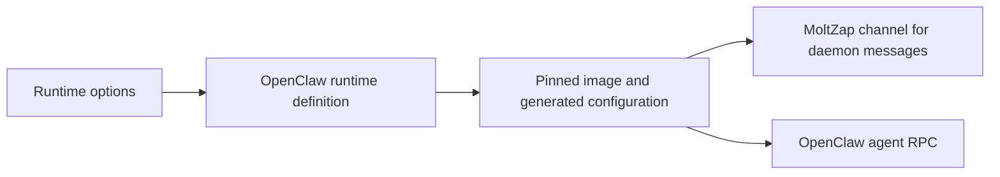

# simulator/agents

_`packages/simulator/src/agents`_

## Purpose

Autonomous agent runtime contracts and shipped implementations.

## Public surface

### [`AgentRoster`](./roster.ts#L76)

_Interface_

```ts
export class AgentRoster<
  Id extends string,
  Definitions extends Readonly<Record<string, AgentRuntimeLike>>,
> {
  readonly [agentRosterTypeId] = agentRosterTypeId;

  readonly definitionId: Id;
  readonly definitions: Definitions;
  readonly validatedDefinitions: ReadonlyArray<
    ValidatedAgentDefinition<Definitions>
  >;
  readonly startedAgents: Context.Tag<
    AgentsService<Id, Definitions>,
    StartedAgents<Definitions>
  >;

  private constructor(
    definitionId: Id,
    definitions: Definitions,
    validatedDefinitions: ReadonlyArray<ValidatedAgentDefinition<Definitions>>,
    startedAgents: Context.Tag<
      AgentsService<Id, Definitions>,
      StartedAgents<Definitions>
    >,
  ) {
    this.definitionId = definitionId;
    this.definitions = definitions;
    this.validatedDefinitions = validatedDefinitions;
    this.startedAgents = startedAgents;
  }

  static make<
    const Id extends string,
    const Definitions extends Readonly<Record<string, AgentRuntimeLike>>,
  >(
    definitionId: Id,
    runtimes: Definitions,
  ): AgentRoster<Id, Definitions> {
    const entries = Object.entries(runtimes);
    const validatedDefinitions =
      /* Safe because each own record entry retains its key and indexed runtime value. */ Object.freeze(
        entries.map(([name, runtime]) =>
          Object.freeze({
            name,
            agentName: Schema.decodeUnknownSync(agentName)(name),
            runtime,
          }),
        ),
      ) as ReadonlyArray<ValidatedAgentDefinition<Definitions>>;
    nextRosterServiceId += 1;
    const definitions =
      /* Safe because the surrounding invariant establishes this asserted shape. */ Object.freeze(
        Object.fromEntries(entries),
      ) as Definitions;
    const agentsValue = Context.GenericTag<
      AgentsService<Id, Definitions>,
      StartedAgents<Definitions>
    >(`@moltzap/simulator/Agents/${definitionId}/${nextRosterServiceId}`);
    return Object.freeze(
      new AgentRoster(
        definitionId,
        definitions,
        validatedDefinitions,
        agentsValue,
      ),
    );
  }
}
```

A roster is both the keyed runtime definition and the owner of the exact
started-agent service used by the experiment Effect.

### [`AgentRosterAcquisitionError`](./roster.ts#L43)

_TypeAlias_

```ts
export type AgentRosterAcquisitionError<
  Definitions extends Readonly<Record<string, AgentRuntimeLike>>,
> = RuntimeAcquisitionErrorOf<Definitions[keyof Definitions]>;
```

Represents agent roster acquisition error conditions.

### [`AgentRuntime`](./agent.ts#L117)

_Interface_

```ts
export interface AgentRuntime<
  Gateway,
  AcquisitionError = never,
  ConfigurationSchema extends
    Schema.Schema.AnyNoContext = Schema.Schema.AnyNoContext,
> extends AgentRuntimeDefinition<
    Gateway,
    AcquisitionError,
    ConfigurationSchema
  > {
  readonly [agentRuntimeTypeId]: typeof agentRuntimeTypeId;
  readonly [runtimeConfigurationProjectionTypeId]: JsonValueType;
  readonly [agentRuntimeTypesTypeId]: AgentRuntimeTypes<
    Gateway,
    AcquisitionError,
    ConfigurationSchema
  >;
}
```

A runtime definition accepted by keyed society rosters.

### [`AgentRuntimeDefinitionError`](./agent.ts#L30)

_Class_

```ts
export class AgentRuntimeDefinitionError extends Schema.TaggedError<AgentRuntimeDefinitionError>()(
  "AgentRuntimeDefinitionError",
  {
    detail: Schema.NonEmptyString,
  },
) {}
```

Invalid runtime metadata rejected before a run acquires resources.

### [`AgentRuntimeInput`](./agent.ts#L85)

_Interface_

```ts
export interface AgentRuntimeInput {
  readonly agentName: AgentName;
}
```

Roster identity presented to a runtime's private realization.

### [`AgentsService`](./roster.ts#L64)

_Interface_

```ts
export interface AgentsService<
  Id extends string,
  Definitions extends Readonly<Record<string, AgentRuntimeLike>>,
> {
  readonly definitionId: Id;
  readonly definitions: Definitions;
}
```

Describes agents service.

### [`Application`](./container.ts#L160)

_Interface_

```ts
export interface Application<Gateway, AcquisitionError> {
  readonly entrypoint: readonly [string, ...string[]];
  readonly environment: Readonly<Record<string, string>>;
  readonly credentials?: readonly CredentialName[];
  /** The controller bridge port, and the port whose accept means ready. */
  readonly port: number;
  readonly files: readonly File[];
  /**
   * Files the cluster reads from the live container after the customer
   * program ends, absent when the runtime harvests nothing.
   */
  readonly harvest?: readonly HarvestTarget[];
  /**
   * Bind the controller to one ready application.
   *
   * `stopped` is the cluster's own view of the container ending. A runtime that
   * can see a stop the cluster cannot — its controller bridge dying while the
   * container still reports Running — reports it through `reportStopped`; the
   * run records whichever stop is observed first. A runtime with nothing extra
   * to observe accepts fewer arguments and ignores it.
   */
  readonly attach: (
    endpoint: ApplicationEndpoint,
    stopped: Effect.Effect<RuntimeTermination>,
    reportStopped: (termination: RuntimeTermination) => Effect.Effect<void>,
  ) => Effect.Effect<Gateway, AcquisitionError, Scope.Scope>;
}
```

One rendered application and its runtime-specific controller bridge.

### [`ApplicationEndpoint`](./container.ts#L96)

_Interface_

```ts
export interface ApplicationEndpoint {
  readonly host: string;
  readonly port: number;
}
```

Where the cluster reached one ready application's controller bridge.

The cluster builds this from the port the application itself declared, so a
runtime reads the address it asked for instead of re-deriving it: a protocol,
port, path, or credential the runtime would have to reject cannot be spelled.

### [`ContainerAgentRuntime`](./container.ts#L206)

_Interface_

```ts
export interface ContainerAgentRuntime<
  Gateway,
  AcquisitionError = never,
  ConfigurationSchema extends
    Schema.Schema.AnyNoContext = Schema.Schema.AnyNoContext,
> extends AgentRuntime<Gateway, AcquisitionError, ConfigurationSchema> {
  readonly [containerRuntimeTypeId]: ContainerRuntime<
    Gateway,
    AcquisitionError
  >;
}
```

A runtime that is known to carry a container realization. Only
`defineContainerRuntime` produces one, so reading its realization back needs
no absent case.

### [`ContainerRuntime`](./container.ts#L193)

_Interface_

```ts
export interface ContainerRuntime<Gateway, AcquisitionError> {
  readonly image: Image;
  readonly resources: Resources;
  readonly render: (
    input: AgentRuntimeInput,
  ) => Effect.Effect<Application<Gateway, AcquisitionError>, AcquisitionError>;
}
```

The container realization of one runtime. Image and resources belong here
rather than to a rendered application because the cluster reserves capacity
for the complete roster before any agent identity exists.

### [`CredentialName`](./container.ts#L38)

_TypeAlias_

```ts
export type CredentialName = "ANTHROPIC_API_KEY" | "OPENAI_API_KEY";
```

Provider credential a container may request from the run-scoped Secret.

### [`defineContainerRuntime`](./container.ts#L267)

_Function_

```ts
export function defineContainerRuntime<
  Gateway,
  AcquisitionError,
  ConfigurationSchema extends Schema.Schema.AnyNoContext,
>(
  definition: AgentRuntimeDefinition<
    Gateway,
    AcquisitionError,
    ConfigurationSchema
  > &
    ContainerRuntime<Gateway, AcquisitionError>,
): ContainerAgentRuntime<Gateway, AcquisitionError, ConfigurationSchema>
```

Define one runtime and bind its container realization in a single operation.
This describes no cross-runtime gateway protocol.

**Returns:** The frozen nominal runtime accepted by a society roster.

### [`File`](./container.ts#L71)

_Interface_

```ts
export interface File {
  readonly path: `/${string}`;
  readonly content: string;
  readonly mode: number;
}
```

One file materialized into a container from the run-scoped Secret.

### [`HarvestTarget`](./container.ts#L83)

_Interface_

```ts
export interface HarvestTarget {
  readonly relativePath: string;
  readonly path: `/${string}`;
  readonly limitBytes: number;
}
```

One file read back from the running application after the customer program
ends. `relativePath` is how the ledger names it, `path` is where the runtime
placed it inside the container, and `limitBytes` bounds what the ledger
carries for it.

### [`image`](./container.ts#L29)

_Variable_

```ts
export const image = Schema.String.pipe(
  Schema.pattern(/^[^@\s]+@sha256:[\da-f]{64}$/u),
  Schema.brand("Image"),
)
```

Digest-pinned image identity accepted by the private container platform.
The repository half excludes `@` so a trailing digest cannot be smuggled in
behind an earlier one, and the digest is lowercase hexadecimal of exactly the
length SHA-256 produces.

### [`Image`](./container.ts#L35)

_TypeAlias_

```ts
export type Image = typeof image.Type;
```

Digest-pinned image identity accepted by the private container platform.

### [`NanoClawGateway`](./nanoclaw/gateway.ts#L54)

_Interface_

```ts
export interface NanoClawGateway {
  readonly submit: (
    input: NanoClawGatewayInput,
  ) => Effect.Effect<void, NanoClawGatewayError>;
  readonly outputs: Stream.Stream<NanoClawGatewayOutput, NanoClawGatewayError>;
}
```

Principal gateway exposed by an acquired NanoClaw runtime.

### [`NanoClawGatewayError`](./nanoclaw/gateway.ts#L41)

_Class_

```ts
export class NanoClawGatewayError extends Schema.TaggedError<NanoClawGatewayError>()(
  "NanoClawGatewayError",
  {
    operation: Schema.Literal("connect", "submit", "receive"),
    detail: Schema.String,
  },
) {
  override get message(): string {
    return `NanoClaw gateway ${this.operation} failed: ${this.detail}`;
  }
}
```

A NanoClaw principal socket could not connect, submit, or receive.

### [`NanoClawGatewayInput`](./nanoclaw/gateway.ts#L27)

_Class_

```ts
export class NanoClawGatewayInput extends Schema.Class<NanoClawGatewayInput>(
  "NanoClawGatewayInput",
)({
  text: Schema.NonEmptyString,
}) {}
```

Native instruction accepted by NanoClaw's owner-local CLI channel.

### [`NanoClawGatewayOutput`](./nanoclaw/gateway.ts#L34)

_Class_

```ts
export class NanoClawGatewayOutput extends Schema.Class<NanoClawGatewayOutput>(
  "NanoClawGatewayOutput",
)({
  text: Schema.String.pipe(Schema.maxLength(NANOCLAW_GATEWAY_TEXT_MAX_LENGTH)),
}) {}
```

One native output frame emitted by NanoClaw's owner-local CLI channel.

### [`nanoclawRuntime`](./nanoclaw/runtime.ts#L124)

_Function_

```ts
export function nanoclawRuntime(
  options: NanoClawRuntimeOptions,
): ContainerAgentRuntime<
  NanoClawGateway,
  RuntimeAcquisitionError,
  typeof NanoClawRuntimeConfiguration
>
```

Construct a NanoClaw descriptor backed by one application container per
roster identity and its runtime-owned native gateway bridge.

**Returns:** The nanoclaw runtime result.

### [`NanoClawRuntimeOptions`](./nanoclaw/runtime.ts#L87)

_Interface_

```ts
export interface NanoClawRuntimeOptions {
  readonly startupTimeout?: Duration.Duration;
  readonly workspaceFiles?: readonly WorkspaceFile[];
  /**
   * Workspace-relative files read back from each running agent after the
   * customer program ends and recorded in the ledger, so an experiment can
   * grade what its agents wrote without their exiting.
   */
  readonly harvestWorkspaceFiles?: readonly string[];
  /**
   * Have the agent's `moltzapd` append every delivery and send it completes
   * to a history export, harvested into the ledger as
   * `moltzap-history.ndjson` when the customer program ends.
   */
  readonly historyExport?: boolean;
  /**
   * Model the runtime asks for. Its provider prefix (`anthropic/`, `openai/`)
   * names the credential forwarded from the run's Secret; an unknown prefix
   * forwards none.
   */
  readonly modelId?: string;

  /**
   * Digest-pinned one-container NanoClaw artifact for Kubernetes execution.
   */
  readonly applicationImage: Image;

  /** MCP servers reachable from the NanoClaw container. */
  readonly mcpServers?: readonly McpServer[];
}
```

Configuration captured by one reusable NanoClaw runtime value.

### [`OpenClawGateway`](./openclaw/gateway.ts#L158)

_Interface_

```ts
export interface OpenClawGateway {
  readonly agent: (
    request: OpenClawGatewayRequest,
  ) => Effect.Effect<OpenClawGatewayResponse, OpenClawGatewayRequestError>;
}
```

Principal gateway exposed by an acquired OpenClaw runtime.

### [`OpenClawGatewayRequest`](./openclaw/gateway.ts#L84)

_Class_

```ts
export class OpenClawGatewayRequest extends Schema.Class<OpenClawGatewayRequest>(
  "OpenClawGatewayRequest",
)({
  message: Schema.NonEmptyString,
  idempotencyKey: Schema.NonEmptyString,
  sessionKey: Schema.optional(Schema.NonEmptyString),
  thinking: Schema.optional(Schema.NonEmptyString),
  timeout: Schema.optional(Schema.NonNegativeInt),
  label: Schema.optional(Schema.NonEmptyString),
  extraSystemPrompt: Schema.optional(Schema.NonEmptyString),
}) {}
```

Principal instruction accepted by OpenClaw's `agent` gateway RPC.

### [`OpenClawGatewayRequestError`](./openclaw/gateway.ts#L146)

_Class_

```ts
export class OpenClawGatewayRequestError extends Schema.TaggedError<OpenClawGatewayRequestError>()(
  "OpenClawGatewayRequestError",
  {
    detail: Schema.String,
  },
) {
  override get message(): string {
    return `OpenClaw gateway request failed: ${this.detail}`;
  }
}
```

An OpenClaw gateway call failed or returned an invalid payload.

### [`OpenClawGatewayResponse (type)`](./openclaw/gateway.ts#L143)

_TypeAlias_

```ts
export type OpenClawGatewayResponse = typeof OpenClawGatewayResponse.Type;
```

Exact terminal response returned by OpenClaw's `agent` gateway RPC.

### [`OpenClawGatewayResponse (value)`](./openclaw/gateway.ts#L136)

_Variable_

```ts
export const OpenClawGatewayResponse = Schema.Union(
  OpenClawGatewaySucceeded,
  OpenClawGatewayTimedOut,
)
```

Schema for the exact terminal response returned by the `agent` gateway RPC.

### [`OpenClawGatewaySucceeded`](./openclaw/gateway.ts#L107)

_Class_

```ts
export class OpenClawGatewaySucceeded extends Schema.Class<OpenClawGatewaySucceeded>(
  "OpenClawGatewaySucceeded",
)({
  runId: Schema.NonEmptyString,
  status: Schema.Literal("ok"),
  summary: Schema.Literal("completed"),
  result: OpenClawGatewayResult,
}) {}
```

Successful terminal result returned by OpenClaw's `agent` gateway RPC.

### [`OpenClawGatewayTimedOut`](./openclaw/gateway.ts#L122)

_Class_

```ts
export class OpenClawGatewayTimedOut extends Schema.Class<OpenClawGatewayTimedOut>(
  "OpenClawGatewayTimedOut",
)({
  runId: Schema.NonEmptyString,
  status: Schema.Literal("timeout"),
  summary: Schema.Literal("aborted"),
  stopReason: Schema.optional(Schema.String),
  timeoutPhase: Schema.optional(openClawTimeoutPhase),
  providerStarted: Schema.optional(Schema.Boolean),
  result: Schema.optional(OpenClawGatewayResult),
}) {}
```

Timed-out terminal result returned by OpenClaw's `agent` gateway RPC.

OpenClaw treats this as a successful RPC payload rather than a transport
failure. A run may time out before it has an agent result.

### [`openClawRuntime`](./openclaw/runtime.ts#L175)

_Function_

```ts
export function openClawRuntime(
  options: OpenClawRuntimeOptions,
): ContainerAgentRuntime<
  OpenClawGateway,
  RuntimeAcquisitionError,
  typeof OpenClawRuntimeConfiguration
>
```

Constructs a simulator runtime from a complete, digest-pinned agent image.



**Returns:** A reusable OpenClaw container runtime definition.

### [`OpenClawRuntimeOptions`](./openclaw/runtime.ts#L118)

_Interface_

```ts
export interface OpenClawRuntimeOptions {
  /** Digest-pinned complete OpenClaw agent image. */
  readonly applicationImage: Image;
  readonly startupTimeout?: Duration.Duration;
  readonly workspaceFiles?: readonly WorkspaceFile[];
  /**
   * Workspace-relative files read back from each running agent after the
   * customer program ends and recorded in the ledger, so an experiment can
   * grade what its agents wrote without their exiting.
   */
  readonly harvestWorkspaceFiles?: readonly string[];
  /**
   * Have the agent's `moltzapd` append every delivery and send it completes
   * to a history export, harvested into the ledger as
   * `moltzap-history.ndjson` when the customer program ends.
   */
  readonly historyExport?: boolean;
  /**
   * Model the runtime asks for. Its provider prefix (`anthropic/`, `openai/`)
   * names the credential forwarded from the run's Secret; an unknown prefix
   * forwards none.
   */
  readonly modelId?: string;
  readonly mcpServers?: readonly McpServer[];

  /** Selects OpenClaw session isolation for evaluations. Defaults to shared. */
  readonly messagingMode?: "shared" | "private";

  readonly tools?: OpenClawToolsConfig;
  readonly sandbox?: OpenClawSandboxConfig;
}
```

Configuration captured by one reusable OpenClaw runtime value.

### [`OpenClawSandboxConfig`](./openclaw/configuration.ts#L26)

_TypeAlias_

```ts
export type OpenClawSandboxConfig = NonNullable<
  NonNullable<NonNullable<OpenClawConfig["agents"]>["defaults"]>["sandbox"]
>;
```

Default-agent sandbox configuration accepted by `OpenClawConfig`.

### [`OpenClawToolsConfig`](./openclaw/configuration.ts#L23)

_TypeAlias_

```ts
export type OpenClawToolsConfig = NonNullable<OpenClawConfig["tools"]>;
```

Tool configuration accepted by `OpenClawConfig`.

### [`Resources`](./container.ts#L64)

_Interface_

```ts
export interface Resources {
  readonly cpuMillis: number;
  readonly memoryBytes: number;
  readonly ephemeralStorageBytes: number;
}
```

Portable resource request for one application container.

### [`routableBridgeEndpoint`](./container.ts#L128)

_Function_

```ts
export function routableBridgeEndpoint(
  endpoint: ApplicationEndpoint,
): ApplicationEndpoint
```

Refuse a bridge address that never leaves the controller's own host.

**Returns:** The same endpoint once it is known to be routable.

### [`RunningAgent`](./agent.ts#L79)

_Interface_

```ts
export interface RunningAgent<Gateway> {
  readonly gateway: Gateway;
  readonly termination: Effect.Effect<RuntimeTermination>;
}
```

A ready runtime exposes its principal gateway and one lifecycle observation.
Completion of the termination Effect records a fact; customer policy decides
whether that fact ends the run.

### [`RuntimeAcquisitionError`](./agent.ts#L211)

_Class_

```ts
export class RuntimeAcquisitionError extends Schema.TaggedError<RuntimeAcquisitionError>()(
  "RuntimeAcquisitionError",
  {
    runtime: Schema.NonEmptyString,
    agent: Schema.NonEmptyString,
    detail: Schema.String,
  },
) {
  override get message(): string {
    return `${this.runtime} runtime for "${this.agent}" failed to start: ${this.detail}`;
  }
}
```

A runtime application or its native gateway did not become ready.

### [`RuntimeCompleted`](./agent.ts#L38)

_Class_

```ts
export class RuntimeCompleted extends Schema.TaggedClass<RuntimeCompleted>()(
  "RuntimeCompleted",
  {},
) {}
```

An autonomous runtime completed normally.

### [`runtimeConfigurationProjection`](./agent.ts#L169)

_Function_

```ts
export function runtimeConfigurationProjection(
  runtime: AgentRuntimeLike,
): JsonValueType
```

Read the validated, immutable JSON projection captured at definition time.

**Returns:** The runtime configuration encoded as JSON.

### [`RuntimeExited`](./agent.ts#L52)

_Class_

```ts
export class RuntimeExited extends Schema.TaggedClass<RuntimeExited>()(
  "RuntimeExited",
  {
    code: Schema.NonNegativeInt,
  },
) {}
```

A runtime process exited with an operating-system exit code.

### [`RuntimeFailed`](./agent.ts#L44)

_Class_

```ts
export class RuntimeFailed extends Schema.TaggedClass<RuntimeFailed>()(
  "RuntimeFailed",
  {
    detail: Schema.String,
  },
) {}
```

An autonomous runtime completed with a recorded failure.

### [`RuntimeGatewayOf`](./roster.ts#L39)

_TypeAlias_

```ts
export type RuntimeGatewayOf<Runtime extends AgentRuntimeLike> =
  RuntimeTypesOf<Runtime>[0];
```

The principal gateway exposed by one acquired runtime definition.

### [`RuntimeSignaled`](./agent.ts#L60)

_Class_

```ts
export class RuntimeSignaled extends Schema.TaggedClass<RuntimeSignaled>()(
  "RuntimeSignaled",
  {
    signal: Schema.NonEmptyString,
  },
) {}
```

A runtime process terminated in response to an operating-system signal.

### [`RuntimeTermination`](./agent.ts#L68)

_TypeAlias_

```ts
export type RuntimeTermination =
  | RuntimeCompleted
  | RuntimeFailed
  | RuntimeExited
  | RuntimeSignaled;
```

Exact terminal observation produced by an acquired runtime.

### [`StartedAgent`](./roster.ts#L48)

_Interface_

```ts
export interface StartedAgent<Name extends string, Gateway>
```

A ready autonomous runtime paired with its Registry-issued identity.

### [`StartedAgents`](./roster.ts#L54)

_TypeAlias_

```ts
export type StartedAgents<
  Definitions extends Readonly<Record<string, AgentRuntimeLike>>,
> = Readonly<{
  [Name in Extract<keyof Definitions, string>]: StartedAgent<
    Name,
    RuntimeGatewayOf<Definitions[Name]>
  >;
}>;
```

Exact keyed agents installed only after every runtime is ready.

### [`stoppedBeforeAttach`](./container.ts#L310)

_Function_

```ts
export function stoppedBeforeAttach<AcquisitionError>(
  stopped: Effect.Effect<RuntimeTermination>,
  onStopped: (detail: string) => AcquisitionError,
): Effect.Effect<never, AcquisitionError>
```

Fail with the runtime's own error the moment its application stops, so a
bridge race reports the stop instead of waiting out the startup deadline.
The error type is a plain parameter, so each runtime keeps its exact failure
channel and no gateway union exists.

**Returns:** An Effect that only ever fails.

## Files

- `agent.ts`
- `container.ts`
- `index.ts`
- `nanoclaw/gateway.ts`
- `nanoclaw/runtime.ts`
- `openclaw/configuration.ts`
- `openclaw/gateway.ts`
- `openclaw/runtime.ts`
- `roster.ts`
- `workspace.ts`
