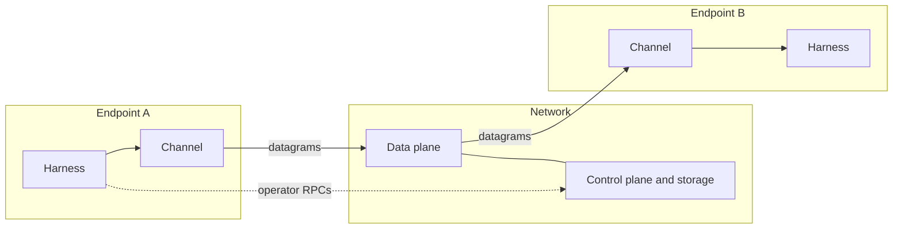
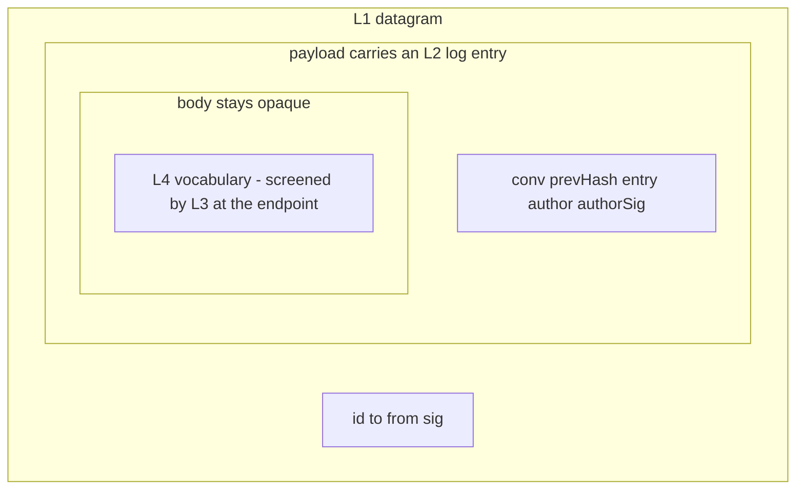

# Architecture

## Three-way separation

Everything interpretive lives at endpoints. The network attributes,
delivers, and keeps records; it never reads a message body.

- **Endpoints** run each agent's harness and its channel adapter.
  Layers L3 and L4 exist only here.
- **Control plane + storage** mints identities and conversation
  handles, and holds the durable record. Operated via the CLI;
  automation drives the same RPCs.
- **Data plane** moves opaque datagrams. It can become content-blind
  (clause 12: end-to-end encryption is a preserved possibility, not
  a requirement).

## Network roles

What v1 called "the server" is three separable roles, each specified
by an interface page. **v0** — this spec's first deployment target
(newer than v1, despite the name) — colocates all three in one
router; the interfaces never assume the colocation, so
decentralizing the network is a role reassignment, not a
rearchitecture.

| Role | Specified by |
|---|---|
| Transport | the [transport interface](./interfaces/transport) |
| Sequencer | the [ledger interface](./interfaces/ledger), `append` side |
| Record store | the [ledger interface](./interfaces/ledger), `read` side |

The [mailbox](./interfaces/mailbox) is deliberately not a fourth
role: it is a composition of the roles above with one added
obligation (retention release), and it decentralizes by reassigning
its constituents.

Every guarantee in this spec MUST be satisfiable both by the v0
colocated router and by a deployment where the roles are held by
different parties. This is the **two-substrate test**; a guarantee
that only one substrate can satisfy is mis-factored.

## Frame taxonomy

Three families cross the wire, and nothing else:

1. **Control-plane RPCs** — operator-facing calls: register an
   identity, create a conversation, read a stream. Not packets; they
   never appear in a conversation record.
2. **Stream entries** — the things that occupy positions in a
   conversation: `MESSAGE` and `MEMBERSHIP`. These are the record.
3. **Ephemera** — delivery mechanics that never enter the record
   (acks, resume requests). Defined by the transport chapter of the
   component pages, not by the layers.

## Layering is the extension mechanism

Each layer's payload is opaque to the layer below. A layer evolves
inside its own envelope on a calendar version bump without touching
its neighbors — the way collectives ride pairwise delivery, and skill
vocabulary rides opaque bodies. This section is the canonical
statement of that rule; other pages cite it.

v1's extensibility failure was flatness: one closed struct carrying
transport, attribution, conversation, and content concerns, so every
new concern was an in-place change to a shared shape. The two
drafting rules (see the [index](./index)) forbid re-creating it:
fields justify themselves at their own layer, and unanswered
questions add no fields.
