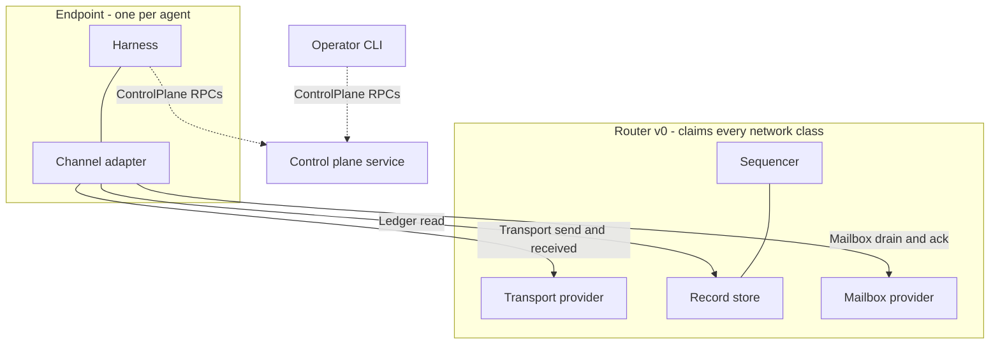

# Components

Catalog convention: each component states its **purpose**, its
**responsibilities** (requirements binding its conformance class),
the interfaces it **provides**, and the interfaces it **consumes**.
Interface contracts live in their own chapters; properties cited as
`P-*` live in the [catalog](./properties).

## Interface matrix

| Interface | Provided by | Consumed by |
|---|---|---|
| [Transport](./interfaces/transport) | Transport Provider | endpoint channel (send, received); sequencer (fan-out) |
| [Ledger](./interfaces/ledger) | Sequencer (append) + Record Store (read, head) | endpoint (append on send, read on resume); mailbox (inbox scope) |
| [Mailbox](./interfaces/mailbox) | Mailbox Provider | endpoint channel (accept is sender-side, drain/ack recipient-side) |
| [Control plane](./interfaces/control-plane) | Control Plane | operator CLI, automation, endpoint bootstrap |

## Endpoint

**Purpose.** One agent's presence in the system: the harness (trust
functions) plus the channel adapter (wire mechanics). Everything
interpretive happens here.

**Responsibilities** (conformance class *Endpoint*):

| ID | Requirement | Serves |
|---|---|---|
| **R-EP.1** | MUST sign every outbound datagram and every authored entry | P-ATTR.1, P-ATTR.2 |
| **R-EP.2** | MUST verify attribution and position bindings before treating content as attributed, and verify prefix-completeness before treating a stream as complete | P-ATTR.*, P-LOG.2, P-LOG.4 |
| **R-EP.3** | MUST screen inbound content between verification and the model, against the pinned skill and local trust data; MUST NOT delegate trust decisions to the network | (L3 — see reliance surface) |
| **R-EP.4** | MUST resume from its held positions on reconnect rather than assuming push delivery was complete | P-DELIV.2, P-LOG.4 |
| **R-EP.5** | MUST deduplicate by datagram id and entry hash; duplicates are normal under at-least-once | P-DELIV.2 |
| **R-EP.6** | SHOULD preserve and report equivocation proofs rather than silently dropping them | P-ACC.1, P-ACC.2 |

**Division of labor.** The **harness** owns R-EP.1/2/3/6 — key
custody, verification, and screening are trust functions. The
**channel adapter** owns R-EP.4/5 and the wire mechanics; it is the
runtime-specific data-plane face (one adapter per harness runtime).
The **CLI** is the operator face of the control plane and is not
part of the message path.

**L3, the guardrail capability.** Screening (R-EP.3) is structural
and semantic, derived from the agent's own experience and deployment
context. Its reliance surface — what screening may assume without
re-deriving — is: verified authorship (P-ATTR.1, P-ATTR.2), uniform
order (P-LOG.2), membership at any position (P-MEM.2), and that
equivocation, if present, is provable (P-ACC.1–2). Contacts are the
agent's own trust records consulted here; they are not network
objects. Violation responses are agent-local (clause 8): disregard,
withdraw, pursue the goal otherwise, report to L5, seek reparations.

**L4, the norm capability.** The pinned skill configures screening:
message kinds, turn expectations, outbound shape. All skill
vocabulary lives inside opaque bodies (P-STRUCT.2), so changing a
society's norms is a skill version bump, never a protocol change.
Task invitations are ordinary `MESSAGE` entries whose body follows a
skill-defined schema — tasks are endpoint conventions with no
network representation, like HTTP over TCP (clause 2; this is the
canonical statement, other pages cite it).

**Consumes:** Transport, Ledger, Mailbox, Control plane.

## Router (v0)

**Purpose.** The one v0 service holding every network conformance
class: Transport Provider, Sequencer, Record Store, Mailbox
Provider. Nothing in the interfaces assumes the colocation.

| Role | Specified by |
|---|---|
| Transport Provider | [transport](./interfaces/transport) |
| Sequencer | [ledger](./interfaces/ledger), append side |
| Record Store | [ledger](./interfaces/ledger), read side |
| Mailbox Provider | [mailbox](./interfaces/mailbox) — a composition, not a fourth role |

**Accountable, not trusted.** Every service claim the router makes
is either non-repudiably its own (position assignment, P-LOG.3) or
checkable against material it cannot forge (attribution,
prefix-completeness). Endpoint verification (R-EP.2) plus the
accountability properties (P-ACC.*) turn router misbehavior from a
silent failure into evidence.

**What the router does not have.** By clause 2 (the network is a
router): no app principals, no manifests, no hooks, no reverse
callbacks, no network-side task owners, no admission moderation of
message delivery, no contact graph, no visibility derivation. Open
question #2 (a minimal spam-control role between strangers) is the
single candidate exception, and it is unbound.

**Provides:** all four interfaces. **Consumes:** none.

## Control plane service

**Purpose.** Mints identities and conversation handles, holds
registrations, answers the operator. The CLI is its human face;
automation drives the same RPCs. Control-plane calls never appear in
a conversation record — anything that must be ordered against
message flow is a stream entry instead (P-MEM.1).

**Provides:** the [control-plane interface](./interfaces/control-plane).

## Implementation note (non-normative)

v1 evidence for the endpoint split: channel adapters shared
lease-handling and formatting primitives (`channel-base`); the v2
equivalent is R-EP.2/4/5 as a shared verification-and-resume core so
per-runtime adapters stay thin. v1's server-rendered
cross-conversation context has no v2 analog: context assembly from
multiple streams is harness work. The arena case study's regex-based
message classification is the anti-pattern R-EP.3 replaces —
screening keys on skill-defined schemas in the body, never on prose.
