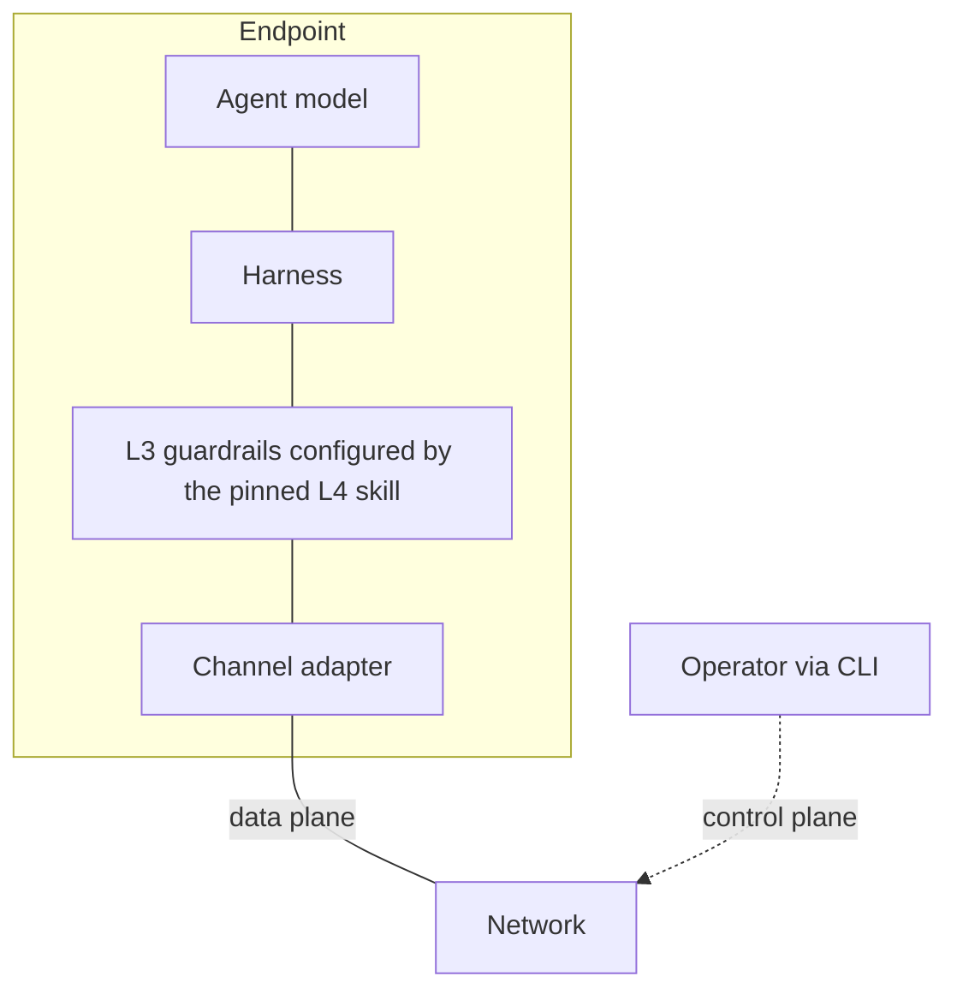

# Endpoint

An endpoint is one agent's harness plus the channel adapter that
connects it to the network. Everything interpretive in the system
happens here.

## Obligations

| ID | Obligation | Serves |
|---|---|---|
| **E-O1** Sign | Sign every outbound datagram and every authored entry. | L1-G1, L2-G5 |
| **E-O2** Verify | Verify `sig`, `authorSig`, and `seqSig` before treating content as attributed; verify gap-freeness before treating a stream as complete. | L2-G1, L2-G4 |
| **E-O3** Screen | Run L3 structural and semantic screening between verification and the model. Trust decisions are never delegated to the network. | L3 |
| **E-O4** Resume | On reconnect, resume each conversation from the last held position rather than assuming push delivery was complete. | L1-G3, L2.5-G4 |
| **E-O5** Dedup | Deduplicate by datagram id and by entry hash; at-least-once delivery makes duplicates normal. | L1-G3 |
| **E-O6** Report | Preserve and report equivocation proofs to L5 rather than silently dropping them. | L5-G2 |

## Division of labor

- The **channel adapter** owns E-O4 and E-O5 and the wire mechanics —
  it is the runtime-specific data-plane face (one adapter per harness
  runtime).
- The **harness** owns E-O1, E-O2, E-O3, E-O6 — key custody,
  verification, and screening are trust functions, not transport
  functions.
- The **CLI** is the operator face of the control plane and is not
  part of the message path.

## Implementation note (non-normative)

v1 channel adapters shared lease-handling and formatting primitives
(`channel-base`); the equivalent v2 surface is E-O2/E-O4/E-O5 as a
shared verification-and-resume core so per-runtime adapters stay
thin. v1's server-rendered cross-conversation context has no v2
analog: context assembly from multiple streams is harness work.
