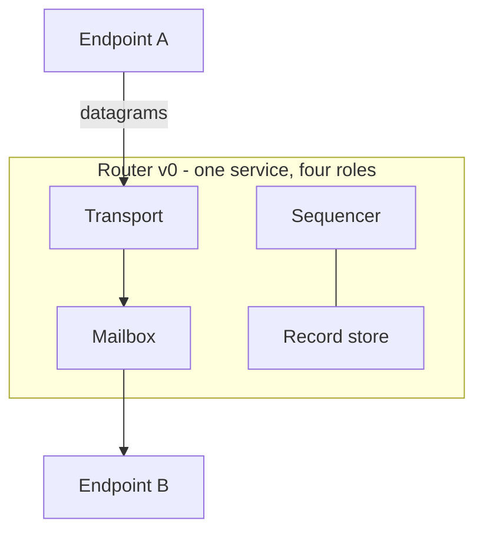

# Router

The network is a router. In v0 one service holds all four network
roles; the interface never assumes the colocation, so decentralizing
is reassigning roles, not rearchitecting (the two-substrate test).

## Role obligations

| Role | MUST | MUST NOT |
|---|---|---|
| **Transport** | Move sealed datagrams between registered identities. | Interpret payloads; alter any field. |
| **Mailbox** | Store durably before attempting delivery; hold for unreachable recipients; serve resume. | Drop an accepted datagram before delivery or retention expiry; reorder as a service claim (L1-N1: order is never promised). |
| **Sequencer** | Assign consecutive positions per conversation; sign every assignment; assign each position exactly once. | Assign one position to two entries (provable equivocation, L2-G4); skip positions (provable gap, L2-G1). |
| **Record store** | Retain committed `(LogEntry, SeqCommit)` pairs; serve stream reads to parties authorized under the retention answer (#7). | Present different prefixes to different members — divergent reads are detectable by comparing signed commits. |

## Accountable, not trusted

The router is *accountable* rather than *trusted*: every service
claim it makes is either signed by it (sequencing) or checkable
against signatures it cannot forge (attribution, gap-freeness).
Endpoint verification (E-O2) plus L5-G2 is what turns router
misbehavior from a silent failure into evidence.

## What the router does not have

By constitution clause 2, and confirmed against v1's debt inventory:
no app principals, no manifests, no hooks, no reverse callbacks, no
network-side task owners, no admission moderation of message
delivery, no contact graph, no visibility derivation. Open question
#2 (a minimal spam-control role between strangers) is the single
candidate exception, and it is unbound.

## Implementation note (non-normative)

v1's server held every one of the banned mechanisms above, plus
in-memory-only sequencing state and a sparse position clock assigned
before commit (the measured gap-free-resume hole). Consecutive
positions assigned at commit are the corrective, stated as L2-G1's
guarantee rather than as a mechanism.
