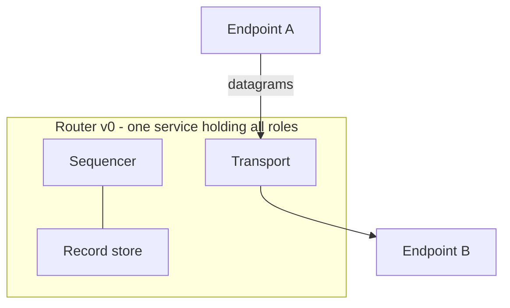

# Router

The network is a router. In v0 one service holds every network role;
nothing in the interfaces assumes the colocation (the two-substrate
test, defined in [Architecture](../architecture)).

## Obligations live with the interfaces

The router implements the [transport](../interfaces/transport),
[ledger](../interfaces/ledger), and [mailbox](../interfaces/mailbox)
interfaces. Its obligations are exactly those pages' guarantees and
are not restated here.

## Accountable, not trusted

The router is *accountable* rather than *trusted*: every service
claim it makes is either non-repudiably its own (position
assignment, LG-G3) or checkable against material it cannot forge
(attribution, gap-freeness). Endpoint verification (E-O2) plus L5-G2
turns router misbehavior from a silent failure into evidence.

## What the router does not have

By constitution clause 2 (the network is a router), and confirmed
against v1's debt inventory: no app principals, no manifests, no
hooks, no reverse callbacks, no network-side task owners, no
admission moderation of message delivery, no contact graph, no
visibility derivation. Open question #2 (a minimal spam-control role
between strangers) is the single candidate exception, and it is
unbound.

## Implementation note (non-normative)

v1's server held every banned mechanism above, plus in-memory-only
sequencing state. The v1 position-clock defect and its corrective
are recorded in the ledger interface's implementation note.
