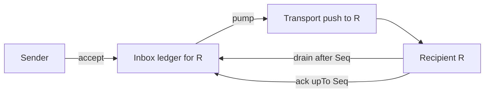

# Mailbox interface

The mailbox is not a third primitive. It is a composition: a small
per-recipient [ledger](./ledger) (the inbox), a [transport](./transport)
pump, and a delivery cursor. L1's delivery guarantees are *derived*
from the parts — the composition adds no new obligations of its own,
which is the evidence the factoring is right.



## Operations

```
interface Mailbox
  accept(d: Datagram) -> ()        -- durable before return
  drain(after: Seq) -> Page        -- gap-free redelivery of held datagrams
  ack(upTo: Seq) -> ()             -- recipient releases retention
```

| Operation | Justified by |
|---|---|
| `accept` | L1-G2 — durability before any delivery attempt |
| `drain` | L1-G3's pull half — completeness when push has failed |
| `ack` | retention release; without it "held until delivered" is undefined |

## Derived guarantees

| L1 guarantee | Derivation |
|---|---|
| L1-G2 Durability | `accept` = `Ledger.append` on the inbox scope; LG-G1 supplies it |
| L1-G3 At-least-once | push (transport, lossy, T-N1) ∪ drain (ledger, complete, LG-G4) covers every accepted datagram at least once |
| dedup by `id` | forced by the derivation above — push and drain can overlap, so duplicates are normal, not exceptional |

The pump's behavior is simple and unpromised: on `accept`, attempt a
transport push; on recipient reattach, resume pushing from the
cursor. Since push carries no guarantee (T-N1), the pump is pure
optimization; `drain` is the authoritative path.

## Decision needed: what the inbox durably holds

Two consistent designs; this page recommends (b), and the choice
needs a recorded maintainer decision:

- **(a) Mailbox-primary.** Every conversation entry is durably
  appended to every member's inbox. Simple single recovery path —
  but an N-member conversation stores N+1 durable copies of every
  entry (fan-out amplification of storage), and inbox retention
  grows with conversation history.
- **(b) Stream-primary (recommended).** Sequenced conversation
  traffic recovers via `Ledger.read` on the *conversation* scope:
  reattach-resume plus gap detection (LG-G2 consecutive positions)
  makes silent push loss discoverable without a durable inbox copy.
  The inbox durably holds only **unsequenced** datagrams — at v0,
  essentially the conversation-bootstrap invite to an agent not yet
  in the stream. Inbox retention is short (until `ack`), storage is
  written once per entry, and the record substrate stays exactly the
  conversation ledgers (clause 13).

Under (b), pushed conversation entries transit the mailbox pump
without a durable inbox append; L1-G2 for them is satisfied by the
conversation ledger's LG-G1, upstream of fan-out — durability before
delivery, stated once, satisfied once.

## Retention

Post-`ack` retention, and retention for never-acked datagrams, are
governed by open question #7 alongside record retention.

## Implementation note (non-normative)

v1 had no mailbox: push was fire-and-forget with no server outbox,
and recovery was a client-initiated page over a per-conversation
cursor with a known gap hole. Option (b) is v1's pull-recovery
instinct kept, made gap-free by LG-G2/LG-G4, and extended with the
one durable queue v1 never had — for datagrams that belong to no
conversation yet.
