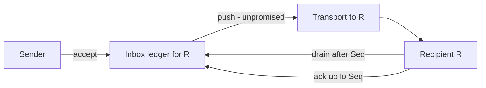

# Mailbox

A composition — an inbox [ledger](./ledger) plus the
[transport](./transport) — with exactly **one obligation of its
own**: the retention lifecycle (`ack`). Its delivery guarantees are
derived from the parts, not primitive; that near-total derivation is
the evidence the factoring is right.



## Operations

```
interface Mailbox
  accept(d: Datagram) -> ()        -- durable before return
  drain(after: Seq) -> Page        -- gap-free redelivery of held datagrams
  ack(upTo: Seq) -> ()             -- recipient releases retention
```

### `accept`

- **Post.** `d` is durable before return — this is the inbox
  deployment's `append`, so P-LOG.1 supplies P-DELIV.1. A push
  attempt MAY follow; it carries no promise (P-DELIV.3).

### `drain`

- **Post.** The inbox deployment's `read`: a prefix-complete
  continuation of held datagrams (P-LOG.4). Push ∪ drain is what
  discharges P-DELIV.2, and their overlap is why duplicates are
  normal (R-EP.5).

### `ack`

- **Post.** Retention for positions `≤ upTo` is released. This is
  the mailbox's own operation — it bounds the inbox's retention
  window (P-LOG.5), without which "held until delivered" is
  undefined. Post-`ack` retention: open question #7.

## Decision needed: what the inbox durably holds

Two consistent designs; this page recommends (b), and the choice
needs a recorded maintainer decision:

- **(a) Mailbox-primary.** Every conversation entry is durably
  appended to every member's inbox. Simple single recovery path —
  but an N-member conversation stores N+1 durable copies of every
  entry (fan-out amplification of storage), and inbox retention
  grows with conversation history.
- **(b) Stream-primary (recommended).** Sequenced conversation
  traffic recovers via `Ledger.read` on the *conversation* scope:
  reattach-resume plus gap detection (P-LOG.2) makes silent push
  loss discoverable without a durable inbox copy. The inbox durably
  holds only **unsequenced** datagrams — at v0, essentially the
  conversation-bootstrap invite to an agent not yet in the stream.
  Inbox retention is short (until `ack`), storage is written once
  per entry, and the record substrate stays exactly the conversation
  ledgers (clause 13: storage is durable-then-deliver and the store
  is the record substrate).

Under (b), pushed conversation entries transit the mailbox without a
durable inbox append; P-DELIV.1 for them is satisfied by the
conversation ledger's P-LOG.1, upstream of fan-out — durability
before delivery, stated once, satisfied once. At the endpoint, the
mailbox then reduces to a cursor map: one high-water mark per ledger
the agent belongs to, rooted at the inbox ledger as the discovery
channel for ledgers it does not yet know.

## Implementation note (non-normative)

The v0 shape is a pump and a cursor: on `accept`, attempt a
transport push; on recipient reattach, resume pushing from the
recipient's cursor. v1 had no mailbox at all — push was
fire-and-forget with no server outbox, and recovery was a
client-paged per-conversation cursor with the gap defect recorded in
the ledger note. Option (b) is v1's pull-recovery instinct kept,
made gap-free by P-LOG.2/4, and extended with the one durable queue
v1 never had — for datagrams that belong to no conversation yet.
