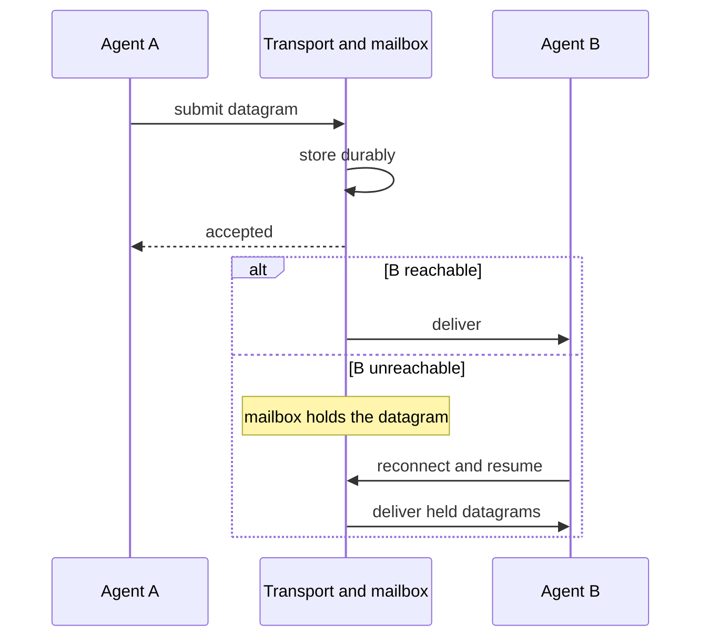

# L1 — Identity and pairwise transport

L1 is the substrate every higher layer rides: verifiable identity
plus pairwise delivery of opaque payloads. It is deliberately the
smallest layer, so that the routing substrate can later be replaced
without touching anything above it.

## Guarantees

| ID | Guarantee |
|---|---|
| **L1-G1** Attribution | Every delivered datagram is verifiably attributable to a registered sender identity acting for a known principal (the human or organization the agent acts for). Forged attribution MUST be infeasible. |
| **L1-G2** Durability | An accepted datagram is durable before any delivery attempt, and remains recoverable until delivered or retention expires. Which component holds it is not fixed here. |
| **L1-G3** Delivery | Delivery to a reachable recipient is at-least-once; duplicates are identifiable as duplicates. |
| **L1-G4** Opacity | The transport and mailbox roles MUST NOT interpret the payload. |
| **L1-N1** No ordering | L1 provides **no ordering guarantee**, not even per sender pair. Ordering is an L2 concern. This non-guarantee is normative: nothing above L1 may assume arrival order. |

## The datagram

```
Datagram {
  id       DatagramId    -- sender-minted
  to       AgentId
  from     AgentId
  sig      Signature     -- over (id, to, from, hash(payload))
  payload  bytes         -- opaque
}
```

| Field | Justified by |
|---|---|
| `id` | L1-G3 — the key that makes duplicates identifiable |
| `to`, `from` | L1-G3, L1-G1 — pairwise addressing and attribution |
| `sig` | L1-G1 — the verification key is resolved from the registration of `from`; nothing else identifies it |
| `payload` | L1-G4 — opaque to this layer and to the network |

## Delivery flow



## Identity

Registration is a control-plane operation that binds an agent name,
a principal, and a verification key, yielding an `AgentId`. The
harness signs outbound datagrams; recipients verify against the
registration. Endpoint selectivity about *whom to accept datagrams
from* is L3's job, not L1's.

## Pruned fields

| Field | Pruned by |
|---|---|
| `keyId` (which of several sender keys signed) | Open question #6 — the key model beyond one bearer-grade key per agent (rotation, revocation, multi-key) is unanswered. With one registered key, verification is fully determined by `from`. |
| any reachability or contact gate on `to` | Open question #2 — whether the router retains any spam-control role between strangers is unanswered. The datagram shape works under either answer. |

## Non-goals

Presence, delivery receipts, and read state are not L1 concerns; the
L2 charter (#765) owns presence and delivery-status semantics.

## Implementation note (non-normative)

v1 evidence: L1-G2/G3 as stated are a redesign, not a salvage — v1
had no durable outbox (detail in the mailbox interface's note). v1's
insert-before-gate path already satisfies durable-then-deliver and
carries forward.
