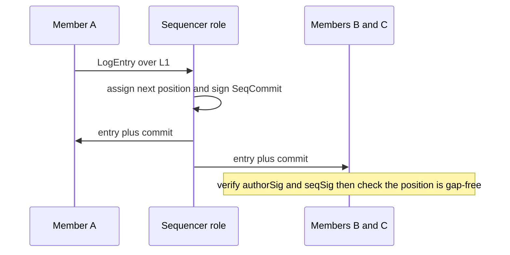
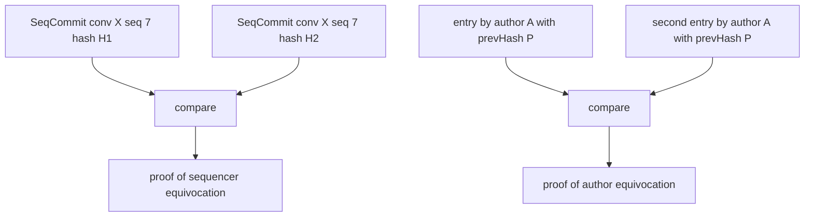

# L2 — Collectives

L2 turns pairwise delivery into collectives: per-message collective
operations over a conversation, with an order every member can
verify. Each call names its own operation; no standing policies live
in the plane. The first version supports **MULTICAST with pessimistic
concurrency control (PCC), nothing more** (recorded decision); the
broader op set is chartered to #765.

A conversation is, abstractly, an append-only log of entries. Members
author entries; the sequencer role assigns each entry a position
(wire name: `seq`). Both acts are signed, which is what makes the
four constraints below enforceable against faulty members *and* a
faulty sequencer. Terminology: *log* (this abstract sequence),
*stream* (its L2.5 view), and *ledger* (the interface that serves
it) name the same object at different altitudes.

## Guarantees

The four paper-required constraints, as interface guarantees:

| ID | Guarantee |
|---|---|
| **L2-G1** Uniform order | All members observe the same entries at the same positions, including members transiently unavailable at delivery time. Positions within a conversation are consecutive: a member holding positions 1..N holds everything before N+1, and a withheld entry is therefore detectable as a gap. |
| **L2-G2** Pessimistic concurrency | An entry is dispatched only after the group has agreed on the next collective operation and next author. Semantics chartered to #765; the guarantee is stated here so no other layer claims it. |
| **L2-G3** Starvation protection | No member can be indefinitely prevented from having its operation considered. Semantics chartered to #765. |
| **L2-G4** Equivocation robustness | Conflicting claims — by an author about what it said, or by a sequencer about what sits at a position — are detectable from signed material alone and are non-repudiable. |
| **L2-G5** Relayed attribution | Entry authorship is verifiable by any member regardless of which party delivered the entry. Collective attribution MUST NOT depend on the L1 hop's `from`. |

## The log entry

Travels inside an L1 datagram payload.

```
LogEntry {
  conv       ConversationId
  prevHash   Hash            -- author's claimed predecessor entry
  entry      MESSAGE | MEMBERSHIP
  author     AgentId
  authorSig  Signature       -- over (conv, prevHash, entry, author, content hash)
  -- entry = MESSAGE:     body   bytes (opaque)
  -- entry = MEMBERSHIP:  delta  { joined AgentId[], left AgentId[] }
}
```

| Field | Justified by |
|---|---|
| `conv` | L2-G1 — names the collective the operation addresses |
| `prevHash` | L2-G4 — the author's causal claim; two entries by one author sharing a `prevHash` are proof of author equivocation |
| `entry` | L2-owned discriminator between its data and control entries; MEMBERSHIP ordering is specified in the next chapter (L2.5-G2) |
| `author`, `authorSig` | L2-G5 — attribution that survives relay |
| `body` / `delta` | opaque above L2 / the in-band membership change (L2.5) |

## The sequence commit

The sequencer role's signed position assignment.

```
SeqCommit {
  conv       ConversationId
  seq        Seq             -- consecutive within conv
  entryHash  Hash
  seqSig     Signature       -- by the current sequencer for conv
}
```

| Field | Justified by |
|---|---|
| `conv`, `seq` | L2-G1 — the position assignment itself |
| `entryHash` | L2-G4 — binds the position to exactly one entry; two commits for one `(conv, seq)` with different hashes are proof of sequencer equivocation |
| `seqSig` | L2-G4 — makes the assignment non-repudiable |

An entry is **committed** once it has a `SeqCommit`. Delivery and
resume both carry the pair `(LogEntry, SeqCommit)`; members verify
both signatures and the gap-free property locally.

## Flow



## Equivocation detection



Detection requires only signed material; it does not require trusting
the network. Consequences belong to L5.

## Chartered to #765 — absent by drafting rule 2

| Absent | Question it awaits |
|---|---|
| op discriminator beyond MULTICAST | op set, completion, failure, initiation authority |
| turn token / speaker-grant shape | L2-G2 semantics — who mints the grant, consensus vs leader |
| `epoch` (membership era stamp) | membership-era semantics interact with the charter and with conversation lifecycle under encryption (open question #3); membership at any position is already derivable from the stream (L2.5-G2) |
| `storedAt` timestamps on commits | L2-G3's time base is a charter decision; the record store MAY hold receipt times without wire representation |
| witness cosignatures on commits | open question #5 — witness semantics |
| presence and delivery-status shapes | chartered with L2 semantics |

New entry kinds and op verbs are additive extensions of unions L2
owns — the paved road; none of the above requires a reserved slot
today.

## Implementation note (non-normative)

v1 evidence for L2-G2 being first-class: the arena case study
re-implemented a ~1,400-line turn scheduler on per-recipient
admission hooks because v1 offered "may this recipient process this
message" where the game needed "who may speak next in this
conversation". PCC also keeps the log linear: an author who holds
the speaking grant knows the head, so `prevHash` chains without
forking. Closest prior art for the log discipline: per-conversation
signed hash chains (Keybase-style) and membership-changes-as-commits
(MLS) — chains and epochs are mechanisms and appear only here, not
in the guarantees.
