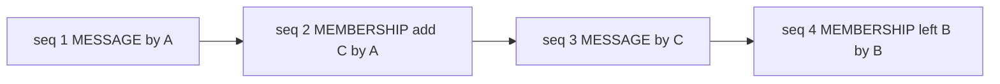

# L2.5 — Conversations

A conversation id is the routing handle — an opaque group handle in
the style of an MPI communicator (parallel computing's group
abstraction, addressed without naming its members) — and the **only
multi-party address in the system**. There is no separate group id, task id, or channel id
on the wire: a group *is* a conversation.

## Guarantees

| ID | Guarantee |
|---|---|
| **L2.5-G1** Opaque handle | `ConversationId` is opaque. Endpoints MUST NOT parse it; the network MUST NOT encode meaning in it. |
| **L2.5-G2** In-band membership | Membership changes are MEMBERSHIP entries in the conversation's own stream, totally ordered against MESSAGE entries. The membership at position N is derivable by any member from the stream prefix 1..N alone. |
| **L2.5-G3** Recipient set | The recipient set of the entry at position N+1 is exactly the membership after applying the entry at position N. Late joiners replaying the stream compute the same recipient sets as live members did. |
| **L2.5-G4** Resume | A member can resume from any position it holds and receive the gap-free remainder of the stream (with L2-G1 this makes catch-up complete and verifiable). |

## The stream

The MEMBERSHIP entry at seq 2 is why C receives seq 3 — no
side-channel notification, no fan-out timing rules. "Who was a
member at seq N" stops being a server-private fact and becomes a
derivation any member, late joiner, or L5 monitor performs
identically.

## Lifecycle

- **Create** is a control-plane RPC: it mints the handle and commits
  the initial MEMBERSHIP entry at position 1. From then on the
  conversation lives entirely in its stream.
- **Join and leave** are MEMBERSHIP entries authored in-band — the
  v0 shape. Open question #3 (conversation lifecycle under
  encryption) may later promote join to a heavier control-plane
  operation; that question stays open. The authority rules — who may
  add or remove whom — are part of the L2 charter's
  initiation-authority cluster (#765) and are not bound here.
- **Reaching a new member**: delivering the stream to an agent named
  in a `joined` delta uses ordinary L1 datagrams. Whether the network
  may refuse conversation bootstraps between strangers is open
  question #2; the shapes here work under either answer.
- **End of life**: archival and retention are open question #7.

## Pruned fields

| Absent | Pruned by |
|---|---|
| task binding on the conversation | Clause 2 — tasks are endpoint conventions; the consequence is stated on the [L4 page](./l4-norms). |
| owning app / moderator reference | Clause 2 — no app principals, no network-side owners. |
| membership `initiator` field | The initiator is the entry's `author`; a separate field duplicated L2 attribution. |
| per-conversation policy or manifest | Standing policies do not live in the plane; which op a well-behaved participant emits next is an L4 concern. |

## Implementation note (non-normative)

v1 delivered membership changes as side-channel notifications with
fan-out timing rules (removed agents notified pre-mutation, added
agents post-mutation) and no ordering against messages; late joiners
could not reconstruct historical recipient sets. L2.5-G2/G3 replace
that mechanism class entirely.
